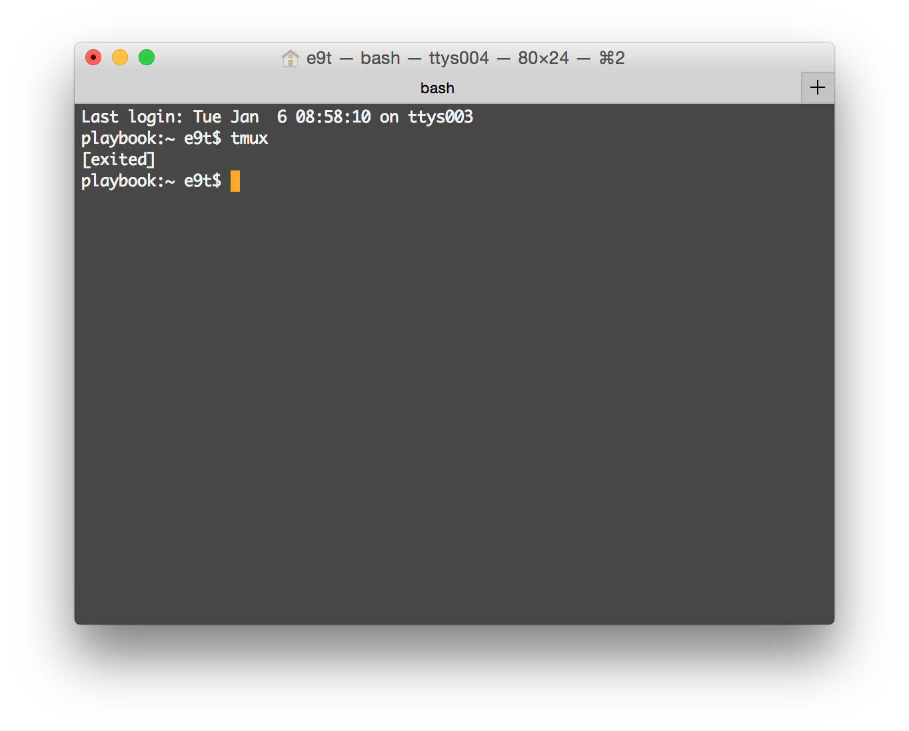

Title: Bash
Date: 2015-04-02 00:00
Tags: programming, seoultech, lectures
Courseid: 2015-ba
Toc: True

## What is an OS?
- DOS, Windows, Linux, Mac OS, iOS, Android, ...

## Linux?
- OS
- Made by Linus Torvalds
- Inspired by Unix
- Debian, CentOS, Ubuntu, Fedora, Redhat Linux, Gentoo, Arch, Suse, Slackware, Mandriva, PintOS, ...

### Why Linux?
- Custom
- Free (in some sense)
- Open source
- Supports multiple users
- Has compatibility with Unix-like OSs

## Files

### Directories

- `.`: current directory
- `..`: parent directory
- `~/`: home directory
- `/`: root directory
- `/some/absolute/path`
- `some/relative/path`

### Permissions

- Read, Write, eXecute
- Owner, Owner group, Others
- rwxrwxrwx
    - All permissions for everyone

<!-- GNU linux history -->
## [What is Bash?](https://www.gnu.org/software/bash/manual/html_node/What-is-Bash_003f.html)

- Bash is a "shell" for the GNU operating system

### Then [what is a shell?](https://www.gnu.org/software/bash/manual/html_node/What-is-a-shell_003f.html###What-is-a-shell_003f)

- A shell is a macro processor that executes commands

### Is Bash the only shell available?

- No.
- There are many many alternatives, such as `sh`, `ksh`, `csh` or `zsh`
- However, `bash` is the default shell in GNU systems

### Can I use `bash` in GNU systems only?

- No.
- You can also use bash in Windows and other platforms, using portable versions

## Why should I use Bash?

### Package managing

- What is a package?
- What is it to manage a package?
- What kind of package managers are there?

    - Windows: ???
    - Mac: Homebrew
    - Ubuntu: apt-get

<!--
Some jokes about package managing:
- https://twitter.com/gardaud/status/357638468572151808
- https://twitter.com/ddprrt/status/529909875347030016
-->

### Data sampling

- ex: http://www.ecogwiki.com/Hash-based_sampling

### Data science

- ex: http://jeroenjanssens.com/2013/09/19/seven-command-line-tools-for-data-science.html
