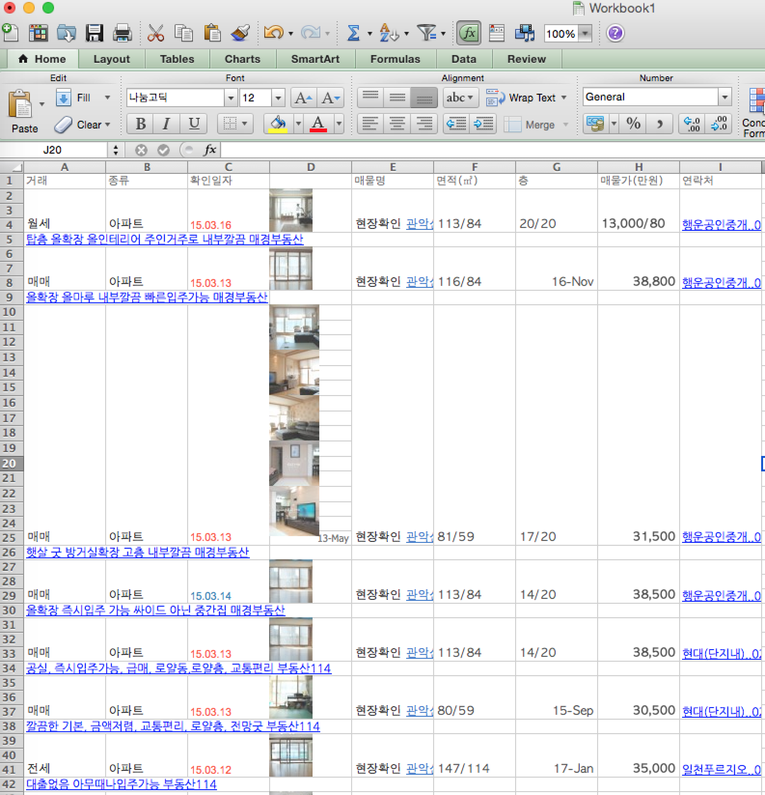
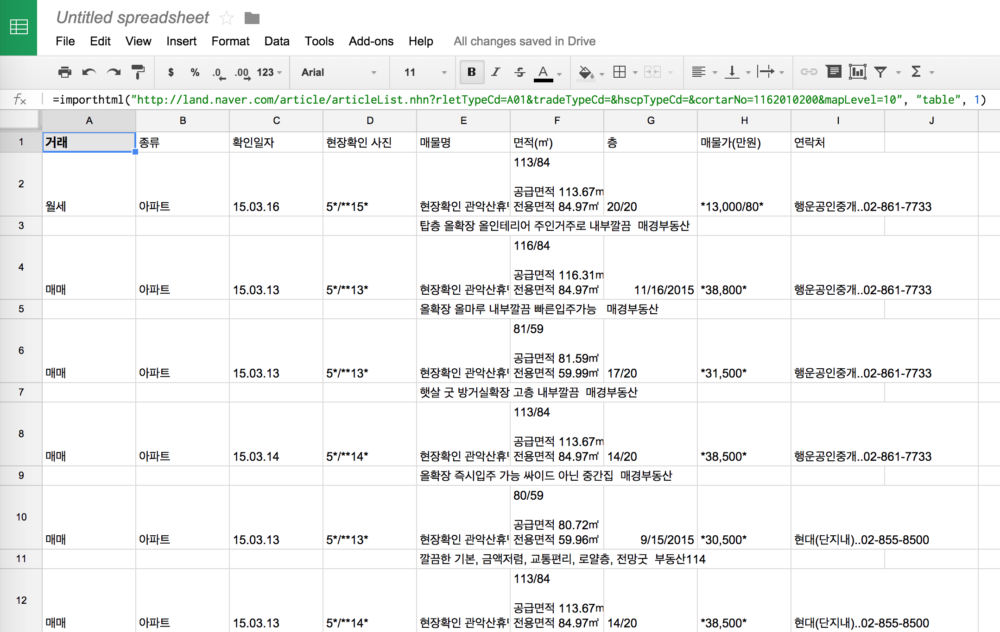
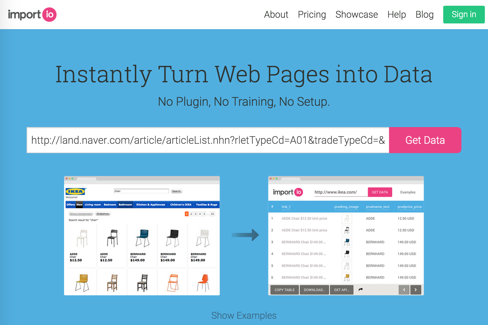
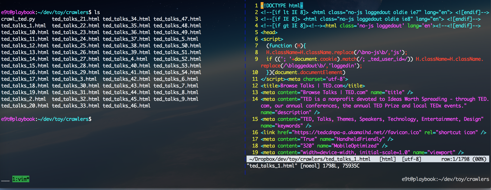
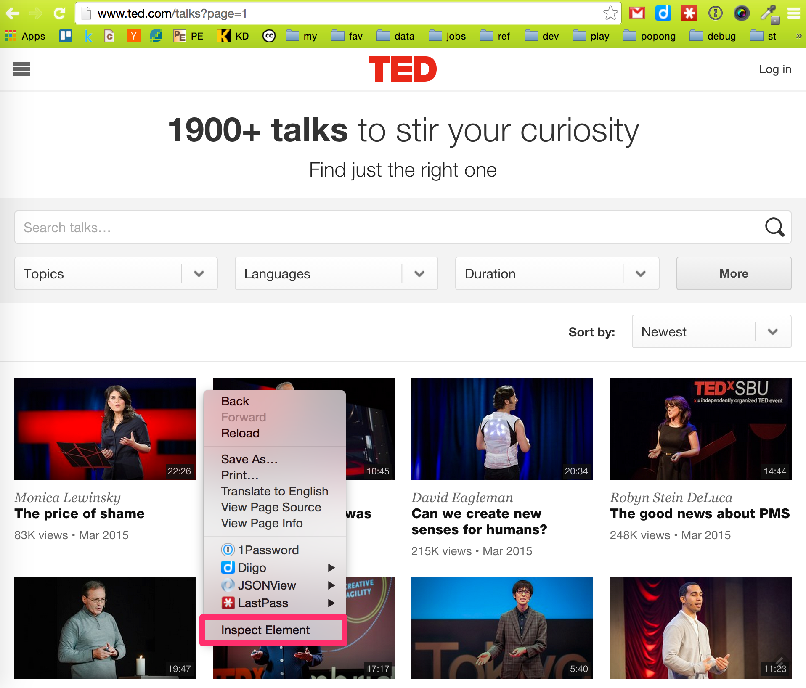
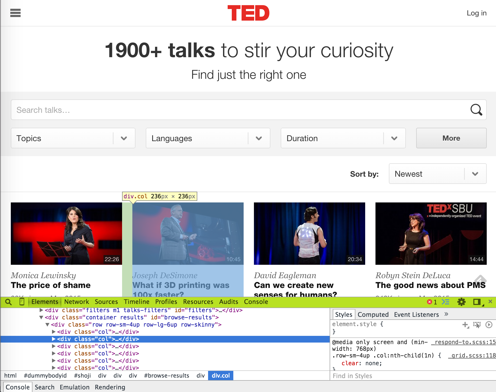
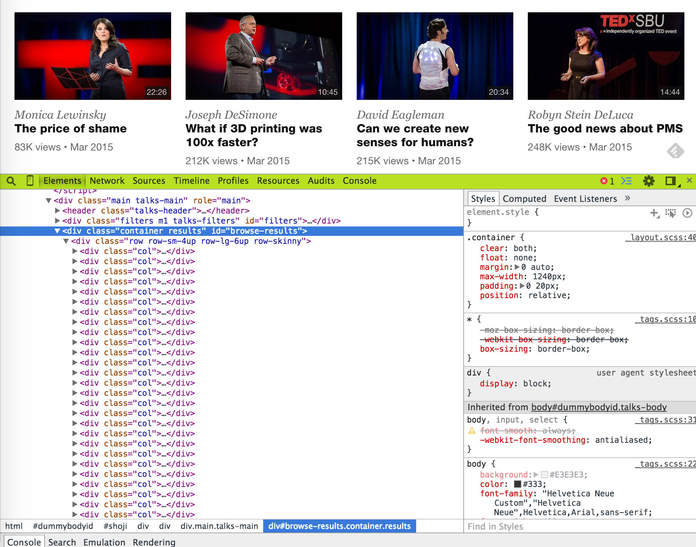
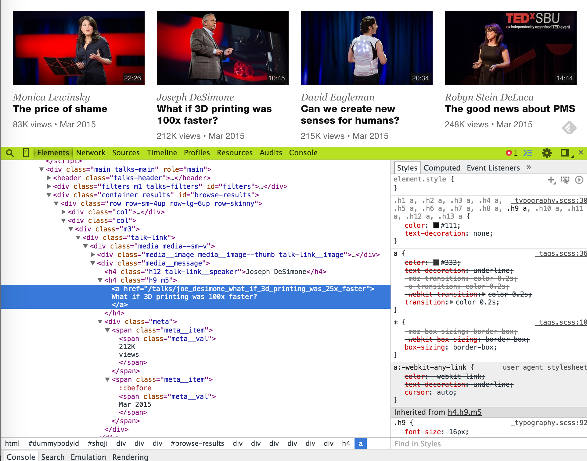

Title: Scraping from the Web
Date: 2015-03-20 15:00
Tags: lectures, crawling
Courseid: 2015-ba
Toc: True

Choose a target of your choice:

- Target 1: [Naver 부동산](http://land.naver.com/article/articleList.nhn?rletTypeCd=A01&tradeTypeCd=&hscpTypeCd=&cortarNo=1162010200&mapLevel=10)
- Target 2: [IMDB](http://www.imdb.com/search/title?count=100&start=101)
- Target 3: [TED.com](http://www.ted.com/talks)

## Method 1: ctrl + c / ctrl + v

## Method 2: Google spreadsheet

## Method 3: import.io (or some other scraping service)

## Method 4: Being the programmer

Let's try programming a crawler ourselves.

### 1. Identify Web page URL
- First find a Web page where you can find item lists
- Let's understand the URL (cf. [Online URL decoder/encoder](http://meyerweb.com/eric/tools/dencoder/))
- It is best to find a page where the URL is has an iterable parameter (ex: page numbers, item IDs)
    - TED.com talks: http://www.ted.com/talks?page=1
        - `page` is iterable from 1 to 54
    - Amazon.com TVs: `http://www.amazon.com/s/?rh=n:172282,n:!493964,n:1266092011,n:172659&page=1`
        - `page` is iterable from 1 to 143
- Set the variables `npages`, `url_base`, and also a `file_base` to name download files. Normally, you want to set npages to a smaller number (ex: 3), rather than the actuall value (i.e., 54) to test the code before actually executing it.

        :::python
        npages = 54
        url_base = 'http://www.ted.com/talks?page=%s'
        file_base = 'ted_talks_%s.html'

### 2. Download Web pages
- First define a function named `save_text`

        :::python
        def save_text(text, filename):
            with open(filename, 'w') as f:
                f.write(text)

- Then using the list URL found on step 1, download list pages. We will use the package `requests` for this task

        :::python
        import requests
        for page_num in range(1, npages+1):
            print(page_num)
            r = requests.get(url_base % page_num)
            save_text(r.text, file_base % page_num)

- Check whether the pages have downloaded succesfully 
    

### 3. Parse downloaded Web pages
- Before we go any further, let's recall how an html document looks like. Take a look at one of the downloaded html docs as well.

        :::html
        <!DOCTYPE html>
        <html>
        <head>
            <meta charset="utf-8">
            <link rel="stylesheet" href="...">
            <script type="text/javascript" src="...">
        </head>
        <body>
            <!-- This is a comment -->
            ... and this is where the visible contents go ...
        </body>
        </html>

- Now, let's set the `page_num` to 1 for detailed investigation, rather than creating a `for` loop for all pages

        :::python
        page_num = 1

- For parsing, we'll be using [`lxml.html`](http://lxml.de/lxmlhtml.html). Many people also use [regex](https://docs.python.org/3/library/re.html). There are various many other options (ex: bs4), so feel free to Google them up.

        :::python
        from lxml import html
        root = html.parse(file_base % page_num)

- With `root`, we can easily parse a given text using [xpath](http://lxml.de/xpathxslt.html#xpath)s, just by identifying the *tag*, *class*, or *id* of an html element. Why don't we try extracting all the text from the `<body>` tag? Try this:

        :::python
        print(root.xpath('//body//text()'))

- Cool, huh? Now, let's think of what we want to extract from our downloaded html, and picture what we want as a result. From our html page, we probably want to extract the title, speaker, view count, date, and url of all TED talks, resulting in a spreadsheet format as follows:
    

    

    
    

    

    
    

    

- So, in order to find what *tag*, *class*, or *id* we need to exact such elements, let's go back to [www.ted.com/talks?page=1](http://www.ted.com/talks?page=1), right click, and "Inspect Element"s. 
    
    

- By navigating with the DOM, we can see that the `div` tag with `id=browse-results` contains all the talk items in `div` tags with `class=col`, each containing a talk item. (When identifying and html element, using *id* is better than using a *class*, because normally *id*s are unique within a html page.) 
    

- Now, let's use xpath to get the talk items.

        :::python
        items = root.xpath('//div[@id="browse-results"]//div[@class="col"]')
        print(len(items))   # returns 36, the number of talk items in the page

- Dig into one of the `
`s, to further investigate the identifiers of talk information. 
    

- Choose one item and extract relevant data.

        :::python
        item = items[0]
        print(item.xpath('.//h4[@class="h12 talk-link__speaker"]/text()'))
        print(item.xpath('.//h4[@class="h9 m5"]/a/text()'))
        print(item.xpath('.//h4[@class="h9 m5"]/a/@href'))
        print(item.xpath('.//span[@class="meta__val"]/text()'))

- All the items are contained in a list, and it would be better if we could strip the new lines(`\n`) from the strings. Additionally, rather than handling each info separately, let's put the extracted info into one dictionary, and make that a function named `parse_item()`.

        :::python
        def parse_item(item):
            return {
                'speaker': item.xpath('.//h4[@class="h12 talk-link__speaker"]/text()')[0],
                'title': item.xpath('.//h4[@class="h9 m5"]/a/text()')[0].strip('\n'),
                'href': item.xpath('.//h4[@class="h9 m5"]/a/@href')[0],
                'views': item.xpath('.//span[@class="meta__val"]/text()')[0].split('\n')[1],
                'date': item.xpath('.//span[@class="meta__val"]/text()')[1].strip('\n')
            }

- Perfect. Now let's iterate through the items on page 1.

        :::python
        data = []
        for item in items:
            d = parse_item(item)
            data.append(d)
        print(len(data))    # returns 36

- Great. Now we're ready to iterate through all 54 web pages.

        :::python
        data = []
        for page_num in range(1, npages+1):

        root = html.parse(file_base % page_num)
        items = root.xpath('//div[@id="browse-results"]//div[@class="col"]')
        for item in items:
            d = parse_item(item)
            data.append(d)
        print(len(data))    # returns 1943 or a similar number

### 4. Save the parsed data to file

- We currently have our data in a dictionary format.
- Normally, it's enough to save this data directly into a json file.

        :::python
        import json
        with open('data.json', 'w') as f:
            json.dump(data, f)

    - [JSONView](https://chrome.google.com/webstore/detail/jsonview/chklaanhfefbnpoihckbnefhakgolnmc?hl=en) is a nice way to pretty print your json.

- However, sometimes it's better to convert this data into a spreadsheet. If so, try this:

        :::python
        import csv
        with open('data.csv', 'w') as f:
            writer = csv.DictWriter(f, fieldnames=data[0].keys())
            writer.writeheader()
            writer.writerows(data)

### 5. What's next?

- You can see a refactored, cleaner code of the crawler above [here](https://gist.github.com/e9t/43f986a915c4059d75af). Try to understand the syntax yourself.
- Furthermore, you can traverse into the individual talk urls you have just acquired from the list pages.
- Concurrent crawling may come of use. Consult [this presentation material](http://www.slideshare.net/cornchz/pyconkr-2014-30).
- Try crawling some other website of interest.
- If you already have enough data to crunch, go ahead and crunch 'em!

## References

Below are some Web crawler examples. Most are for Python 2, so be careful.

- [TED.com crawler](https://gist.github.com/e9t/95df9b68ff829a557cfb)
- [Naver OnStage crawler](https://gist.github.com/e9t/9680106)
- [Team POPONG crawlers](http://github.com/teampopong/crawlers)
- [Korean National Assembly bill crawler](https://gist.github.com/e9t/551f9647f58800273025)
