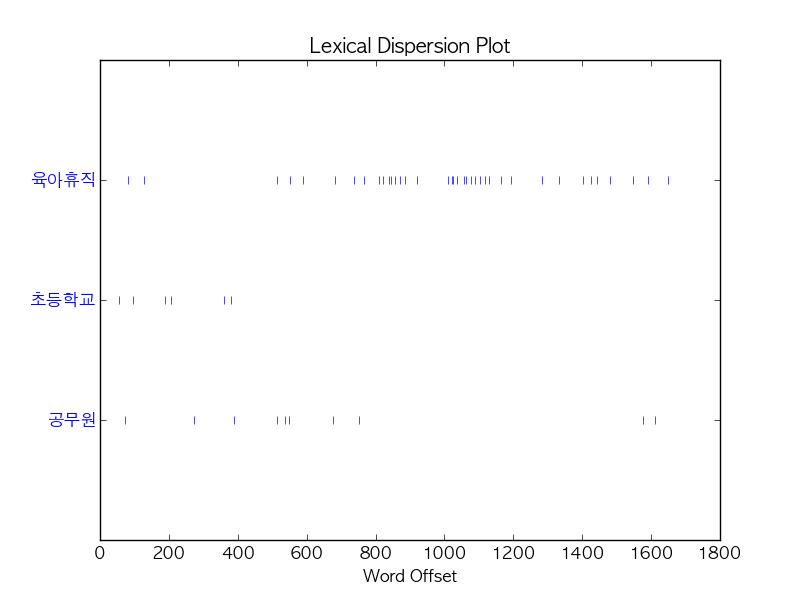

Title: Mining English and Korean text with Python
Date: 2015-03-27 15:00
Tags: text, lectures
Courseid: 2015-ba
Toc: True
Math: True

> We use Python 3 in this tutorial, but provide minimal guidelines for Python 2.

## Terminologies



## Text analysis process

1. Load text
1. Tokenize text (ex: stemming, morph analyzing)
1. Tag tokens (ex: POS, NER)
1. Token(Feature) selection and/or filter/rank tokens (ex: stopword removal, TF-IDF)
1. ...and so on (ex: calculate word/document similarities, cluster documents)

## Python Packages for Text Mining and NLP

...that we use in this tutorial.

1. [NLTK](http://nltk.org): Provides modules for text analysis (mostly language independent)

        :::bash
        pip install nltk

    - [Text corpora](http://www.nltk.org/book/ch02.html)

            :::python
            nltk.download('gutenberg')
            nltk.download('maxent_treebank_pos_tagger')

    - [Word POS, NER classification](http://www.nltk.org/api/nltk.tag.html)
    - [Document classification](http://www.nltk.org/book/ch06.html)

1. [KoNLPy](http://konlpy.org): Provides modules for Korean text analysis

        :::bash
        pip install konlpy

    - [Text corpora](http://konlpy.org/en/latest/data/#corpora)
    - [Word POS classification](http://konlpy.org/en/latest/api/konlpy.tag/)
        - Hannanum
        - Kkma
        - Mecab
        - Komoran
        - Twitter

1. [Gensim](http//radimrehurek.com/gensim/): Provides modules for topic modeling and calculating similarities among documents

        :::bash
        pip install -U gensim

    - Topic modeling
        - [Latent Dirichlet allocation (LDA)](http://radimrehurek.com/gensim/models/ldamodel.html)
        - [Latent semantic indexing (LSI)](http://radimrehurek.com/gensim/models/lsimodel.html)
        - [Hierarchical Dirichlet process (HDP)](http://radimrehurek.com/gensim/models/hdpmodel.html)
    - Word embedding
        - [word2vec](radimrehurek.com/gensim/models/word2vec.html)

1. [Twython](https://github.com/ryanmcgrath/twython): Provides easy access to Twitter API

        :::bash
        pip install twython

    - Example: Getting "Samsung (삼성)" related tweets

            :::python
            from twython import Twython
            import settings as s    # Create a file named settings.py, and put oauth KEY values inside
            twitter = Twython(s.APP_KEY, s.APP_SECRET, s.OAUTH_TOKEN, s.OAUTH_TOKEN_SECRET)
            tweets = twitter.search(q='삼성', count=100)
            data = [(t['user']['screen_name'], t['text'], t['created_at']) for t in tweets['statuses']]

## Text exploration

### 1. Read document

As example documents, we select
[Jane Austen's Emma](http://www.gutenberg.org/ebooks/158) for English,
and [Korea National Assembly's bill number 1809890](http://pokr.kr/bill/1809890) for Korean.
Otherwise, you can use a document of your own with `open('some_file.txt').read()`.

- English

        :::python
        from nltk.corpus import gutenberg   # Docs from project gutenberg.org
        files_en = gutenberg.fileids()      # Get file ids
        doc_en = gutenberg.open('austen-emma.txt').read()

- Korean

        :::python
        from konlpy.corpus import kobill    # Docs from pokr.kr/bill
        files_ko = kobill.fileids()         # Get file ids
        doc_ko = kobill.open('1809890.txt').read()

### 2. Tokenize

There are numerous ways to tokenize a document.

Here, we use `nltk.regexp_tokenize` for English,
`konlpy.tag.Twitter.morph` for Korean text.

- English

        :::python
        from nltk import regexp_tokenize
        pattern = r'''(?x) ([A-Z]\.)+ | \w+(-\w+)* | \$?\d+(\.\d+)?%? | \.\.\. | [][.,;"'?():-_`]'''
        tokens_en = regexp_tokenize(doc_en, pattern)

- Korean

        :::python
        from konlpy.tag import Twitter; t = Twitter()
        tokens_ko = t.morphs(doc_ko)

### 3. Load tokens with `nltk.Text()`

- English

        :::python
        import nltk
        en = nltk.Text(tokens_en)

- Korean

        :::python
        import nltk
        ko = nltk.Text(tokens_ko, name='대한민국 국회 의안 제 1809890호')   # For Python 2, input `name` as u'유니코드'

`nltk.Text()` is a convenient way to explore a current document.
For Python 2, `name` has to be input as u'유니코드'.
If you are using Python 2, use u'유니코드' for input of all following Korean text.

1. Tokens
    - English

            :::python
            print(len(en.tokens))       # returns number of tokens (document length)
            print(len(set(en.tokens)))  # returns number of unique tokens
            en.vocab()                  # returns frequency distribution

        <pre class="result">
        191061
        7927
        FreqDist({',': 12018, '.': 8853, 'to': 5127, 'the': 4844, 'and': 4653, 'of': 4278, '"': 4187, 'I': 3177, 'a': 3000, 'was': 2385, ...})
        </pre>

    - Korean

            :::python
            print(len(ko.tokens))       # returns number of tokens (document length)
            print(len(set(ko.tokens)))  # returns number of unique tokens
            ko.vocab()                  # returns frequency distribution

        <pre class="result">
        1707
        476
        FreqDist({'.': 61, '의': 46, '육아휴직': 38, '을': 34, '(': 27, ',': 26, '이': 26, ')': 26, '에': 24, '자': 24, ...})
        </pre>

1. Plot frequency distributions

    - English

            :::python
            en.plot(50)     # Plot sorted frequency of top 50 tokens

        

    - Korean

            :::python
            ko.plot(50)     # Plot sorted frequency of top 50 tokens

        

    > **Tip**: To save a plot programmably, and not through the GUI, overwrite `pylab.show` with `pylab.savefig` before drawing the plot ([reference](http://stackoverflow.com/questions/27392390/how-do-i-send-nltk-plots-to-files)):
    > <pre>
    > from matplotlib import pylab
    > pylab.show = lambda: pylab.savefig('some_filename.png')
    > </pre>
    >
    > **Troubleshooting**: For those who see rectangles instead of letters in the saved plot file, include the following configurations before drawing the plot:
    > <pre>
    > from matplotlib import font_manager, rc
    > font_fname = 'c:/windows/fonts/gulim.ttc'     # A font of your choice
    > font_name = font_manager.FontProperties(fname=font_fname).get_name()
    > rc('font', family=font_name)
    > </pre>
    >
    > Some example fonts:
    >
    > - Mac OS: `/Library/Fonts/AppleGothic.ttf`

1. Count
    - English

            :::python
            en.count('Emma')        # Counts occurrences

        <pre class="result">
        865
        </pre>

    - Korean

            :::python
            ko.count('초등학교')   # Counts occurrences

        <pre class="result">
        6
        </pre>

1. Dispersion plot
    - English

            :::python
            en.dispersion_plot(['Emma', 'Frank', 'Jane'])

        

    - Korean

            :::python
            ko.dispersion_plot(['육아휴직', '초등학교', '공무원'])

        

1. Concordance
    - English

            :::python
            en.concordance('Emma', lines=5)

        <pre class="result">
        Displaying 5 of 865 matches:
                                             Emma by Jane Austen 1816 ] VOLUME I CHAPT
                                             Emma Woodhouse , handsome , clever , and 
        both daughters , but particularly of Emma . Between _them_ it was more the int
         friend very mutually attached , and Emma doing just what she liked ; highly e
        r own . The real evils , indeed , of Emma ' s situation were the power of havi
        </pre>

    - Korean (or, use [konlpy.utils.concordance](http://konlpy.org/en/v0.4.3/api/konlpy/#konlpy.utils.concordance))

            :::python
            ko.concordance('초등학교')

        <pre class="result">
        Displaying 6 of 6 matches:
         ․ 김정훈 김학송 의원 ( 10 인 ) 제안 이유 및 주요 내용 초등학교 저학년 의 경우 에도 부모 의 따뜻한 사랑 과 보살핌 이 필요 한
         을 할 수 있는 자녀 의 나이 는 만 6 세 이하 로 되어 있어 초등학교 저학년 인 자녀 를 돌보기 위해서 는 해당 부모님 은 일자리 를 
         다 . 제 63 조제 2 항제 4 호 중 “ 만 6 세 이하 의 초등학교 취학 전 자녀 를 ” 을 “ 만 8 세 이하 ( 취학 중인 경우 
         전 자녀 를 ” 을 “ 만 8 세 이하 ( 취학 중인 경우 에는 초등학교 2 학년 이하 를 말한 다 ) 의 자녀 를 ” 로 한 다 . 부 
         . ∼ 3 . ( 현행 과 같 음 ) 4 . 만 6 세 이하 의 초등학교 취 4 . 만 8 세 이하 ( 취학 중인 경우 학 전 자녀 를 양
        세 이하 ( 취학 중인 경우 학 전 자녀 를 양육 하기 위하 에는 초등학교 2 학년 이하 를 여 필요하거 나 여자 공무원 이 말한 다 ) 의
        </pre>

1. Find similar words
    - English

            :::python
            en.similar('Emma')
            en.similar('Frank')

        <pre class="result">
        she it he i harriet you her jane him that me and all they them there herself was hartfield be
        mr mrs emma harriet you it her she he him hartfield them jane that isabella all herself look i me
        </pre>

    - Korean

            :::python
            ko.similar('자녀')
            ko.similar('육아휴직')

        <pre class="result">
        논의
        None
        </pre>

1. Collocations
    - English

            :::python
            en.collocations()

        <pre class="result">
        Frank Churchill; Miss Woodhouse; Miss Bates; Jane Fairfax; Miss
        Fairfax; every thing; young man; every body; great deal; dare say;
        John Knightley; Maple Grove; Miss Smith; Miss Taylor; Robert Martin;
        Colonel Campbell; Box Hill; said Emma; Harriet Smith; William Larkins
        </pre>

    - Korean

            :::python
            en.collocations()

        <pre class="result">
        초등학교 저학년; 육아휴직 대상
        </pre>

<!--
1. Common contexts
    - English

            :::python
            en.common_contexts(['Emma', 'Frank'])

        <pre class="result">
        that_could that_s for_i and_and and_was between_and on_s of_s to_it in_s
        </pre>

    - Korean
    
            :::python
            ko.common_contexts(['육아휴직'])

        <pre class="result">
        따라서_이 에서_급 p_대상자 받는_자 경우_급여 으로_기간 n_급 위하여_을 인_자 대비하여_자 와_자 따라_신청 표_급여
        에게_자 에는_자 근로자_가능 평균_급여 이며_에 에_자 가_을
        </pre>
-->

For more information on `nltk.Text()`, see the [source code](http://www.nltk.org/_modules/nltk/text.html#Text) or [API](http://www.nltk.org/api/nltk.html#nltk.text.Text).

## Tagging and chunking

Until now, we used delimited text, namely *tokens*, to explore our sample document.
Now let's classify words into given classes, namely *part-of-speech tags*, and chunk text into larger pieces.

### 1. POS tagging

There are numerous ways of tagging a text.
Among them, the most frequently used, and developed way of tagging is arguably POS tagging.

Since one document is too long to observe a parsed structure,
lets use one short sentence for each language.

- English

        :::python
        tokens = "The little yellow dog barked at the Persian cat".split()
        tags_en = nltk.pos_tag(tokens)

    <pre class="result">
    [('The', 'DT'),
     ('little', 'JJ'),
     ('yellow', 'NN'),
     ('dog', 'NN'),
     ('barked', 'VBD'),
     ('at', 'IN'),
     ('the', 'DT'),
     ('Persian', 'NNP'),
     ('cat', 'NN')]
    </pre>

    - It is also possible to use the famous [Stanford POS tagger with NLTK](http://www.nltk.org/api/nltk.tag.html#module-nltk.tag.stanford), with `from nltk.tag.stanford import POSTagger`

- Korean

        :::python
        from konlpy.tag import Twitter; t = Twitter()
        tags_ko = t.pos("작고 노란 강아지가 페르시안 고양이에게 짖었다")

    <pre class="result">
    [('작고', 'Noun'),
     ('노란', 'Adjective'),
     ('강아지', 'Noun'),
     ('가', 'Josa'),
     ('페르시안', 'Noun'),
     ('고양이', 'Noun'),
     ('에게', 'Josa'),
     ('짖었', 'Noun'),
     ('다', 'Josa')]
    </pre>

### 2. Noun phrase chunking

[`nltk.RegexpParser()`](http://www.nltk.org/api/nltk.chunk.html#nltk.chunk.regexp.RegexpParser) is a great way to start chunking.

- English

        :::python
        parser_en = nltk.RegexpParser("NP: {<DT>?<JJ>?<NN.*>*}")
        chunks_en = parser_en.parse(tags_en)
        chunks_en.draw()

    

- Korean

        :::python
        parser_ko = nltk.RegexpParser("NP: {<Adjective>*<Noun>*}")
        chunks_ko = parser_ko.parse(tags_ko)
        chunks_ko.draw()

    

For more information on chunking, refer to [Extracting Information from Text](http://www.nltk.org/book/ch07.html) for English, and [Chunking](http://konlpy.org/en/v0.4.3/examples/chunking/) for Korean.

## Topic modeling

- Topic modeling in a nutshell 
    
- History 
    

    - LSI: Learns latent topics by performing a matrix decomposition (SVD) on the term-document matrix
    - LDA: A generative probabilistic model, that assumes a Dirichelt prior over the latent topics
    - HDP: A natural nonparametric generalization of LDA, where the number of topics can be unbounded ant learnt from data

### 1. Preprocessing

1. Load documents
    - Korean

            :::python
            from konlpy.corpus import kobill
            docs = [kobill.open(i).read() for i in kobill.fileids()]

1. Tokenize
    - Korean

            :::python
            from konlpy.tag import Twitter; t = Twitter()
            pos = lambda d: ['/'.join(p) for p in t.pos(d, stem=True, norm=True)]
            texts = [pos(doc) for doc in docs]

1. Encode
    - Korean

            :::python
            from gensim import corpora
            dictionary = corpora.Dictionary(texts)
            dictionary.save('ko.dict')  # save dictionary to file for future use
            
1. Calculate TF-IDF
    - Korean

            :::python
            from gensim import models
            tf = [dictionary.doc2bow(text) for text in texts]
            tfidf_model = models.TfidfModel(tf)
            tfidf = tfidf_model[tf]
            corpora.MmCorpus.serialize('ko.mm', tfidf) # save corpus to file for future use

### 2. Train topic models
1. LSI
    - Korean

            :::python
            ntopics, nwords = 5, 5
            lsi = models.lsimodel.LsiModel(tfidf, id2word=dictionary, num_topics=ntopics)
            print(lsi.print_topics(num_topics=ntopics, num_words=nwords))

        <pre class="result">
        ['0.518\*"육아휴직/Noun" + 0.257\*"만/Noun" + 0.227\*"×/Foreign" + 0.214\*"대체/Noun" + 0.201\*"고용/Noun"',
         '0.449\*"파견/Noun" + 0.412\*"부대/Noun" + 0.267\*"UAE/Alpha" + 0.243\*"○/Foreign" + 0.192\*"국군/Noun"',
         '-0.326\*"결혼/Noun" + -0.315\*"예고/Noun" + -0.285\*"손해/Noun" + -0.205\*"ㆍ/Foreign" + -0.197\*"원사/Noun"',
         '0.490\*"학위/Noun" + 0.401\*"간호/Noun" + 0.312\*"연한/Noun" + 0.312\*"수업/Noun" + 0.223\*"학사/Noun"',
         '-0.520\*"예고/Noun" + 0.349\*"결혼/Noun" + -0.297\*"입법/Noun" + -0.208\*"「/Foreign" + -0.208\*"」/Foreign"']
        </pre>

1. LDA
    - Korean

            :::python
            import numpy as np; np.random.seed(42)  # optional
            lda = models.ldamodel.LdaModel(tfidf, id2word=dictionary, num_topics=ntopics)
            print(lda.print_topics(num_topics=ntopics, num_words=nwords))

        <pre class="result">
        ['0.002\*결혼/Noun + 0.002\*육아휴직/Noun + 0.002\*파견/Noun + 0.002\*중개업/Noun + 0.002\*소말리아/Noun',
         '0.001\*육아휴직/Noun + 0.001\*고용/Noun + 0.001\*만/Noun + 0.001\*대체/Noun + 0.001\*세/Noun',
         '0.003\*육아휴직/Noun + 0.002\*만/Noun + 0.002\*×/Foreign + 0.001\*대체/Noun + 0.001\*第/Foreign',
         '0.003\*육아휴직/Noun + 0.002\*손해/Noun + 0.002\*학위/Noun + 0.002\*간호/Noun + 0.002\*원사/Noun',
         '0.003\*예고/Noun + 0.002\*UAE/Alpha + 0.002\*부대/Noun + 0.002\*파견/Noun + 0.002\*입법/Noun']
        </pre>

1. HDP
    - Korean

            :::python
            import numpy as np; np.random.seed(42)  # optional
            hdp = models.hdpmodel.HdpModel(tfidf, id2word=dictionary)
            print(hdp.print_topics(topics=ntopics, topn=nwords))

        <pre class="result">
        ['topic 0: 0.004\*소집/Noun + 0.004\*도/Josa + 0.004\*’/Foreign + 0.004\*｢/Foreign + 0.004\*9892/Number',
         'topic 1: 0.004\*이애주/Noun + 0.004\*年/Foreign + 0.004\*意思/Foreign + 0.004\*마찰/Noun + 0.004\*고려/Noun',
         'topic 2: 0.005\*명시/Noun + 0.004\*영업정지/Noun + 0.004\*세로/Noun + 0.004\*중개업/Noun + 0.004\*다양하다/Adjective',
         'topic 3: 0.004\*지다/Verb + 0.004\*호에/Exclamation + 0.004\*아부다비/Noun + 0.004\*1851/Number + 0.003\*국위/Noun',
         'topic 4: 0.005\*분/Noun + 0.005\*인정/Noun + 0.004\*단위/Noun + 0.004\*외교/Noun + 0.004\*상태/Noun']
        </pre>

### 3. Scoring documents

- Korean

        :::python
        bow = tfidf_model[dictionary.doc2bow(texts[0])]
        sorted(lsi[bow], key=lambda x: x[1], reverse=True)
        sorted(lda[bow], key=lambda x: x[1], reverse=True)
        sorted(hdp[bow], key=lambda x: x[1], reverse=True)

    <pre class="result">
    [(0, 0.97829017893328907),
     (3, 0.000835863239709228),
     (4, -0.0017374397950225228),
     (1, -0.016909513239921941),
     (2, -0.020121561014424794)] 

    [(3, 0.9310052562798824),
     (2, 0.017425082394479496),
     (0, 0.017378015173812589),
     (1, 0.017104887218062227),
     (4, 0.017086758933763269

    [(0, 0.94848723192042672),
     (1, 0.014364056233061516),
     (2, 0.010285449586192942)]
    </pre>

        :::python
        bow = tfidf_model[dictionary.doc2bow(texts[8])]
        sorted(lsi[bow], key=lambda x: x[1], reverse=True)
        sorted(lda[bow], key=lambda x: x[1], reverse=True)
        sorted(hdp[bow], key=lambda x: x[1], reverse=True)

    <pre class="result">
    [(1, 0.86944662880694601),
     (0, 0.028513131927812137),
     (4, 0.022819377684756378),
     (3, 9.8368109092188263e-05),
     (2, -0.073085445604715568)]

    [(0, 0.92779202787548953),
     (4, 0.018203028198907352),
     (1, 0.018011915903463821),
     (2, 0.017996693337477582),
     (3, 0.017996334684661889)]

    [(4, 0.84196426404194868),
     (0, 0.1107088922238752),
     (1, 0.01517818403850886),
     (2, 0.010833216176185687)]
    </pre>

## Word embedding

- Objective: Learn feature vectors from documents
    - Text is normally represented with one-hot encoding + hand crafted features
    - Ex: [0 0 0 0 0 1 0 0 0 0 0 0 0 0 0 0 0 ]
- **Word embedding**: A set of feature unsupervised learning techniques where words are mapped to n-dimensional vectors of real numbers (the continuous space)
    - Use local context to get a more syntactic or semantic representation
    - Ex: v("cat") = [0.2, -0.4, ..., 0.7], v("mat") = [-0.0, -0.2, ..., -0.1]
- Approaches
    - Neural networks (Bengio et al., 2001, Mikolov et al., 2013)
    - Dimensionality reduction (Lebret et al., 2013)

### word2vec (Mikolov et al., 2013)
- A neural network based embedding method for learning distributed vector representations of words
    - No hidden layers!
- "an optimized single-machine  can train 100B+ words in one day"
- CBOW & Skip-gram: Two ways of creating the "task" for the neural network 
    
- Characteristics
    - Places similar words next to each other in a vector space
    - Places similar relations in parallel (preserve linguistic regularities)
        - ex: France: Paris = Germany: Berlin != Italy: Madrid 
            
    - Linguistic regularities
        - v(KING) – v(MAN) + v(WOMAN) = v(QUEEN)
        - v(KINGS) – v(KING) + v(QUEEN) = v(QUEENS)
        - v(MADRID) – v(SPAIN) + v(FRANCE) = v(PARIS)
        - 
- Applications
    - Machine translation (Socher et al., 2013) 
        
    - Jointly embedding images and text (Frome et al., 2013, [link](http://googleresearch.blogspot.co.uk/2014/11/a-picture-is-worth-thousand-coherent.html)) 
        
- Some good references to begin with in case you are interested:
    - http://radimrehurek.com/2014/02/word2vec-tutorial/
    - http://www.kaggle.com/c/word2vec-nlp-tutorial/details/part-1-for-beginners-bag-of-words

Let's go for it.

### word2vec toy problem

1. Load documents
    - Korean

            :::python
            from konlpy.corpus import kobill
            docs = [kobill.open(i).read() for i in kobill.fileids()]

1. Tokenize
    - Korean

            :::python
            from konlpy.tag import Twitter; t = Twitter()
            pos = lambda d: ['/'.join(p) for p in t.pos(d)]
            texts = [pos(doc) for doc in docs]

1. Train
    - Korean

            :::python
            from gensim.models import word2vec
            wv_model = word2vec.Word2Vec(texts)
            wv_model.init_sims(replace=True)
            wv_model.save('ko_word2vec.model')

1. Test
    - Korean

            :::python
            wv_model.most_similar(pos('초등학교'))

        <pre class="result">
        [('국가/Noun', 0.96285080909729),
         ('김정훈/Noun', 0.9593605995178223),
         ('바탕/Noun', 0.9352315664291382),
         ('에/Eomi', 0.9122501611709595),
         ('연령/Noun', 0.8923488259315491),
         ('세/Noun', 0.892114520072937),
         ('여자/Noun', 0.8854814171791077),
         ('상향/Noun', 0.8816936016082764),
         ('만/Noun', 0.8690725564956665),
         ('취학/Noun', 0.8688436150550842)]
        </pre>

### word2vec in the real world

Not enough? Let's see a real life example.

- Data source: Naver News & Naver blog 
    
- Questions 
    
- Matching pairs: 그/Noun:남자/Noun = 그녀/Noun:? 
    
- Visualization 
     
     
     

<!--

## Text classification
### Sentiment analysis
- https://github.com/nltk/nltk/wiki/Sentiment-Analysis

## Machine translation
- http://www.statmt.org/

## Deep learning
- https://github.com/nltk/nltk/wiki/Installing-Third-Party-Software#senna-for-various-nlp-tasks
    - http://ml.nec-labs.com/senna/
-->
