Title: Visualization
Date: 2015-05-01
Tags: lectures
Courseid: 2015-ba
Toc: True

## What is data visualization?

- The visual representation of information
- Goals of data visualization
    - Effective, clear communication of information
    - Stimulate viewer engagement
    - Exploratory data analysis

## Advantages of visualization

- With many numbers and large datasets, need an efficient way to understand a vast amount of data
- The human visual system is the highest-bandwidth channel to the human brain
> **Example**: Given the income, college degree percentage of each state, try answering the following questions with either a table and a graphic representation. Which method is better in answering the questions? 
> - Which state has highest income? 
> - Relationship between income and education? 
> - Outliers? 
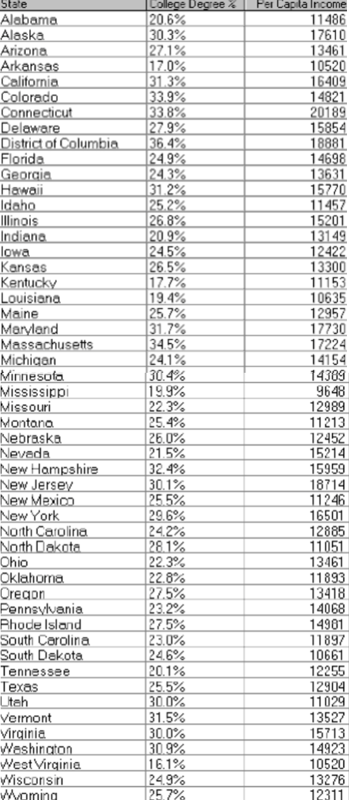
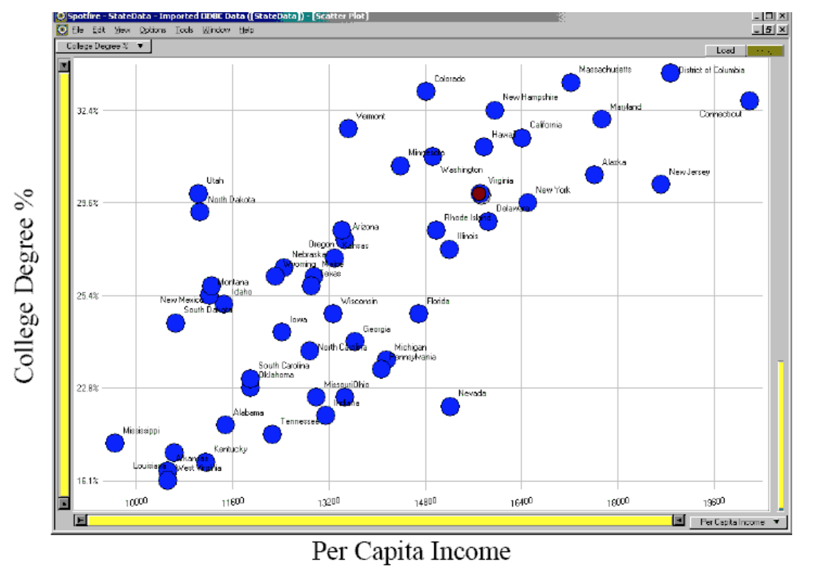 
(Example by [Marti Hearst](http://en.wikipedia.org/wiki/Marti_Hearst))
- Graphs reveal data that statistics may not
> **Example**: [Anscombe's quartet](http://en.wikipedia.org/wiki/Anscombe's_quartet) 



Simple summary statistics are all identical for four datasets
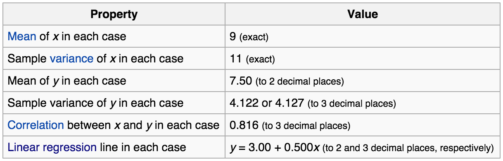
However, the four datasets vary considerably when graphed
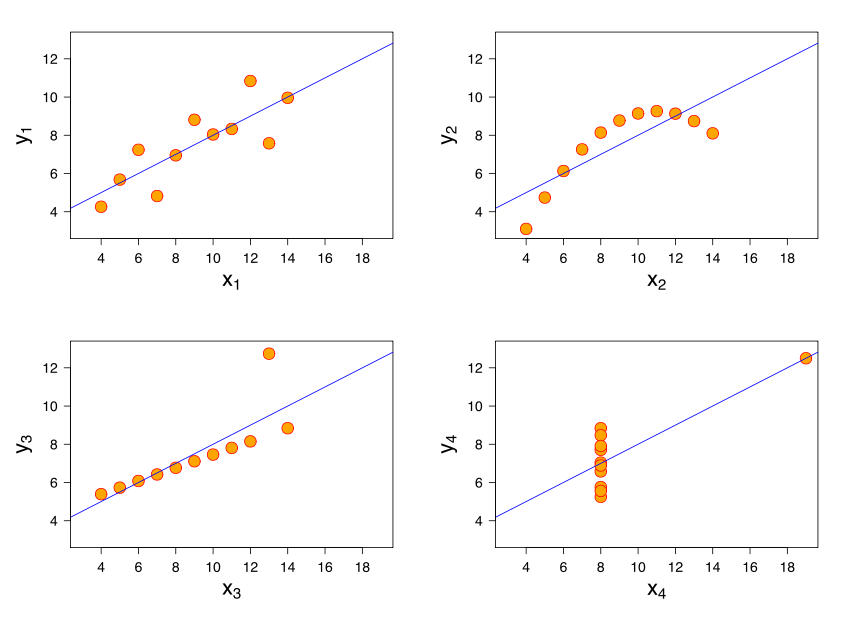

## Data visualization process

1. Classify datatypes
    - Nominal (ex: fruits - apples, oranges, ...)
        - Operations: ==, !=
    - Ordinal (ex: quality of meat - grade A, AA, AAA, ...)
        - Operations: ==, !=, <=, >=
    - Quantitative
        - Interval (ex: dates - May 1st, 2015, location - LAT 38.9 LON 127)
            - Only differences may compared
            - Operations: ==, !=, <=, >=, -
        - Ratio (ex: length - 160cm)
            - Origin is meaningful
            - Operations: ==, !=, <=, >=, -, /
1. Map datasets to visual attributes that represent data types most effectively (also known as *data encoding*)
    - Bertin's visual variables (Bertin, *Semiology of Graphics*, 1967|1983)
        

        

        - Position
        - Size
        - Value
        - Texture
        - Color
        - Orientation
        - Shape
        

        

        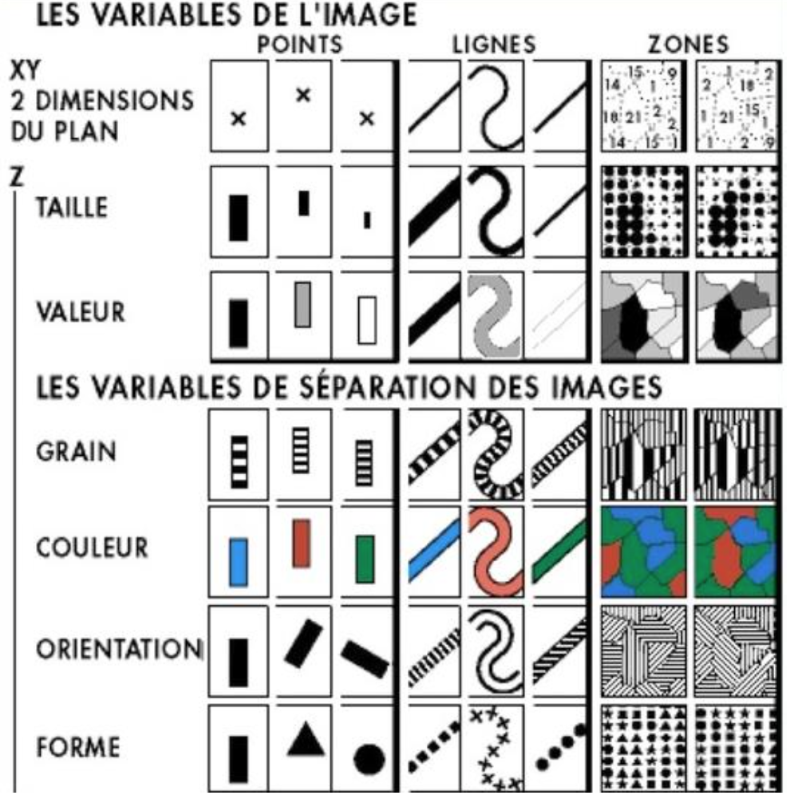
        

        

# Data encoding
- Objective
    - Assume 7 visual encodings and n data attributes
    - Pick the best encoding from the exponential number of possibilities
- Principle of Consistency
    - The properties of the image (visual variables) should match the properties of the data
- Principle of Importance Ordering
    - Encode the most important information in the most effective way
- Mackinlay’s expressiveness criteria
    - A set of facts is expressible in a visual language if the sentences (i.e. the visualizations) in the language express all the facts in the set of data, and only the facts in the data. 
- Mackinlay’s effectiveness criteria
    - A visualization is more effective than another visualization if the information conveyed by one visualization is more readily perceived than the information in the other visualization. 
    
    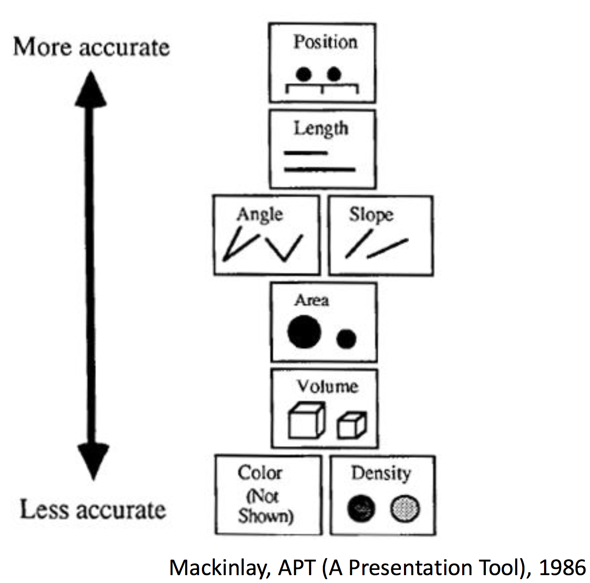
- Bertin's visual variables and their syntactics. Figure derived from Bertin (1967|1983), MacEachren (1995), and MacEachren et al. (2012) 
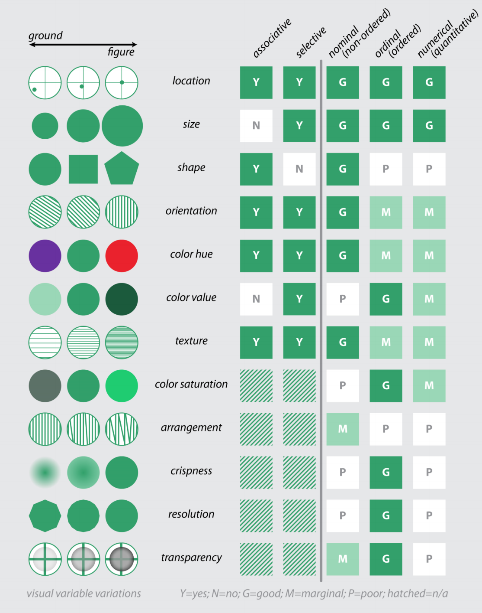

## Data combinations and dimensions

### Univariate data (1D)

1. Line plot 
1. Bar plot 
1. Box-and-whisker plot 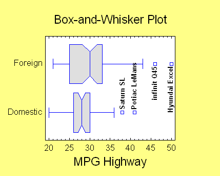

### Bivariate data (2D)

1. 2D scatter plot 

### Trivariate data (3D)

1. Use 3D scatter plot 
1. Map two variables [x, y] in 2D space + Map third variable [z] with another visual attribute (ex: color, shape, size) 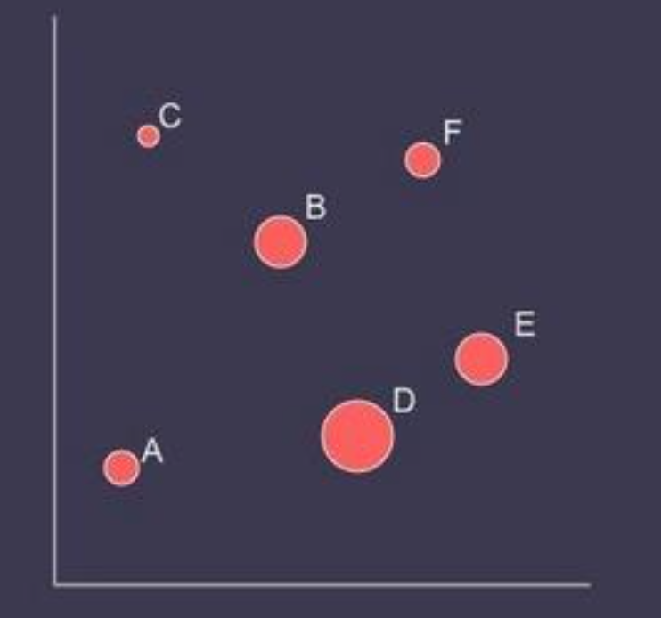

### Multivariate data (>3D)

- How many variables can be depicted in a image?

> "With up to three rows, a data table can be constructed directly as a single image. However, an image has only three dimensions. And this barrier is impassible." -- Bertin

## Examples
### [Iris dataset](http://en.wikipedia.org/wiki/Iris_flower_data_set)
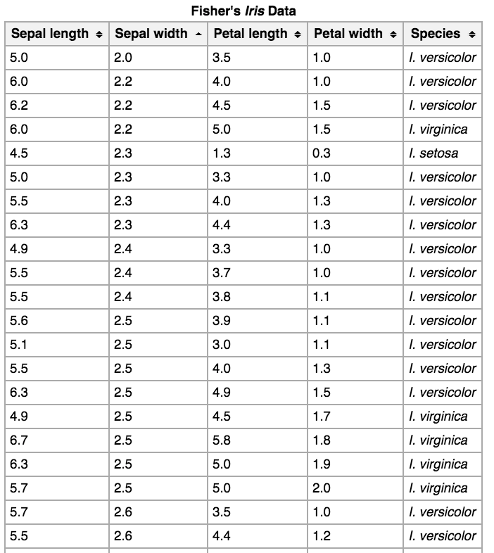

### [How to lie with visualization](http://data.heapanalytics.com/how-to-lie-with-data-visualization/)

1. Truncated Y-Axis 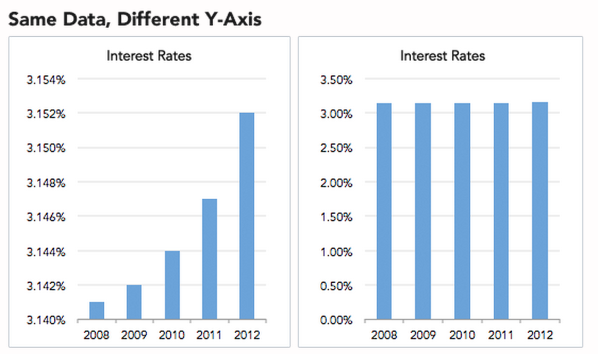
1. Cumulative graphs 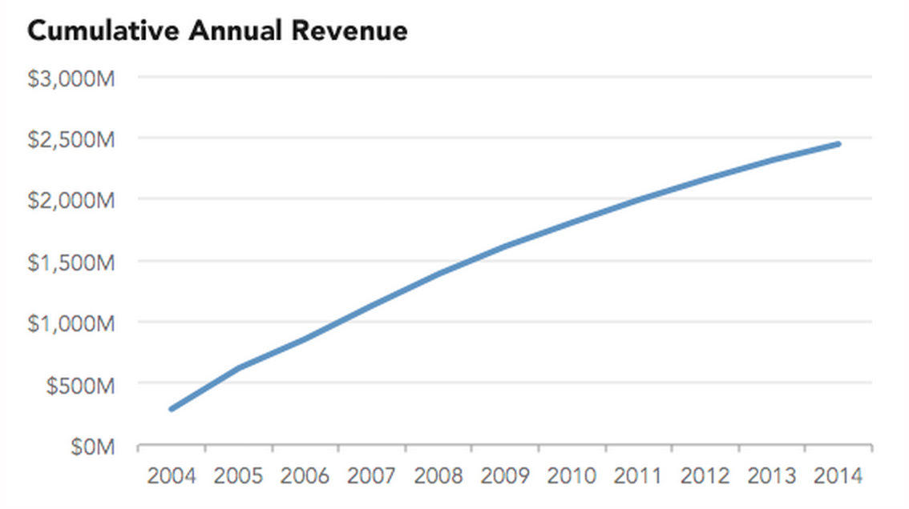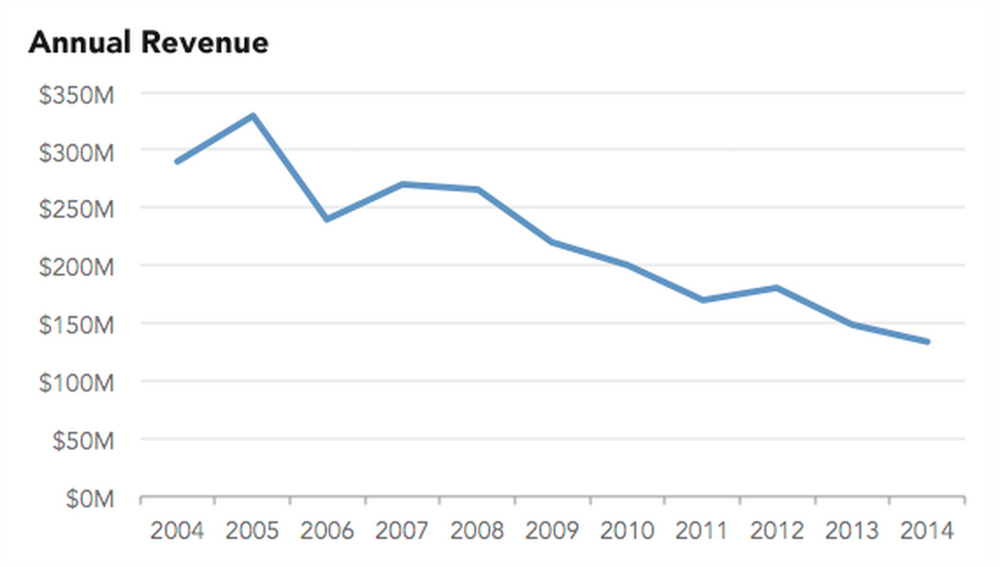
1. Ignoring conventions 
1. For more, see [WTF visualizations](http://viz.wtf/)

### Awesome visualization examples

1. Words 
1. Web pages
    - [http://internet-map.net/](http://internet-map.net/)
1. World refugees
    - [http://www.therefugeeproject.org/](http://www.therefugeeproject.org/)
1. Movie revenues
    - [http://www.nytimes.com/interactive/2008/02/23/movies/20080223_REVENUE_GRAPHIC.html](http://www.nytimes.com/interactive/2008/02/23/movies/20080223_REVENUE_GRAPHIC.html)
1. Others
    - [http://infosthetics.com/](http://infosthetics.com/)
    - [http://www.visualcomplexity.com/](http://www.visualcomplexity.com/)
    - [http://datavisualization.ch/showcases/](http://datavisualization.ch/showcases/)

## In-class Practice: Worldwide Disasters (1900-2008)

- Visualize with the data below 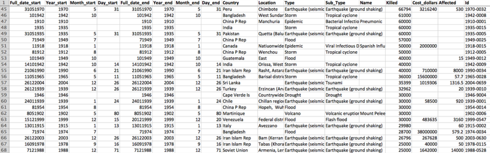
- Evaluation
    - Expressiveness
        - Do the mappings show the facts and only the facts?
        - Are visual mappings consistent? (e.g., respect color mappings)
    - Effectiveness
        - Are perceptually effective encodings used?
        - Are the most important data mapped to the most effective visual variables?
    - Cognitive Load (Efficiency)
        - Are there extraneous (unmapped) visual elements?
    - Data Transformation
        - Are transformations (filter, sort, derive, aggregate) appropriate?
    - Guides (Non-Data Elements)
        - Descriptive, consistent: Title, Label, Caption, Source, Annotations
        - Meaningful references: Gridlines, Legend 

## References
- http://selection.datavisualization.ch/
- [Chart and image gallery: 30+ free tools for data visualization and analysis](http://www.computerworld.com/article/2506820/business-intelligence-chart-and-image-gallery-30-free-tools-for-data-visualization-and-analysis.html)
- [NYT the year in graphics: 2012](http://www.nytimes.com/interactive/2012/12/30/multimedia/2012-the-year-in-graphics.html)
- [NYT the year in graphics: 2014](http://www.nytimes.com/interactive/2014/12/29/us/year-in-interactive-storytelling.html)
- Many contents in courtesy of [Cecilia Aragon](https://faculty.washington.edu/aragon/) and [Maneesh Agrawala](http://vis.berkeley.edu/~maneesh/)
