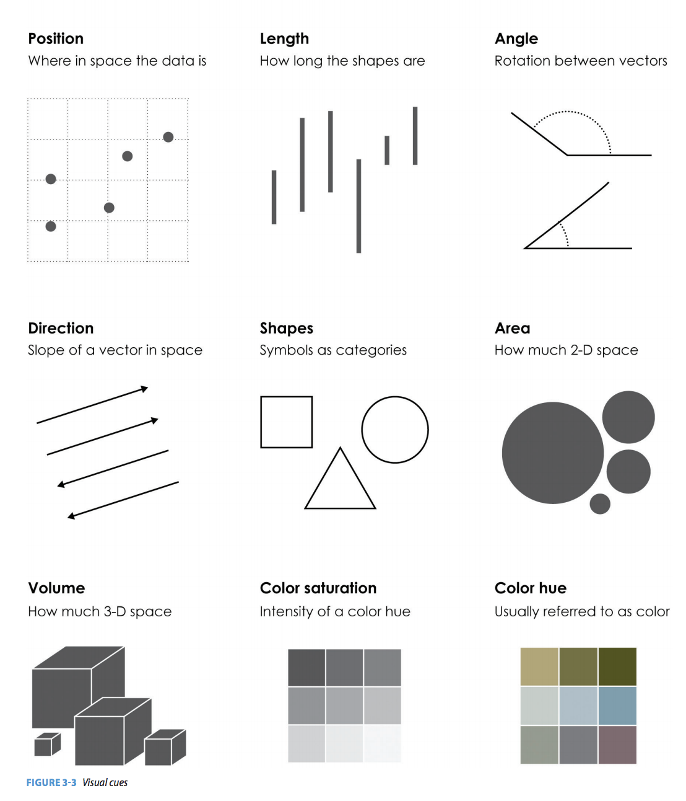

Title: Visualization
Date: 2015-05-08
Tags: lectures
Courseid: 2015-ba
Toc: True

 ([source](http://www.marketingdistillery.com/2014/08/30/data-science-skill-set-explained/))

## [Review] Data visualization

### Data types

- Nominal, ordinal, quantitative

### Visual variables 

- Comparisons

(Source: Nathan Yau, [Data points](http://flowingdata.com/data-points/DataPoints-Ch3.pdf))

### Data visualization patterns

(Source: Joel Laumans, [An introduction to visualizing data](http://piksels.com/wp-content/uploads/2009/01/visualizingdata.pdf))

## Map visualizations (Geomapping)

### Projections

 
 
 
(Source: [Jason Davies](http://www.jasondavies.com/maps/))

### Visual variables for spatial data

### Examples
#### Dot map: A dot for every data point

([source](http://bl.ocks.org/e9t/ba9edd99793a5c91eaab))

> How to lie with a dot map 
>  
> (Source: [xkcd](http://xkcd.com/1138/))

#### Choropleth map: Attribute uniformly distributed in region

([source](http://bl.ocks.org/mbostock/4060606))
([source](http://bl.ocks.org/e9t/55699e9fa8c3eb7fe40c))

> How to lie with a choropleth 
>  
> (Source: [Huffington Post](http://elections.huffingtonpost.com/2012/results))

#### Cartograms: Size of region scaled to attribute value

(Source: Shawn Allen, [Cartograms with d3 & TopoJSON](http://prag.ma/code/d3-cartogram/#intlmig/2011))

<!--
#### Others
 ([source](http://www.biz-gis.com/index.php?mid=GIS_Essay&document_srl=60689&sort_index=readed_count&order_type=asc)) 
 ([source](http://powertothepeople.kr/comm/bbs/board.php?bo_table=news&wr_id=374&page=5)) 
-->

(Source: Maneesh Agrawala, [D3 Introduction](http://vis.berkeley.edu/courses/cs294-10-fa14/wiki/images/3/3f/Lec294-10-20141006.pdf), Mike Bostock, [D3 workshop](http://bost.ocks.org/mike/d3/workshop/))

## Visualization tools
### D3

- Go to [d3js.org](http://d3js.org/)

### MapBox

- Go to [MapBox](https://www.mapbox.com)

