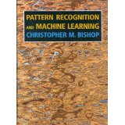
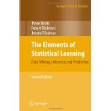
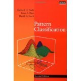
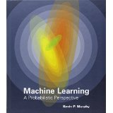
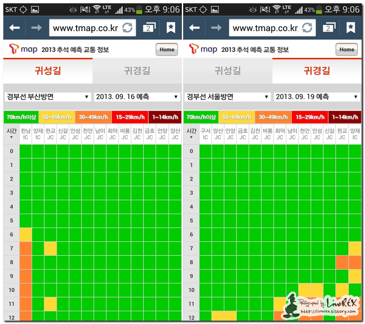
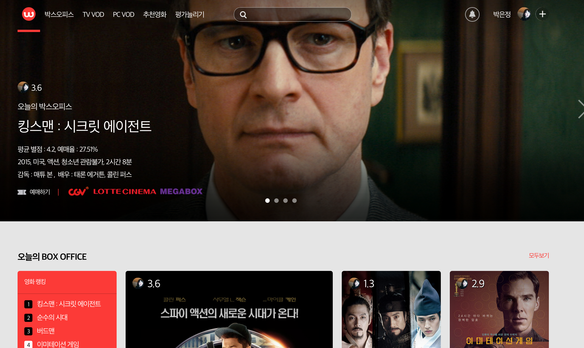
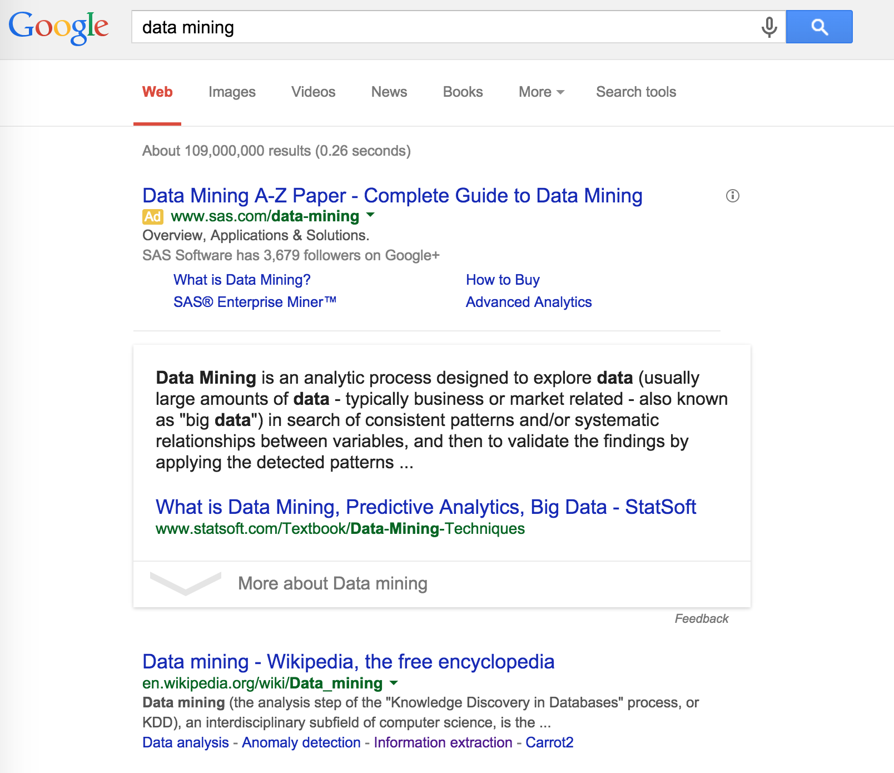
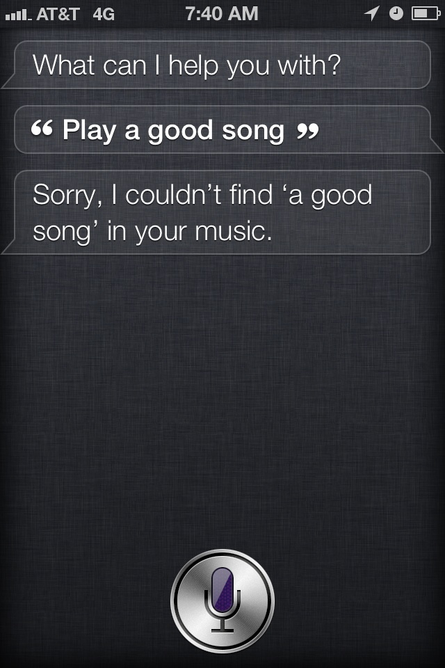
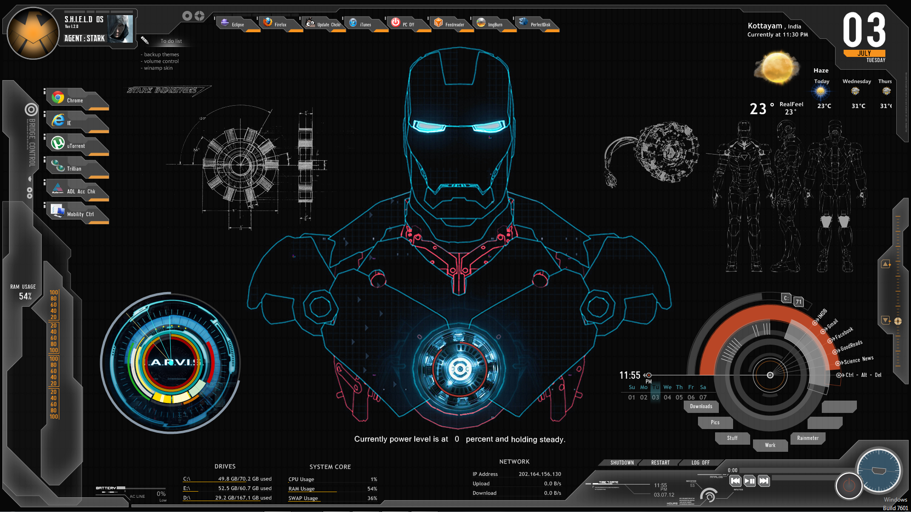

Title: 데이터마이닝을 소개합니다
Date: 2015-03-06 09:00
Tags: seoultech, lectures
Courseid: 2015-dm
Toc: True

> 이번 시간이 끝나고 나면:
> 데이터마이닝에 대해 정의할 수 있게 됩니다. 

## 한 마디로 "데이터마이닝"은?
**대용량의 데이터에 담긴 의미있는 규칙을 찾는 일**

그런데 [데이터마이닝(data mining)](http://en.wikipedia.org/wiki/Data_mining)은...

- 많은 자료 속에 숨어있는 일정한 패턴(규칙)을 발견하는 일이기에 [패턴인식(pattern recognition)](http://en.wikipedia.org/wiki/Pattern_recognition)의 영역과 맞닿아 있으며
- 컴퓨터를 학습(훈련)시키는 [기계학습(machine learning)](http://en.wikipedia.org/wiki/Machine_learning)과도 유사합니다
- 좀더 발전적인 개념으로는 [인공지능(artificial Intelligence)](http://en.wikipedia.org/wiki/Artificial_intelligence)도 있어요

2014년 기준 데이터마이닝, 패턴인식, 기계학습, 인공지능에 대한 구글 트렌드. 음? 그렇다면 <a href="http://www.google.com/trends/explore#q=data%20mining%2C%20pattern%20recognition%2C%20machine%20learning%2C%20artificial%20intelligence%2C%20big%20data&cmpt=q&tz=">빅데이터(big data)</a>는? 데이터사이언스(data science)는?

이 영역들은 각기 다른 탄생 배경을 가지고, 엄밀하게는 철학과 목적이 상당히 다르기도 하지만, 방법론의 측면에서는 상당히 유사해서 각 영역끼리 서로 배우는 점도 많지요.
사실 공부도 같은 책으로 많이 해요.
(심도있는 공부를 원하시는 분들은 아래 책들도 한 번 찾아보세요!)

## 데이터가 우리 삶을 돕는 다섯 가지 방법

1. [미래 교통정보 예측: SK Planet T map](http://readme.skplanet.com/?p=8870) 
    

1. [영화 추천: Frograms Watcha](http://watcha.net) 
    

1. [문서 랭킹: Google](http://google.com) 
    

1. [음악 인식: Naver 앱 음악 및 와인라벨 인식](http://labs.naver.com/tech.html#multimedia_recognition) 
    

1. [질의응답 (QA): Apple Siri](https://www.apple.com/ios/siri/
) 
    
    
    

    cf. IBM Watson

## 데이터가 우리 삶을 바꿀 방법

1. Jarvis and Samantha 
    
    
    <!--
    <iframe width="560" height="315" src="https://www.youtube.com/embed/ZwOxM0-byvc" frameborder="0" allowfullscreen></iframe>
    -->
1. IOT 
    <iframe width="560" height="315" src="https://www.youtube.com/embed/NjYTzvAVozo?list=PLl-15sUN2G4eEY2VOqxMEazASNrlMF5FP" frameborder="0" allowfullscreen></iframe>

## 데이터마이너가 되면 좋은 점

- 세상의 다양한 면을, 다양한 관점에서 살펴볼 수 있습니다
    - 마케팅부터 시작해서,
    - 주가의 흐름을 예측하거나(금융),
    - DNA 분석이나 MRI 영상을 분석하기도 하며(의료),
    - 디지털 카메라에서 얼굴 인식(기계)을 하기도 합니다.
- 사실상 직업이 매일 바뀌는 것이나 다름없음
- 물론 그 외에도 우리가 상상할 수 있는 대부분의 영역에 데이터마이닝이 적용된다는 사실!

> 다음 시간 예고:
> 데이터마이닝을 할 때 가장 중요한 것은? Asking the right question.
