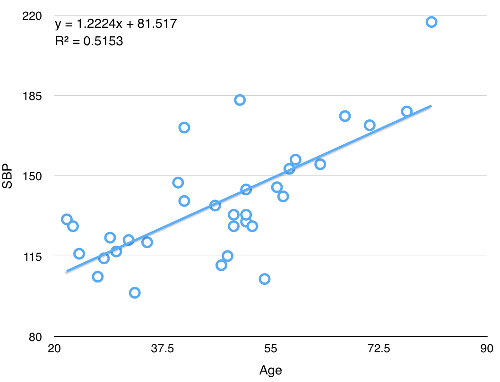
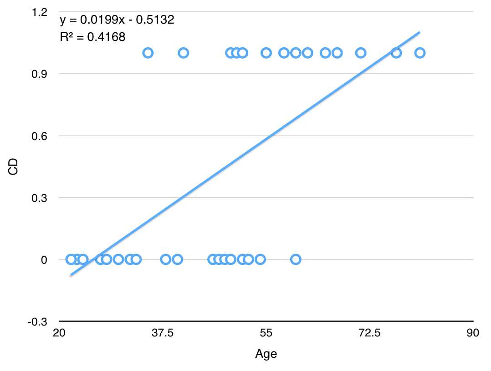

Title: Logistic regression
Date: 2015-03-20 09:00
Courseid: 2015-dm
Toc: True
Math: True

## 오늘의 목표

- MLR의 블랙박스 열어보기
- 로지스틱 회귀모형 개념 익히기
- 파이썬으로 실제 데이터 파일을 로딩하기

## Multiple linear regression (revisited)

- 지난 시간에 우리는 MLR(multiple linear regression)에 대해 배우고 파이썬으로 실제 데이터에 대해 모델을 구축해보았다
- 그런데 우리 컴퓨터는 MLR을 어떻게 학습했을까? (i.e., 파라미터 $b_j$들을 어떻게 추정했을까?)
- 이번 시간에는 MLR의 [블랙박스(black box)](http://en.wikipedia.org/wiki/Function_(mathematics)) 안에 무엇이 있는지를 보자. 
    
- Multiple linear regression? Fit a linear relationship between a quantitative dependent variable $y$ and a set of independent variables $x_1, x_2, ..., x_m$

    $$y = b_0 + b_1x_1 + b_2x_2 + ... + b_mx_m + \epsilon$$

    - $y$: output variable / dependent variable
    - $x_j$: $j$th input variable / independent variable
    - $b_j$: parameters / coefficients
    - $m$: Number of input variables/features
    - $\epsilon$: Observation noise

- ex: 33명 성인 여성의 나이와 수축혈압(SBP, systolic blood pressure) 

    

    
    

    

    
    

### OLS(ordinary least squares) for parameter estimation

- MLR의 파라미터 $b_j$들을 추정하기 위해서는 OLS를 사용한다
    - 정답과의 오차를 최소화한다는 의미
- Formulation
    - Hypothesis: $f(x) = b_0 + b_1x_1 + b_2x_2 + ... + b_mx_m$
    - Parameters: $b_0, b_1, ..., b_m$
    - Cost function: $J(b_0, b_1, ..., b_m) = \frac{1}{2n}\sum_{i=1}^{n}(f(x_1^{(i)}) - y^{(i)})^2$
        - The equation above is called the MSE(mean squared error, 오차의 제곱의 평균)
        - MSE 말고도 평균 오차(mean error), MAE, MAPE, RMSE 등을 사용할 수도 있다
            - Mean error: $\frac{1}{n}\sum_{i=1}^{n} (f(x_1^{(i)}) - y^{(i)})$
            - Mean absolute error (MAE): $\frac{1}{n}\sum_{i=1}^{n} |f(x_1^{(i)}) - y^{(i)}|$
            - Mean absolute percentage error (MAPE): $100 \times \frac{1}{n}\sum_{i=1}^{n} \frac{|f(x_1^{(i)}) - y^{(i)}|}{y^{(i)}}$
            - Root mean squared error (RMSE): $\sqrt{\frac{1}{2n}\sum_{i=1}^{n}(f(x_1^{(i)}) - y^{(i)})^2}$
        - 이 값은 작을수록 좋음. 즉, 좋은 MSE가 되게 하는 모델이 좋은 모델
        - 바꿔말하면 좋은 모델을 만들기 위해서는 작은 MSE가 되게 하면 됨
    - Goal: $arg \min J(b_0, b_1, ..., b_m)$
        - 즉, 비용 $J$를 최소화하는 $b_j (j=0, 1, ..., m)$를 찾자
- Solution
    - Numerical solution: [Gradient descent](http://en.wikipedia.org/wiki/Gradient_descent)
        - Local minimum을 찾기 위한 방법론
    - Analytical solution: Normal equation
        - Let $y = b_0 + b_1x_1 = X\beta$, then
            $$\beta = (X^TX)^{-1}X^Ty$$

## Logistic regression

- ex: 33명 성인 여성의 나이와 심장동맥병(CD, coronary heart disease) 발병 여부
    - `CD==1`: positive class (normally the minority class, 예측 대상, ex: 불량, 발병, 스팸 등)
    - `CD==0`: negative class (normally the majority class) 
    

        

        
        

        

        
        

    

    - 위와 같이 일반적인 linear regression 알고리즘을 fitting한 후 $f(x) = ax+b$에 대해 다음과 같은 모델을 추가할 수 있다
        - if $f(x) \geq 0.5$, then $\hat{y}=1$
        - if $f(x) \lt 0.5$, then $\hat{y}=0$
    - 하지만 이 방법은 두 가지 측면에서 적절하지 않다.
        1. [Outlier](http://en.wikipedia.org/wiki/Outlier)에 robust하지 못하다. 가령 나이가 1세이고 CD==0인 단 한 개의 점이 training set에 추가된다면 모델은 어떻게 바뀔까?
        2. 실제로 $y$값은 0, 1의 두 가지 값밖에 가지지 못함에도 불구하고, $-\infty < f(x) < \infty$ 여서 $f(x)$가 0과 1 사이의 값 뿐 아니라 1보다 크거나 0보다 작은 값도 가질 수 있게 된다. (이 때, 분류 오차도 엄청 커질 수 있다)
- Logistic Regression? Fit a linear relationship between a *categorical* dependent variable $y$ and a set of independent variables $x_1,x_2,...,x_m$
    - 주의: 이름에 등장하는 "regression"이라는 표현과는 달리 logisitic regression은 분류 문제를 풀기 위한 알고리즘!
- 목표: $0 \leq f(x) \leq 1$가 되는 $f(x)$를 만들어보자.
    - $f(x) = g(b_0 + b_1x_1 + ... + b_mx_m)$: Multiple linear regression에 함수 $g(x)$를 씌운 꼴
    - where $g(z) = \frac{1}{1+e^{-z}}$ ("logistic function" or "[sigmoid function](http://en.wikipedia.org/wiki/Sigmoid_function)")

    

### MLE(maximum likelihood estimation) for parameter estimation

TBD

## [Programming] Handling real datasets

- 예시: [관악구 신림동 지역의 부동산 가격](http://land.naver.com/article/articleList.nhn?rletTypeCd=A01&tradeTypeCd=&hscpTypeCd=&cortarNo=1162010200&mapLevel=10) 예측하기
- [들어가기 전 몇 가지 꿀팁](../tips/terminal.html)

### Data exploration



### Preprocessing

처음 데이터를 받고 나면 무엇부터 할 수 있을까?
다음은 실제 데이터를 다룰 떄 살펴보는 사항들이다.

1. 데이터가 크기가 얼마나 되는가?
1. $y$ 값으로 설정할만한 실수형 혹은 범주형 변수가 있는가?
1. Missing data가 있는가?
1. 변수의 종류는 무엇인가? 실수형? 범주형?
    - 범주형은 1-of-c 코딩 등의 방식으로 변환해주는 것이 일반적
1. 데이터는 어떻게 분할할까?
    - Training:Test=60:40이 일반적이기는 하지만 다른 방법은 없을까?
    - 10-fold cross validation

## Summary

- Linear regression models are very popular tools, for both explanatory modeling and prediction.
- A good predictive model has high predictive accuracy (to a useful practical level), precision, and recall.
- Predictive models are built using a training data set, and evaluated on a separate test data set.
- Removing redundant predictors is key to achieving predictive accuracy and robustness.
- Subset selection methods help find "good" candidate models. These should then be run and assessed.
