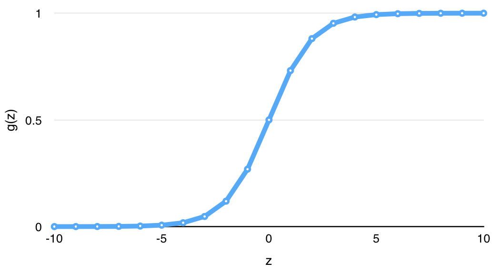
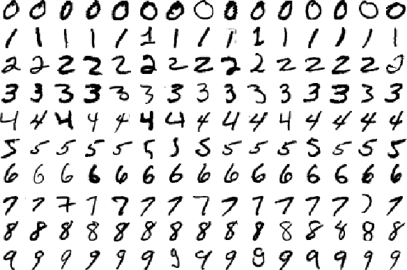
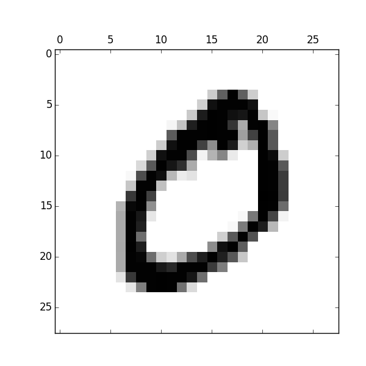
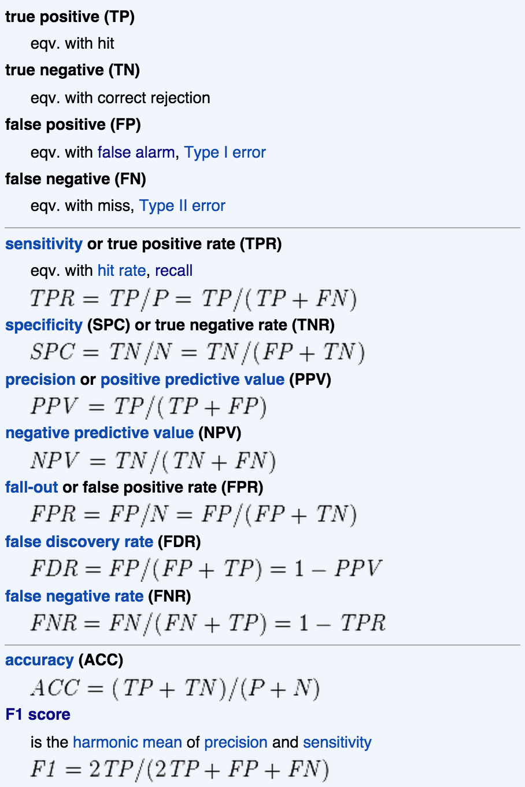

Title: Logistic regression
Date: 2015-03-20 09:00
Courseid: 2015-dm
Toc: True
Math: True

## 오늘의 목표

- MLR의 블랙박스 열어보기
- 로지스틱 회귀모형 개념 익히고 실제로 구현하기

## Multiple linear regression (revisited)

- 지난 시간에 우리는 MLR(multiple linear regression)에 대해 배우고 파이썬으로 실제 데이터에 대해 모델을 구축해보았다
- MLR은 실제로 기술 모델링, 설명 모델링 모두를 위해 인기있는 방법론이니 잘 알아두면 좋다.
- 그런데 우리 컴퓨터는 MLR을 어떻게 학습했을까? (i.e., 파라미터 $b_j$들을 어떻게 추정했을까?)
- 이번 시간에는 MLR의 [블랙박스(black box)](http://en.wikipedia.org/wiki/Function_(mathematics)) 안에 무엇이 있는지를 보자. 
    
- Multiple linear regression? Fit a linear relationship between a quantitative dependent variable $y$ and a set of independent variables $x_1, x_2, ..., x_m$

    $$y = b_0 + b_1x_1 + b_2x_2 + ... + b_mx_m + \epsilon$$

    - $y$: output variable / dependent variable
    - $x_j$: $j$th input variable / independent variable
    - $b_j$: parameters / coefficients
    - $m$: Number of input variables/features
    - $\epsilon$: Observation noise

- ex: 33명 성인 여성의 나이와 수축혈압(SBP, systolic blood pressure) 

    

    
    

    

    
    

### OLS(ordinary least squares) for parameter estimation

- MLR의 파라미터 $b_j$들을 추정하기 위해서는 OLS를 사용한다
    - 정답과의 오차를 최소화한다는 의미
- Formulation
    - Hypothesis: $f(x) = b_0 + b_1x_1 + b_2x_2 + ... + b_mx_m$
    - Parameters: $b_0, b_1, ..., b_m$
    - Cost function: $J(b_0, b_1, ..., b_m) = \frac{1}{2n}\sum_{i=1}^{n}(f(x_1^{(i)}) - y^{(i)})^2$
        - The equation above is called the MSE(mean squared error, 오차의 제곱의 평균)
        - MSE 말고도 평균 오차(mean error), MAE, MAPE, RMSE 등을 사용할 수도 있다
            - Mean error: $\frac{1}{n}\sum_{i=1}^{n} (f(x_1^{(i)}) - y^{(i)})$
            - Mean absolute error (MAE): $\frac{1}{n}\sum_{i=1}^{n} |f(x_1^{(i)}) - y^{(i)}|$
            - Mean absolute percentage error (MAPE): $100 \times \frac{1}{n}\sum_{i=1}^{n} \frac{|f(x_1^{(i)}) - y^{(i)}|}{y^{(i)}}$
            - Root mean squared error (RMSE): $\sqrt{\frac{1}{2n}\sum_{i=1}^{n}(f(x_1^{(i)}) - y^{(i)})^2}$
        - 이 값은 작을수록 좋음. 즉, 좋은 MSE가 되게 하는 모델이 좋은 모델
        - 바꿔말하면 좋은 모델을 만들기 위해서는 작은 MSE가 되게 하면 됨
    - Goal: $arg \min J(b_0, b_1, ..., b_m)$
        - 즉, 비용 $J$를 최소화하는 $b_j (j=0, 1, ..., m)$를 찾자
- Solution
    - Numerical solution: [Gradient descent](http://en.wikipedia.org/wiki/Gradient_descent)
        - Local minimum을 찾기 위한 방법론
    - Analytical solution: Normal equation
        - Let $y = X\beta$, then
            $$\beta = (X^TX)^{-1}X^Ty$$

## Logistic regression

- ex: 33명 성인 여성의 나이와 심장동맥병(CD, coronary heart disease) 발병 여부
    - `CD==1`: positive class (normally the minority class, 예측 대상, ex: 불량, 발병, 스팸 등)
    - `CD==0`: negative class (normally the majority class) 
    

        

        
        

        

        
        

    

    - 위와 같이 일반적인 linear regression 알고리즘을 fitting한 후 $f(x) = ax+b$에 대해 다음과 같은 모델을 추가할 수 있다
        - if $f(x) \geq 0.5$, then $\hat{y}=1$
        - if $f(x) \lt 0.5$, then $\hat{y}=0$
    - 하지만 이 방법은 두 가지 측면에서 적절하지 않다.
        1. [Outlier](http://en.wikipedia.org/wiki/Outlier)에 robust하지 못하다. 가령 나이가 1세이고 CD==0인 단 한 개의 점이 training set에 추가된다면 모델은 어떻게 바뀔까?
        2. 실제로 $y$값은 0, 1의 두 가지 값밖에 가지지 못함에도 불구하고, $-\infty < f(x) < \infty$ 여서 $f(x)$가 0과 1 사이의 값 뿐 아니라 1보다 크거나 0보다 작은 값도 가질 수 있게 된다. (이 때, 분류 오차도 엄청 커질 수 있다)
- Logistic Regression? Fit a linear relationship between a *categorical* dependent variable $y$ and a set of independent variables $x_1,x_2,...,x_m$
    - 주의: 이름에 등장하는 "regression"이라는 표현과는 달리 logisitic regression은 분류 문제를 풀기 위한 알고리즘!
    - logistic regression = logit regression == maximum-entropy classification (MaxEnt) == log-linear classifier
- 목표: $0 \leq f(x) \leq 1$가 되는 $f(x)$를 만들어보자.
    - $f(x) = g(b_0 + b_1x_1 + ... + b_mx_m)$: Multiple linear regression에 함수 $g(x)$를 씌운 꼴
    - where $g(z) = \frac{1}{1+e^{-z}}$ ("logistic function" or "[sigmoid function](http://en.wikipedia.org/wiki/Sigmoid_function)")

    

### MLE(maximum likelihood estimation) for parameter estimation

- MLE를 알기 위해서는 먼저 likelihood의 개념을 아는 것이 중요하다.
- likelihood의 개념을 알기 위해서는 [Bayesian 통계](https://sites.google.com/site/lucyparklab/4-discussions/bayesian)를 아는 것이 중요하다.
    - $p(x \vert y)$: 사후확률(posterior)
    - $p(y \vert x)$: 우도(likelihood)
    - $p(x)$: 사전확률(prior)
    - $p(y)$: 증거(evidence)

$$p(x|y) = \frac{p(y|x)p(x)}{p(y)}$$

- 이 likelihood $p(y|x)$에 log를 씌우면 log likelihood가 되고 logistic regression에서는 log likelihood를 $w$에 대해 편미분하여 최대화하는 방식으로 파라미터를 구한다.

$$L(w) = \sum_{i=1}^{n} \log{p(y|x)} = \sum \log{g(x, w)^{y}} + (1-g(x, w))^{1-y}$$

where $g(x, w) = \frac{1}{1+\exp{-wx}}$

- 마지막으로 gradient decent를 사용하며 update rule은 $w \leftarrow w + \nu \sum(y-g(x,w))x$이다.
- 식 유도 과정은 [이 문서](http://web.engr.oregonstate.edu/~xfern/classes/cs534/notes/logistic-regression-note.pdf) 참고

## [Programming] Logistic regression with scikit-learn

- [먼저 시작하기 전에 터미널 프로그래밍을 위한 몇 가지 tip](../tips/terminal.html)

### 1. Data acquisition

- 오늘도 지난 시간처럼 데이터 파일을 직접 구해서 로딩하기보다는 편의를 위해 scikit-learn 패키지를 이용해보자.
    - 단, 이번에는 원래 scikit-learn 패키지에 포함되어 있는 데이터가 아니라 scikit-learn의 [`datasets.fetch_mldata()`](http://scikit-learn.org/0.12/modules/generated/sklearn.datasets.fetch_mldata.html) 메소드를 이용해서 [mldata.org](http://mldata.org)에 있는 데이터셋을 받아올 것이다.
    - 그 밖에도 scikit-learn을 통해 접근하거나 다운로드 받을 수 있는 데이터셋에 관해서는 [이 링크](http://scikit-learn.org/stable/datasets/)를 참고하자.
- 이번에 우리가 사용할 데이터셋은 머신러닝계에서 아주 유명한 [MNIST 데이터](http://yann.lecun.com/exdb/mnist/)이다.
    - 이 데이터셋은 너비 28픽셀, 높이 28픽셀로 된 숫자 필기 이미지 70,000장에 대한 데이터이다.
    - 오늘 풀어볼 문제는, "임의의 숫자 필기 이미지를 입력받았을 때 컴퓨터가 어떤 숫자에 대한 이미지인지 알게 할 수 있는가?" 즉, 필기 인식이다.
    - 사실은 사람들도 꾸준한 "학습(learning)"을 통해 생성된 "분류기"를 이용해 숫자를 분류한다. 
    
- 이제 데이터를 다운로드 받아보자. [`datasets.fetch_mldata()`](http://scikit-learn.org/stable/datasets/#downloading-datasets-from-the-mldata-org-repository) 메소드에
우리가 받고 싶은 데이터의 이름 'MNIST original'를 명시한 후,
데이터를 저장할 곳 `data_home`을 현재 디렉토리(`.`)로 정해주면 데이터가 다운로드 된 후 바로 변수 `d`로 로드(load)된다.

        :::python
        from sklearn import datasets
        d = datasets.fetch_mldata('MNIST original', data_home='.')

    - `data_home`은 얼마든지 다른 디렉토리로 지정해줘도 된다.
    - 한번 데이터를 다운받고 나서 같은 명령어를 재실행하면 다운로드 없이 바로 데이터가 로드된다.
- 이번에도 변수 `d`는 dictionary 형태로 되어 있으며, [지난 시간에 살펴보았던 당뇨병(diabetes) 데이터셋](multiple-linear-regression.html#programming-slr-mlr-with-scikit-learn)과 마찬가지로 dictionary를 구성하는 key, value 중 'data', 'target'라는 key를 비롯하여 'COL_NAMES', 'DESCR' 등의 key도 있다.
(이 key들이 어떤 value를 담고 있는지 궁금하다면 출력해보자.)

- 여기서는 곧바로 당뇨병 데이터와 마찬가지로 'data' key의 value를 `X`에, 'target' key의 value를 `y`라는 변수에 저장하고,

        :::python
        print(d.keys())     # python shell에서 실행하는 경우 `print()`는 필요없음
        X = d['data']
        y = d['target']

- `X`, `y`의 차원(dimension)을 확인해보자.

        :::python
        print(type(X), type(y)) # check data type of variable X, y
        print(X.shape, y.shape) # returns (70000, 784) (70000,)

    - 출력된 결과를 보니 `X`에는 70,000개의 record(row)와 784개의 attribute(column, variable)가 있고, `y`는 70,000개의 record로 구성된 1차원 데이터라고 한다.
    - 또, 넘어가기 전에 **X의 record수와 y의 record 수가 일치**하고 **y는 1차원**임을 반드시 확인하고 넘어가자.  위의 두 가지 사항이 맞지 않는다면 꽤 골치 아파질 것이다.
(왜 그럴까? 각자 생각해보자.)
    - 한편, 여기서 사용하는 `shape`는 numpy의 `ndarray`나  pandas의 `DataFrame` 등 특정 데이터 타입을 사용할 때만 적용할 수 있다는 점을 알아두면 좋다.
(즉, 파이썬의 `list` 데이터 타입을 사용할 때는 `shape`를 사용할 수 없는데, 무슨 말인지 모르겠으면 일단 넘어가자. 다음에 이런 일이 발생하게 된다면 어차피 에러가 뜰테니까.)

### 2. Data exploration

처음 데이터를 받고 나면 무엇부터 할 수 있을까?
바로 데이터 학습? 아니다.
다음은 실제 데이터를 다룰 떄 살펴보는 사항들이다.

1. 데이터가 크기가 얼마나 되는가? (용량, 행/열 차원 수)
1. $y$ 값으로 설정할만한 실수형 혹은 범주형 변수가 있는가?
1. Missing data가 있는가?
1. 변수의 종류는 무엇인가? 실수형? 범주형?
    - 범주형은 1-of-c 코딩 등의 방식으로 변환해주는 것이 일반적
1. 데이터는 어떻게 분할할까?
    - Training:Test=60:40이 일반적이기는 하지만 다른 방법은 없을까?
    - [10-fold cross validation](http://en.wikipedia.org/wiki/Cross-validation_(statistics))

우리도 본격적으로 logistic regression 알고리즘으로 분류 모델을 만들기 전에 우리가 가진 데이터를 이리저리 살펴보자.
Data exploration은 현재 가지고 있는 데이터를 이리저리 굴려가며 모양새를 확인하는 것이다.

- X, y는 각각 어떤 값들로 이루어졌는지 확인해보기 위해 X, y 각각의 첫번째 값을 출력해보자. (배열의 첫번째 index는 1이 아니라 0이라는 사실이 기억나는가?)

        :::python
        print(X[0])
        print(y[0])

- X는 특히 0과 256 미만의 숫자들로 구성이 되어 있는데 이것은 어떤 의미를 가질까? (256이라는 숫자가 힌트!)

        :::python
        print(min(X[0]), max(X[0]))

- 쉽게 이해하기 위해 `matplotlib` 패키지를 이용해 첫 번째 record를 한 번 그려보자. (원래 matplotlib은 3rd party 패키지여서 따로 설치해야하지만, 다행히도 anaconda가 matplotlib을 미리 설치해줬다.)

        :::python
        from matplotlib import pyplot as plt
        X0 = X[0].reshape(28, 28)           # reshape 1*784 array to 28*28 array
        plt.rc('image', cmap='binary')      # set runtime configurations (rc) for color maps
        plt.matshow(X0)                     # plot matrix
        plt.savefig('X0.png')               # save plot to image file
        plt.show()                          # show plot on screen

    - 무슨 모양 같은가? 그렇다. 숫자 '0'이다. 
    - 그럼 `y[0]`의 값을 출력해보면? 마찬가지로 '0'이다. `y[0]`는 `X[0]`의 "정답"이다. 
    - 여유가 된다면 X, y의 첫번째 record가 아니라 42번째, 10000번째, 마지막 record 등도 그려보자.

- 이번에는 y가 어떤 값들을 가질 수 있는지 확인해보기 위해 다음을 입력해보자.

        :::python
        print(set(y))   # returns {0.0, 1.0, 2.0, 3.0, 4.0, 5.0, 6.0, 7.0, 8.0, 9.0}

    - [`set()`](https://docs.python.org/3/tutorial/datastructures.html#sets)은 파이썬에서 제공하는 기본 함수로, 배열을 입력받으면 unique한 값들을 반환한다.
        - 예를들어, [1,2,3,2,2,1,1,1,3,1,1]이라는 배열을 입력받았을 때 [1,2,3]을 반환한다.

- 우리가 하려는 것이 뭔지 대충 감이 잡히는가?
    - 우리는 `X`에 손글씨로 숫자를 쓴 필기 이미지와, `y`에 그 이미지의 label(정답)을 가지고 있으며 정답셋은 0-9까지의 숫자로 구성되어 있다.
    - 지난 시간에 다룬 당뇨병 데이터는 $y$가 실수형 벡터였던 것과 달리 이번 시간에 다루는 MNIST 데이터는 $y$가 범주형(categorical) 벡터이다. $y$가 실수형일 때는 regression problem이지만, $y$가 범주형일 때는 classification problem이다.
    - 보다시피 필기체 인식은, 가장 대표적인 분류 문제 중 하나이다. 
    

### 3. Data partitioning

- 이번에는 데이터를 partitioning 해보자.
    - 다시 한 번 얘기하지만, data partitioning은 **overfitting 방지, 일반화 성능 향상**을 위해 하는 것이다.
    - Data partitioning의 의미를 잊었다면 [이 곳](multiple-linear-regression.html#data-partitioning)에 가서 복습하고 오자.
     데이터로 컴퓨터를 학습시킬 때 가장 중요한 개념 중 하나이니 반드시 익혀둬야 한다.
- 당뇨병 데이터셋에서는 X, y를 단순한 list split을 통해 440개 record 중에서 400개를 training set, 40개를 test set으로 설정했다.
이번에는 record가 70,000개인데, 어떻게 나누는 것이 좋을까?

        :::python
        from sklearn import cross_validation
        X_train, X_test, y_train, y_test = cross_validation.train_test_split(X, y, test_size=0.4, random_state=1234)

    - 다시 list split을 사용해도 되지만, 이번에는 scikit-learn에서 제공하는 [`train_test_split()`](http://scikit-learn.org/stable/modules/generated/sklearn.cross_validation.train_test_split.html)을 써보자.
    - 이 메소드는 데이터를 비율에 맞게 랜덤 샘플링(random sampling)해준다는 점에서 단순히 list split을 하는 것보다 바람직하다. 왜일까? `y`의 값들이 오름차순으로 정렬되어 있기 때문이다.
    - `test_size` 파라미터는 test set의 비율이다. 0.4로 했으니 training set은 0.6이 될 것이고, 따라서 test set에는 70,000의 40%인 28,000개의 record가 random으로 selection돼서 들어간다. 이 값을 명시해주지 않으면 scikit-learn v0.15.2를 기준으로 test set이 0.25, training set이 0.75가 된다.
    - `random_state`는 랜덤 샘플링할 때 사용하는 seed이다.
    이 seed를 같은 숫자로 설정해주면 같은 결과를 얻게 되고, 설정해주지 않으면 실행할 때마다 다른 결과를 얻게 된다.
    실험 재현(reproduction)의 측면에서 random number를 generation하는 seed를 지정해주는 것은 아주 중요하다.
    여기서 사용한 1234가 아니라 51321, 0 등 어떤 숫자를 사용해도 되는데,
    중요한 것은 실험 조작 등을 방지하고, 누구라도 같은 코드를 돌렸을 때 동일한 실험 결과를
    낳을 수 있게 하기 위해 가급적이면 명시하는 것이 좋다.
    - 또, 여기서 사용한 서브패키지 `cross_validation`은 사실 단순히 데이터를 두 개의 파티션으로 나누는 일 외에도 중요한 일을 하는데, 아직은 몰라도 되지만 곧 학기 중에 반드시 다루게 될 중요한 개념이니 이름을 익혀두도록 하자.

### 4. Training

자, 이제 드디어 로지스틱 회귀분석 모델을 학습해보자!
고맙고 신기하게도 scikit-learn 패키지를 이용하면 모델 학습은 단 세 줄만에 끝난다.
(물론 내부에는 누군가가 이미 고생해서 짜놓은 어마어마한 "black box"가 존재한다는 것을 잊지 말자.)
MLR을 학습할 때와 마찬가지로 LogisticRegression 클래스를 import한 후, instance를 생성하고, training set으로 모델을 학습하면 된다

    :::python
    from sklearn.linear_model import LogisticRegression
    lr = LogisticRegression(random_state=1234)      # LR instance 생성
    lr.fit(X_train, y_train)                        # LR 학습

- 그런데... 결과가 뜨지 않는다.
컴퓨터가 먹통됐나? 아니다. 실제로 컴퓨터는 엄청 열심히 돌고 있다.
- 당뇨병 데이터로 MLR을 돌릴 때는 뭔가 돌긴 돌았나 싶을 정도로 빨리 끝났지만,
이번에는 경우가 다르다.
- 데이터 개수도 440개에서 70,000개로 늘어난데다가 무엇보다 차원의 수가 10개에서 784개로 늘어났다.
    - 데이터 크기가 10배가 증가했다고 해서 학습/처리 시간이 10배만큼 늘어나는 것이 아니라, 때로는 100배, 1000배씩 증가할 때도 있다.
    - 특히 차원의 개수가 늘어날 때 우리는 [차원의 저주(curse of dimensionality)](http://en.wikipedia.org/wiki/Curse_of_dimensionality)를 겪는다고 말한다.
    - 학습은 아니지만 계산 속도가 기하급수적으로 증가하는 간단한 실험: `sum(range(10**7))`, `sum(range(10**8))`, `sum(range(10**9)`의 계산 속도를 비교해보자.
- 쿼드 코어 노트북 기준으로 이 로지스틱 회귀분석 모델을 학습하는데는 약 45분이 걸렸다. (..)
- 따라서 이 데이터 전체를 돌리는 것은 [숙제](assignments.html#assignment-1-classification)다.

실제로 데이터로 좋은 모델은 학습 **시간**이 짧고 **성능(performance)**이 좋다.

어떻게 하면 빠르게 학습시킬 수 있는가? 어떻게 하면 더 좋은 성능을 낼 수 있는가?
이런 질문들은 데이터마이너들에게 아주 익숙한 질문이다.

그런데 여기서 끝내기엔 좀 아쉽지 않은가?
시간을 단축하기 위해 문제를 단순화 시키고, 하는 김에 csv에서 데이터 로딩하는 법을 익혀보자.

### 5. 2범주 MNIST: 0과 1 구분하기

0, 1은 프로그래밍할 때 굉장히 중요한 숫자들이다.
이들만 골라서 2범주 분류 문제를 한 번 풀어보자.
편의를 위해 [이 변환 파일](https://gist.github.com/e9t/5d4c2b48d8eca8c662ef#file-mnist_binarize-py)을 이용해 10 class, 70000 row의 MNIST dataset을
2 class, 14780 row의 데이터셋으로 변환했다.

먼저 데이터셋을 다운로드 받은 후, csv 파일을 열어 데이터 모양을 확인해보자.
(csv 파일은 엑셀로 열 수 있는 spreadsheet 형태의 데이터이며 comma-separated-values의 약자이다.)

- X: [lucypark.kr/courses/2015-dm/data/mnist-x-bin.csv](data/mnist-x-bin.csv)
- y: [lucypark.kr/courses/2015-dm/data/mnist-y-bin.csv](data/mnist-y-bin.csv)

다음으로 아래 코드를 이용해 csv 데이터를 로딩해보자.

여기서는 numpy의 [`genfromtxt()`](http://docs.scipy.org/doc/numpy/reference/generated/numpy.genfromtxt.html)를 써서 csv 파일을 로딩해보자.
파일에서 데이터 로딩하는 것도 그리 어렵지 않다!

    :::python
    from numpy import genfromtxt
    X_bin = genfromtxt('mnist-x-bin.csv', delimiter=',')
    y_bin = genfromtxt('mnist-y-bin.csv', delimiter=',')

> 참고: pandas 패키지의 `read_csv()`를 이용하면 더 간판하고 빠르게 csv 데이터를 읽을 수 있다.
pandas는 파이썬에서 DataFrame 등을 이용하여 구조적 데이터를 편리하게 분석할 수 있게 해주는 인기있는 도구이다. 관심있다면 검색해보자.

자, 이제 여러번 반복했듯 data partitioning, 그리고 model fitting(==training)을 해서 `lr2`이라는 이름으로 저장하자.  
(이 부분은 설명을 생략)

모델을 학습한 다음에는 무엇을 해야할까?
성능을 측정하기 위해 시험을 봐야지! (Testing phase)
Training 데이터와 test 데이터 모두의 정확도를 도출해보자.

    :::python
    print(lr2.score(X_bin_train, y_bin_train))
    print(lr2.score(X_bin_test, y_bin_test))

사실 분류 문제는 정확도 말고도 precision, recall, f-measure 등의 지표가 있다.
아래는 이들 지표에 대한 목록이다. (참고: [Precision and recall](http://en.wikipedia.org/wiki/Precision_and_recall))

이 값들은 [precision_recall_fscore_support()](http://scikit-learn.org/stable/modules/generated/sklearn.metrics.precision_recall_fscore_support.html)을 이용해서 구할 수 있다.

    :::python
    from sklearn.metrics import precision_recall_fscore_support
    y_bin_pred = lr2.predict(X_bin_test)
    precision_recall_fscore_support(y_bin_test, y_bin_pred, average='macro')

성능 지표의 값들은 얼마가 나오는가?
괜찮은가?

### 6. 1범주 MNIST: 1-against-all

사실 우리가 애초에 풀려던 문제는 좀 어려운 문제였을 수 있다.
무려 10가지 숫자(digit) 중에서 맞는 숫자를 골라보라니!
(실제로 [2013년 기준 현대 AI의 수준은 4살짜리 꼬마의 지능과 유사하다](http://www.livescience.com/38310-ai-has-four-year-old-iq.html)고 한다)

이번에는 처음의 70000행의 MNIST 데이터셋을 그대로 사용하되
문제를 좀 단순화시켜서, 이미지에 등장한 숫자가 1인지 아닌지만 판단하는 모델 `lr1`을 만들어보자.
즉, 이 모델은 0, 2, 3, 4, ..., 9는 0(또는 False)을 반환하고, 1만 1(또는 True)을 반환하면 된다.
이렇게.

    :::python
    from sklearn.linear_model import LogisticRegression
    lr1 = LogisticRegression(random_state=1234)
    lr1.fit(X_train, y_train==1)

이제 accuracy, precision, recall, f-measure을 재보자.
성능이 어떤가? 학습 시간은?

> 참고: 
> 1. [Visualizing MNIST: An Exploration of Dimensionality Reduction](http://colah.github.io/posts/2014-10-Visualizing-MNIST/) 
> 2. [Classifying MNIST digits using Logistic Regression](http://deeplearning.net/tutorial/logreg.html) 
> 3. [Kaggle Digit Recognizer contest](https://www.kaggle.com/c/digit-recognizer)
