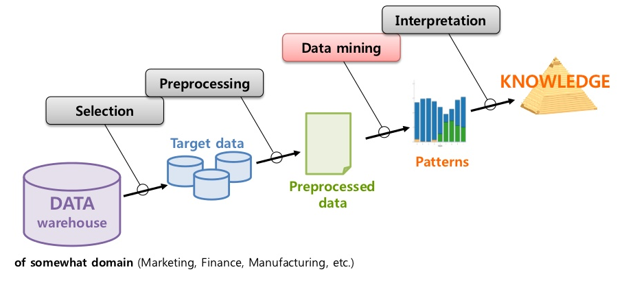
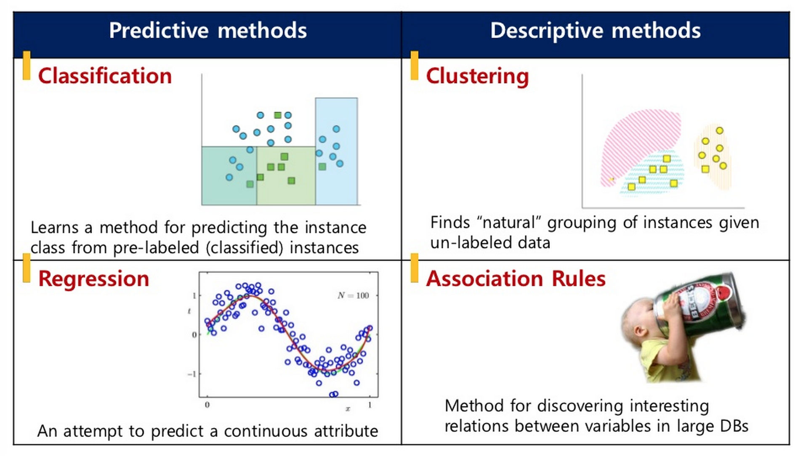
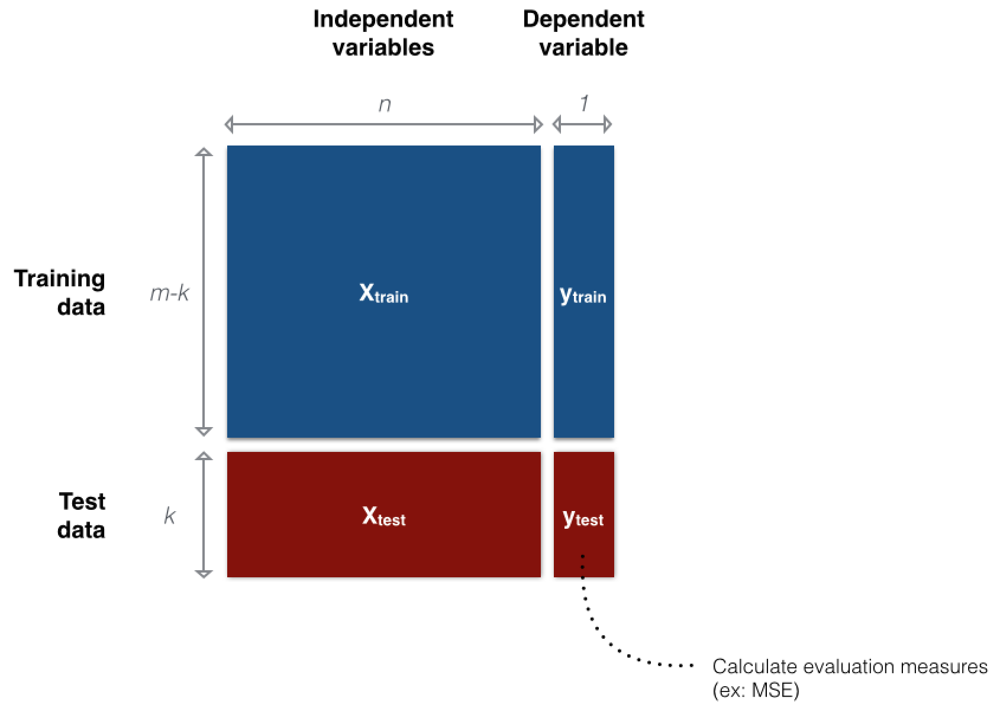
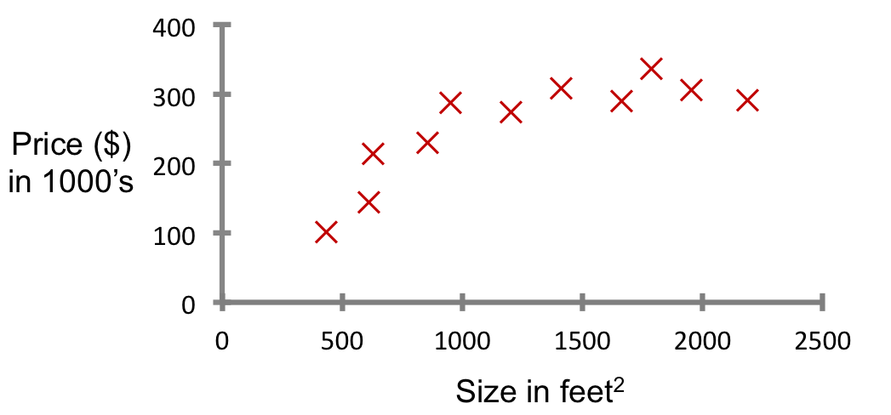

Title: Multiple linear regression
Date: 2015-03-13 09:00
Courseid: 2015-dm
Toc: True
Math: True
Modified: 2015-03-16 18:37

## 오늘의 목표
- 데이터마이닝 알고리즘의 분류
- Data partitioning 개념 익히기
- 그 외 데이터마이닝에서 빈번히 다루는 용어들 익히기
- 단변수, 다변수 선형회귀분석(linear regression)의 개념 익히고 파이썬으로 돌려보기

## Data mining process

1. Problem definition
1. Data acquisition and selection
1. Data exploration
1. Data preprocessing
1. Train and evaluate data mining model
1. Interpret results

### 목적에 따른 분류: Predictive methods vs Descriptive methods
- **Predictive modeling**
    - Predict the *future*
    - Identify strong links between variables of data
    - To predict the unknown consequence (dependent variable) based on the information provided (independent variable)
        - 과거를 통해 현재를 알고 미래를 내다보자
- **Descriptive modeling**
    - Look back to the *past*
    - To extract compact and easily understood information from large, sometimes gigantic databases

### 학습데이터에 따른 분류: Supervised learning vs Unsupervised learning
- **교사학습(Supervised learning)**
    - Goal: predict a single "target" or "outcome" variable $y$
        - Finds relations between $X$ and $y$: $y = f(x_1, x_2, ..., x_n) + \epsilon$
        - 입출력(input-output)의 쌍으로 구성된 training data로부터 입력을 출력을 사상하는 함수를 학습하는 과정
    - Method: *Learn* on training data, *score* on test data
        - 즉, 입력벡터를 $X$, 그에 대응하는 출력벡터(i.e., label)를 $y$라고 할 때, training data는 $D={(x, y)}$로 주어지게 되며, 모델은 이 training data에 기반하여 관측하지 않은 새로운 데이터 $x'$가 들어왔을 때 그에 해당되는 label, $y'$을 추론하는 방법을 배우게 된다
    - ex: 분류(classification)와 회귀분석(regression)
- **비교사학습(Unsupervised learning)**
    - Goal: Explore intrinsic characteristics of data $X$
    - Method: Estimate underlying distributions and/or segment data into meaningful groups or detect patterns
        - There is no target (outcome) variable to predict or classify
        - 출력값 없이 오직 입력값만 주어지며, 이러한 입력값들의 공통적인 특성을 파악하여 학습하는 과정
        - Training data는 $D={(x)}$로 주어지게 된다.
    - ex: 군집화(clustering), 밀도추정(density estimation), 차원축소(dimension reduction)
- cf. semi-supervised learning

### Data partitioning
- 데이터를 training data와 test data로 나누는 것
    - Training data: 모델 학습용
    - Test data: 모델 성능 측정용
- 보통은 60:40 정도로 데이터를 분할하지만, 보유하고 있는 데이터 규모에 따라 이 비율은 달라지기도 함
- 컴퓨터가 모델을 학습하고 평가 받는 것은, 교실에서 학생과 선생님 사이에서 발생하는 일과 매우 유사하다!
    - Training phase: 교사는 문제($X_{train}$)와 정답($y_{train}$)이 모두 포함된 training data를 이용해 컴퓨터를 훈련(training)시키고, 컴퓨터는 모델을 학습한다(learning).
    - Testing phase: 컴퓨터가 training data로 모델을 학습한 후에는 교사가 컴퓨터에게 정답($y_{test}$) 없이 문제($X_{test}$)만 포함된 시험(test data)을 전달한다. 이 때, 컴퓨터가 제출한 답안지($\hat{y}$)와 실제 정답($y_{test}$)간의 차이를 비교해서 오답/오류(error)가 얼마나 발생했는지 확인함으로써 모델의 성능/성적을 평가한다.
- 때로는 training data, validation data, test data 등 세 개의 그룹으로 데이터를 나누기도 함 (참고: [What is the difference between test set and validation set?](http://stats.stackexchange.com/questions/19048/what-is-the-difference-between-test-set-and-validation-set))

## Simple linear regression (SLR)

- Regression
    - 대표적인 교사학습(supervised learning) 방법론
        - "right answers" given
    - Predict continuous valued output
- Formulation
    - $x$: 독립변수(independent variable)
    - $y$: 종속변수(dependent variable)
    - $a, b$: 파라미터(parameters) or 계수(coefficients)
    - $\epsilon$: Observation noise

    $$y = ax + b + \epsilon$$

- ex: Housing price prediction 
    

## Multiple linear regression (MLR)

- Formulation
    - $x_j$: 독립변수들(independent variables)
    - $y$: 종속변수(dependent variable)
    - $b_j$: 파라미터(parameters) or 계수(coefficients)
    - $\epsilon$: Observation noise

    $$y = b_0 + b_1x_1 + b_2x_2 + ... + b_mx_m + \epsilon$$

## [Programming] SLR, MLR with scikit-learn

1. 데이터 import 하기
    - 먼저 파이썬에서 MLR을 시행하기 위해서 [scikit-learn](http://scikit-learn.org/) 패키지를 사용해보자.
    - 보통은 데이터를 어디선가 다운로드 받고, 정제한 후 읽어들어야겠지만, scikit-learn 패키지에 이미 몇 가지 데이터셋이 준비되어 있으니 그 중 한 가지인 diabetes(당뇨병) 데이터셋을 써보자.
    - 파이썬에서 패키지를 사용하기 위해서는 `import some_package`을 입력하면 되고, 하나의 큰 패키지에서 일부만을 사용할 때는 `from some_package import a_subpackage`를 입력하면 된다.
우리는 먼저 scikit-learn의 일부인 `dataset` subpackage 사용할 것이니 `from sklearn import datasets`를 하고, 데이터를 로딩해보자.
    - 어렵지 않다. 말 그대로 다른 패키지에서 특정 기능, 혹은 모든 기능을 수입(import)해오겠다는 것이다. (참고: `import`에 대해 더 자세히 알기 위해서는 [모듈에 대한 파이썬 공식 문서](https://docs.python.org/3/tutorial/modules.html)를 보자.)

            :::python
            from sklearn import datasets
            d = datasets.load_diabetes()

    - 우리가 다른 곳에서 (ex: [UCI Datasets](http://archive.ics.uci.edu/ml/)) 데이터를 다운로드 받았다면 별도의 전처리 과정을 거쳐야했겠지만 친절하게도 scikit-learn은 데이터를 이미 전처리해서 data (X), target (y)로 나누어 놓았다. 이를 각각 `X`, `y`에 넣어보자.

            :::python
            print(d.keys())  # returns ['target', 'data']
            X = d['data']
            y = d['target']

    - 다른 작업을 진행하기 이전에 X, y 데이터에 대한 탐색을 해보자.

            :::python
            print(X.shape)      # returns (442, 10)

1. Simple linear regression
    - 먼저 하나의 변수를 정해 simple linear regression부터 해보자.

            :::python
            import numpy as np
            X2 = X[:, np.newaxis][:, :, 2]

    - 변수를 선택하고 나면 X2, y를 각각 training set, test set으로 나눈다. 현재 데이터의 개수가 442개이므로 test set을 약 10%인 40개로 해보자.

            :::python
            X2_train, X2_test = X2[:-40], X2[-40:]
            y_train, y_test = y[:-40], y[-40:]

    - Train

            :::python
            from sklearn.linear_model import LinearRegression
            slr = LinearRegression()
            slr.fit(X2_train, y_train)

            # The coefficients
            print('Coefficients: \n', slr.coef_)

            # mean square error
            print("RSS: %.2f" % np.mean((slr.predict(X2_test) - y_test) ** 2))

            # Explained variance score: 1 is perfect prediction
            print('Variance score: %.2f' % slr.score(X2_test, y_test))

    - Plot

            :::python
            import matplotlib.pyplot as plt
            plt.scatter(X2_test, y_test,  color='black')
            plt.plot(X2_test, slr.predict(X2_test), color='blue', linewidth=3)
            plt.xticks(())
            plt.yticks(())
            plt.show()

1. Multiple linear regression
    - Data partitioning

            :::python
            X_train, X_test = X[:-40], X[-40:]
            y_train, y_test = y[:-40], y[-40:]

    - Train

            :::python
            from sklearn.linear_model import LinearRegression
            mlr = LinearRegression()
            mlr.fit(X_train, y_train)

            # The coefficients
            print('Coefficients: \n', mlr.coef_)

            # mean square error
            print("RSS: %.2f" % np.mean((mlr.predict(X_test) - y_test) ** 2))

            # Explained variance score: 1 is perfect prediction
            print('Variance score: %.2f' % mlr.score(X_test, y_test))

> Example source: [Linear regression example](http://scikit-learn.org/stable/auto_examples/linear_model/plot_ols.html)

## [Tip] How to write a data mining proposal

- Choosing a good project topic
    1. 이 문제를 푸는 것이 의미가 있는가 (있다면 어떤 의미가 있는가?)
    1. 데이터를 구할 수 있는가 (어디서 구할 수 있는가? 정제는 되어 있는가?)
    1. 어떤 접근법/방법론을 사용할 것인가? (내가 주어진 시간 안에 할 수 있는가? 원하는 것을 전부 할 수 없다면, 내가 할 수 있는 범위는 어디까지인가?)
