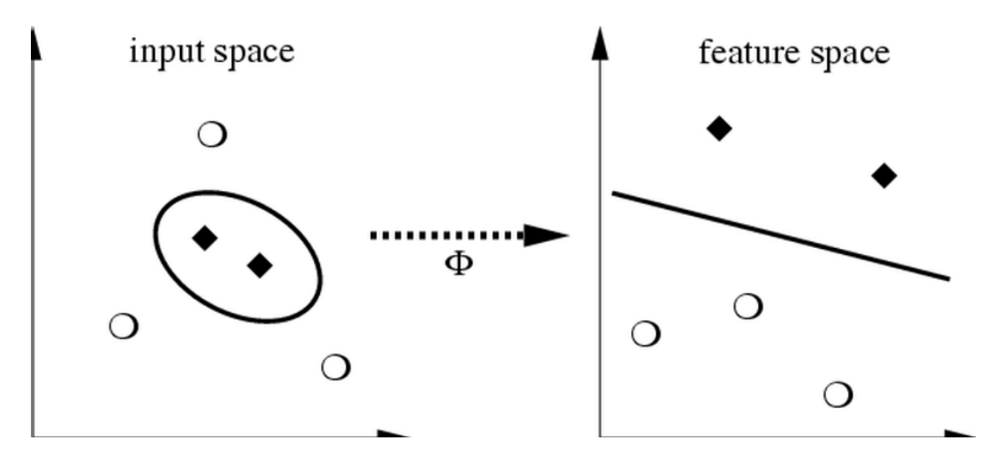

Title: Support vector machines
Date: 2015-05-22 09:00
Tags: lectures, svm
Courseid: 2015-dm
Toc: True
Math: True

## Class overview

You learning to teach the computer to learn from data

- How?
    - Find a *general rule* (i.e., 일반화 성능 향상, 오버피팅 방지)
    - That explains data given only as a sample of limited size
    - According to some measurement of accuracy or error
    - 한마디로, finding [signals among the noise](https://www.goodreads.com/book/show/13588394-the-signal-and-the-noise)
- 지금까지 배운 방법론들
    - Supervised learning
        - Data are sample of input-output pairs
        - Find input-output mapping
        - Regression, classification, etc
    - Unsupervised learning
        - Data are sample of objects
        - Find some common structure
        - Clustering, etc.
    - Text mining
- 오늘 배울 것: 여전히 핫한 알고리즘, SVM, and yet another supervised learning algorithm
- 앞으로 남은 세 시간:
    - `classes[-3]`: Semisupervised learning + A touch of visualization
    - `classes[-2]`: Big data technologies: Hadoop & spark + Tips for your exam
    - `classes[-1]`: 대망의 기말고사

## SVM: Support vector machines

<!-- cf. <s>single valuable man ?</s> -->

### Classification examples

1. Sheep vector machines
    - Using the existing sheep distributions (the training set), determine whether the new sheep belongs with the white sheep or the black sheep. 
    
2. Spam filtering
    - Using word occurrences in existing email documents, determine whether a new email is spam or ham. 
    
    - Instance space: $x \in X$  ($|X| = n$ data points)
        - Binary or real-valued feature vector $x$ of word occurrences
        - $d$ features (words + other things, d~100,000+)
    - Class: $y \in Y$
        - $y$: Spam (+1), Ham (-1)



### Linear binary classification

- There may exist many solutions that separate the classes exactly
- Usually, we find the one that will give the smallest generalization error
- This is the problem of choosing the or **decision boundary**, or **hyperplane** 
    
- Input: Binary/real valued vectors $x$ and labels $y$
- Goal: Find real valued vector $w$ 

- Each feature has a weight $w_i$
    - Prediction is based on the weighted sum: $f(x) = \sum w_i x_i = w \cdot x$
    - If the f(x) is
        - Positive: Predict +1 (i.e., is sheep, is spam)
        - Negative: Predict -1 (i.e., is not sheep, is ham) 

### SVM, the maximal margin classifier

- Idea:
    - Distance from the separating hyperplane corresponds to the "confidence" of prediction
    - In the image below, we are more sure about the class of A and B than of C 
    
- SVM finds the decision boundary with concept of maximizing this distance, or **margins**
    - Margin $\gamma$: The perpendicular distance between the decision boundary and the closest of the data points (left figure below).
    <!--
    The reason we define margin this way is due to theoretical convenience and existence of
    generalization error bounds that depend on the value of margin. - Jurafsky
    -->
    - Support vectors: Maximizing the margin leads to a particular subset of existing data points (right figure below). 
    
- Why is maximizing $\gamma$ a good idea?
    - Remember: Dot product $A \cdot B = |A||B|cos\theta$ 
    
    - Let:
        - Line $L = w \cdot x + b = 0$
        - Weight $w = [w_1, w_2]$
        - Point $A = [x_1^{(A)}, x_2^{(A)}]$
        - Point $M = [x_1^{{(M)}}, x_2^{{(M)}}]$ 
        
    - Then the distance between A, L:
        $$\begin{align}
        d(A, L) & = |AH|\\\
            & = |(A-M) \cdot w|\\\
            & = |(x_1^{(A)} - x_1^{(M)}) w_1 + (x_2^{(A)} - x_2^{(M)}) w_2|\\\
            & = x_1^{(A)} w_1 + x_2^{(A)} w_2 + b\\\
            & = w \cdot A + b
        \end{align}$$
    - Prediction = $sign(w \cdot x + b)$
    - "Confidence" = $(w \cdot x + b)y$
    - For i-th data point: $\gamma_i = (w \cdot x^{(i)} + b)y^{(i)}$
    - Therefore, the objective function becomes: 
        - max $\gamma$ s.t., $y^{(i)}(w \cdot x^{(i)} + b) \geq \gamma$ ($\forall i$)
    - Good according to 1) intuition 2) theory and 3) practice
- Normalized weights
    - Problem: With this equation, scaling $w$ increases margin! (i.e., $w$ can be arbitrarily large)
        - If $(w \cdot x + b)y = \gamma$, then $(2w \cdot x + 2b)y = 2\gamma$
    - Solution: work with normalized $w$, and require support vectors to be on the margin
        - $\gamma = (\frac{w}{|w|} \cdot x + b)y$
        - $w \cdot x^{(i)} + b = \pm 1$
- Margin maximization == weight minimization? 
    
    - We know three things
        - $x^{(1)} = x^{(2)} + 2 \gamma \frac{w}{|w|}$
        - $w \cdot x^{(1)} + b = +1$
        - $w \cdot x^{(2)} + b = -1$
    - Therefore
        - $w \cdot x^{(1)} + b = +1$
        - $w (x^{(2)} + 2 \gamma \frac{w}{|w|}) + b = +1$
        - $(w \cdot x^{(2)} + b) + 2 \gamma \frac{w}{|w|} = +1$
        - $\gamma = \frac{1}{|w|}$
    - max $\gamma \thickapprox$ max $\frac{1}{|w|} \thickapprox$ min $|w| \thickapprox$ min $\frac{1}{2} |w|^2$
    - Which finally gives
        - min $\frac{1}{2} |w|^2$ s.t., $y^{(i)}(w \cdot x^{(i)} + b) \geq 1$ ($\forall i$)
        - This is called SVM with "hard" constraints
    
### Soft margin SVMs

- Relax constraints
    - Allowing the margin constraints to be violated
    - In other words, allow some of the training data points to be misclassified
- min $\frac{1}{2} |w|^2 + C \sum_{i=1}^n \xi_i$ s.t., $y^{(i)}(w \cdot x^{(i)} + b) \geq 1 - \xi_i$ ($\forall i$) 
    

### [Kernel methods](http://en.wikipedia.org/wiki/Kernel_method)

> Warning: NOT related to shell/kernels in the OS

- Life is not so easy, not all problems are linearly separable
- If so, choose a mapping to some (high dimensional) dot-product space, namely the *feature space*: $\Phi: X \to H$

- Mercer's condition
    - If a symmetric function $K(x, y)$ satisfies $\sum_{i,j=1}^{M} a_ia_jK(x_i,x_j) \geq 0$ 
      for all $M \in \mathbb{N}, x_i, a_i \in \mathbb{R}$ 
      there exists a mapping function $\Phi$ that maps x into the dot-product feature space and $K(x, y) = <\Phi(x), \Phi(y)>$ and vice versa.
- Function $K$ is called the **kernel**.
- Types of kernels
    - Linear kernels: $K(x, y) = &lt;x, y&gt;$
    - Polynomial kernels: $K(x, y) = (&lt; x, y&gt; + 1)^d$ for $d = 2$
    - RBF kernels: $K(x, y) = exp(-\frac{||x-y||^2}{d^2})$
    - ...and more!
        - Kernels on various objects, such as graphs, strings, texts, etc.
        - Enable us to use dot-product algorithms
        - Measure of similarity

## Programming SVMs

Go to the [SVM documents](http://scikit-learn.org/stable/modules/svm.html) in the Scikit-learn webpage.

- SVC: Support vector *classification*
- SVR: Support vector *regression*
- Also see: [What is the difference between C-SVM and nu-SVM?](http://www.quora.com/What-is-the-difference-between-C-SVM-and-nu-SVM)

## References

- Wikipedia, [Support Vector Machine](http://en.wikipedia.org/wiki/Support_vector_machine)
- Scikit-learn, [Support Vector Machines](http://scikit-learn.org/stable/modules/svm.html)
- Andrew Ng, [CS229 Lecture notes: Support vector machines](http://cs229.stanford.edu/notes/cs229-notes3.pdf)
- Petra Kudova, [Learning with kernels and SVM](http://www.cs.cas.cz/petra/slides/svm.pdf)
- [support-vector-machines.org](http://www.support-vector-machines.org/) (Sometimes, algorithms have websites of their own! See [here](https://twitter.com/echojuliett/status/488991816595697664) for more of them.)

> Many contents in courtesy of [Jure Leskovec](http://cs.stanford.edu/people/jure/) and [Petra Kudova](http://www.cs.cas.cz/petra/)
