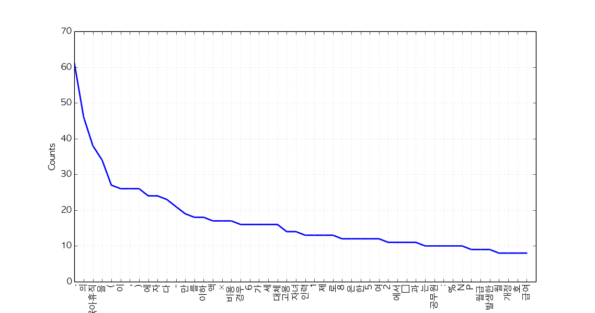

Title: Mining English and Korean text with Python
Date: 2015-03-27 15:00
Tags: text, lectures
Courseid: 2015-ba
Toc: True
Math: True

> We use Python 3 in this tutorial, but provide minimal guidelines for Python 2.

## Review

### Terminologies



### Text analysis process

전처리는 아래의 세부 과정으로 다시 한 번 나뉜다.

1. Load text
1. Tokenize text (ex: stemming, morph analyzing)
1. Tag tokens (ex: POS, NER)
1. Token(Feature) selection and/or filter/rank tokens (ex: stopword removal, TF-IDF)
1. ...and so on (ex: calculate word/document similarities, cluster documents)

## Useful Python Packages for Text Mining and NLP

1. [NLTK](http://nltk.org): Provides modules for text analysis (mostly language independent)
    - 설치하기

            :::bash
            pip install nltk

    - 주요기능
        1. [Text corpora](http://www.nltk.org/book/ch02.html): 특히, 이 튜토리얼에서는 아래의 두 가지 데이터가 필요하니 미리 다운 받아두자.

                :::python
                nltk.download('gutenberg')
                nltk.download('maxent_treebank_pos_tagger')

        1. [Word POS, NER classification](http://www.nltk.org/api/nltk.tag.html)
        1. [Document classification](http://www.nltk.org/book/ch06.html)

1. [KoNLPy](http://konlpy.org): Provides modules for Korean text analysis
    - 설치하기

            :::bash
            pip install konlpy

    - 주요기능
        1. [Text corpora](http://konlpy.org/en/latest/data/#corpora)
        1. [Word POS classification](http://konlpy.org/en/latest/api/konlpy.tag/)
            - Hannanum
            - Kkma
            - Mecab
            - Komoran
            - Twitter

1. [Gensim](http//radimrehurek.com/gensim/): Provides modules for topic modeling and calculating similarities among documents
    - 설치하기

            :::bash
            pip install -U gensim

    - 주요기능
        1. Topic modeling
            - [Latent Dirichlet allocation (LDA)](http://radimrehurek.com/gensim/models/ldamodel.html)
            - [Latent semantic indexing (LSI)](http://radimrehurek.com/gensim/models/lsimodel.html)
            - [Hierarchical Dirichlet process (HDP)](http://radimrehurek.com/gensim/models/hdpmodel.html)
        1. Word embedding
            - [word2vec](radimrehurek.com/gensim/models/word2vec.html)

1. [Twython](https://github.com/ryanmcgrath/twython): Provides easy access to Twitter API
    - 설치하기

            :::bash
            pip install twython

    - 사용예시: "Samsung (삼성)" 관련 트윗 받기

            :::python
            from twython import Twython
            import settings as s    # Create a file named settings.py, and put oauth KEY values inside
            twitter = Twython(s.APP_KEY, s.APP_SECRET, s.OAUTH_TOKEN, s.OAUTH_TOKEN_SECRET)
            tweets = twitter.search(q='삼성', count=100)
            data = [(t['user']['screen_name'], t['text'], t['created_at']) for t in tweets['statuses']]

## Text exploration

### 1. Read document

이 튜토리얼에서는 NLTK, KoNLPy에서 제공하는 문서들을 사용한다.

- 영어: [Jane Austen의 소설 Emma](http://www.gutenberg.org/ebooks/158)
- 한국어: [대한민국 국회 제 1809890호 의안](http://pokr.kr/bill/1809890)

할 수 있는 사람은, 위의 문서 대신 다른 텍스트 데이터를 로딩하여 사용해보자.

- English

        :::python
        from nltk.corpus import gutenberg   # Docs from project gutenberg.org
        files_en = gutenberg.fileids()      # Get file ids
        doc_en = gutenberg.open('austen-emma.txt').read()

- Korean

        :::python
        from konlpy.corpus import kobill    # Docs from pokr.kr/bill
        files_ko = kobill.fileids()         # Get file ids
        doc_ko = kobill.open('1809890.txt').read()

### 2. Tokenize

문서를 토큰으로 나누는 방법은 다양하다.
여기서는 영어에는 `nltk.regexp_tokenize`, 한국어에는 `konlpy.tag.Twitter.morph`를 사용해보자.

- English

        :::python
        from nltk import regexp_tokenize
        pattern = r'''(?x) ([A-Z]\.)+ | \w+(-\w+)* | \$?\d+(\.\d+)?%? | \.\.\. | [][.,;"'?():-_`]'''
        tokens_en = regexp_tokenize(doc_en, pattern)

- Korean

        :::python
        from konlpy.tag import Twitter; t = Twitter()
        tokens_ko = t.morphs(doc_ko)

### 3. Load tokens with `nltk.Text()`

`nltk.Text()`는 문서 하나를 편리하게 탐색할 수 있는 다양한 기능을 제공한다.

- English

        :::python
        import nltk
        en = nltk.Text(tokens_en)

- Korean (For Python 2, `name` has to be input as u'유니코드'. If you are using Python 2, use u'유니코드' for input of all following Korean text.)

        :::python
        import nltk
        ko = nltk.Text(tokens_ko, name='대한민국 국회 의안 제 1809890호')   # For Python 2, input `name` as u'유니코드'

지금부터 `nltk.Text()`가 제공하는 다양한 기능을 하나씩 살펴보자.
(참고링크: [class nltk.text.Text API 문서](http://www.nltk.org/api/nltk.html#nltk.text.Text))

1. Tokens
    - English

            :::python
            print(len(en.tokens))       # returns number of tokens (document length)
            print(len(set(en.tokens)))  # returns number of unique tokens
            en.vocab()                  # returns frequency distribution

        <pre class="result">
        191061
        7927
        FreqDist({',': 12018, '.': 8853, 'to': 5127, 'the': 4844, 'and': 4653, 'of': 4278, '"': 4187, 'I': 3177, 'a': 3000, 'was': 2385, ...})
        </pre>

    - Korean

            :::python
            print(len(ko.tokens))       # returns number of tokens (document length)
            print(len(set(ko.tokens)))  # returns number of unique tokens
            ko.vocab()                  # returns frequency distribution

        <pre class="result">
        1707
        476
        FreqDist({'.': 61, '의': 46, '육아휴직': 38, '을': 34, '(': 27, ',': 26, '이': 26, ')': 26, '에': 24, '자': 24, ...})
        </pre>

1. Plot frequency distributions

    - English

            :::python
            en.plot(50)     # Plot sorted frequency of top 50 tokens

        

    - Korean

            :::python
            ko.plot(50)     # Plot sorted frequency of top 50 tokens

        

    > **Tip**: To save a plot programmably, and not through the GUI, overwrite `pylab.show` with `pylab.savefig` before drawing the plot ([reference](http://stackoverflow.com/questions/27392390/how-do-i-send-nltk-plots-to-files)):
    > <pre>
    > from matplotlib import pylab
    > pylab.show = lambda: pylab.savefig('some_filename.png')
    > </pre>
    >
    > **Troubleshooting**: For those who see rectangles instead of letters in the saved plot file, include the following configurations before drawing the plot:
    > <pre>
    > from matplotlib import font_manager, rc
    > font_fname = 'c:/windows/fonts/gulim.ttc'     # A font of your choice
    > font_name = font_manager.FontProperties(fname=font_fname).get_name()
    > rc('font', family=font_name)
    > </pre>
    >
    > Some example fonts:
    >
    > - Mac OS: `/Library/Fonts/AppleGothic.ttf`

1. Count
    - English

            :::python
            en.count('Emma')        # Counts occurrences

        <pre class="result">
        865
        </pre>

    - Korean

            :::python
            ko.count('초등학교')   # Counts occurrences

        <pre class="result">
        6
        </pre>

1. Dispersion plot
    - English

            :::python
            en.dispersion_plot(['Emma', 'Frank', 'Jane'])

        

    - Korean

            :::python
            ko.dispersion_plot(['육아휴직', '초등학교', '공무원'])

        

1. Concordance
    - English

            :::python
            en.concordance('Emma', lines=5)

        <pre class="result">
        Displaying 5 of 865 matches:
                                             Emma by Jane Austen 1816 ] VOLUME I CHAPT
                                             Emma Woodhouse , handsome , clever , and 
        both daughters , but particularly of Emma . Between _them_ it was more the int
         friend very mutually attached , and Emma doing just what she liked ; highly e
        r own . The real evils , indeed , of Emma ' s situation were the power of havi
        </pre>

    - Korean (or, use [konlpy.utils.concordance](http://konlpy.org/en/v0.4.3/api/konlpy/#konlpy.utils.concordance))

            :::python
            ko.concordance('초등학교')

        <pre class="result">
        Displaying 6 of 6 matches:
         ․ 김정훈 김학송 의원 ( 10 인 ) 제안 이유 및 주요 내용 초등학교 저학년 의 경우 에도 부모 의 따뜻한 사랑 과 보살핌 이 필요 한
         을 할 수 있는 자녀 의 나이 는 만 6 세 이하 로 되어 있어 초등학교 저학년 인 자녀 를 돌보기 위해서 는 해당 부모님 은 일자리 를 
         다 . 제 63 조제 2 항제 4 호 중 “ 만 6 세 이하 의 초등학교 취학 전 자녀 를 ” 을 “ 만 8 세 이하 ( 취학 중인 경우 
         전 자녀 를 ” 을 “ 만 8 세 이하 ( 취학 중인 경우 에는 초등학교 2 학년 이하 를 말한 다 ) 의 자녀 를 ” 로 한 다 . 부 
         . ∼ 3 . ( 현행 과 같 음 ) 4 . 만 6 세 이하 의 초등학교 취 4 . 만 8 세 이하 ( 취학 중인 경우 학 전 자녀 를 양
        세 이하 ( 취학 중인 경우 학 전 자녀 를 양육 하기 위하 에는 초등학교 2 학년 이하 를 여 필요하거 나 여자 공무원 이 말한 다 ) 의
        </pre>

1. Find similar words
    - English

            :::python
            en.similar('Emma')
            en.similar('Frank')

        <pre class="result">
        she it he i harriet you her jane him that me and all they them there herself was hartfield be
        mr mrs emma harriet you it her she he him hartfield them jane that isabella all herself look i me
        </pre>

    - Korean

            :::python
            ko.similar('자녀')
            ko.similar('육아휴직')

        <pre class="result">
        논의
        None
        </pre>

1. Collocations
    - English

            :::python
            en.collocations()

        <pre class="result">
        Frank Churchill; Miss Woodhouse; Miss Bates; Jane Fairfax; Miss
        Fairfax; every thing; young man; every body; great deal; dare say;
        John Knightley; Maple Grove; Miss Smith; Miss Taylor; Robert Martin;
        Colonel Campbell; Box Hill; said Emma; Harriet Smith; William Larkins
        </pre>

    - Korean

            :::python
            en.collocations()

        <pre class="result">
        초등학교 저학년; 육아휴직 대상
        </pre>

For more information on `nltk.Text()`, see the [source code](http://www.nltk.org/_modules/nltk/text.html#Text) or [API](http://www.nltk.org/api/nltk.html#nltk.text.Text).

## Tagging and chunking

Until now, we used delimited text, namely *tokens*, to explore our sample document.
Now let's classify words into given classes, namely *part-of-speech tags*, and chunk text into larger pieces.

### 1. POS tagging

There are numerous ways of tagging a text.
Among them, the most frequently used, and developed way of tagging is arguably POS tagging.

Since one document is too long to observe a parsed structure,
lets use one short sentence for each language.

- English

        :::python
        tokens = "The little yellow dog barked at the Persian cat".split()
        tags_en = nltk.pos_tag(tokens)

    <pre class="result">
    [('The', 'DT'),
     ('little', 'JJ'),
     ('yellow', 'NN'),
     ('dog', 'NN'),
     ('barked', 'VBD'),
     ('at', 'IN'),
     ('the', 'DT'),
     ('Persian', 'NNP'),
     ('cat', 'NN')]
    </pre>

    - It is also possible to use the famous [Stanford POS tagger with NLTK](http://www.nltk.org/api/nltk.tag.html#module-nltk.tag.stanford), with `from nltk.tag.stanford import POSTagger`

- Korean

        :::python
        from konlpy.tag import Twitter; t = Twitter()
        tags_ko = t.pos("작고 노란 강아지가 페르시안 고양이에게 짖었다")

    <pre class="result">
    [('작고', 'Noun'),
     ('노란', 'Adjective'),
     ('강아지', 'Noun'),
     ('가', 'Josa'),
     ('페르시안', 'Noun'),
     ('고양이', 'Noun'),
     ('에게', 'Josa'),
     ('짖었', 'Noun'),
     ('다', 'Josa')]
    </pre>

### 2. Noun phrase chunking

[`nltk.RegexpParser()`](http://www.nltk.org/api/nltk.chunk.html#nltk.chunk.regexp.RegexpParser) is a great way to start chunking.

- English

        :::python
        parser_en = nltk.RegexpParser("NP: {<DT>?<JJ>?<NN.*>*}")
        chunks_en = parser_en.parse(tags_en)
        chunks_en.draw()

    

- Korean

        :::python
        parser_ko = nltk.RegexpParser("NP: {<Adjective>*<Noun>*}")
        chunks_ko = parser_ko.parse(tags_ko)
        chunks_ko.draw()

    

For more information on chunking, refer to [Extracting Information from Text](http://www.nltk.org/book/ch07.html) for English, and [Chunking](http://konlpy.org/en/v0.4.3/examples/chunking/) for Korean.

## Drawing a word cloud

1. 제 1809890호 의안의 빈도분포(frequency distribution)를 다시 살펴보자.

        :::python
        print(ko.vocab())

    <pre class="result">
    FreqDist({'.': 61, '의': 46, '육아휴직': 38, '을': 34, '(': 27, ',': 26, '이': 26, ')': 26, '에': 24, '자': 24, ...})
    </pre>

1. 이 빈도분포의 data type과 attribute 목록을 확인해보자.

        :::python
        type(ko.vocab())

    <pre class="result">
    nltk.probability.FreqDist
    </pre>

        :::python
        dir(ko.vocab())

    <pre class="result">
    ['B',
     'N',
     ...
     'items',
     ...
     'pop',
     'popitem',
     'pprint',
     'r_Nr',
     'setdefault',
     'subtract',
     'tabulate',
     'unicode_repr',
     'update',
     'values']
    </pre>

1. `items()`를 사용하면 빈도분포의 item 전체를 set의 형태로 볼 수 있다. 이를 `data`라는 이름의 변수에 저장한 후, data type을 관찰하자.

        :::python
        data = ko.vocab().items()
        print(data)
        print(type(data))

    <pre class="result">
    dict_items([('명', 5), ('예상된', 3), ('하나', 1), ('11', 2), ('팀', 2), ...])
    `<class 'dict_items'>`
    </pre>

1. 이 set을 이제 `words.csv`라는 파일에 저장해보자. 데이터 header는 word,freq로 하면 된다.

        :::python
        import csv
        with open('words.csv', 'w', encoding='utf-8') as f:
            f.write('word,freq\n')
            writer = csv.writer(f)
            writer.writerows(data)

1. 다음으로 [이 링크](https://gist.github.com/e9t/e462f7462e9d83b03464#file-index-html)에서 `index.html`의 내용을 복사하여 `words.csv`가 있는 폴더 내에 다시 `index.html`이라는 이름으로 저장하자.
1. `index.html`과 `words.csv`가 저장된 폴더에서 아래를 실행하자.

        :::python
        python -m http.server 8888      # for Python2, `python -m SimpleHTTPServer`

1. 마지막으로, 모던 브라우저(ex: 크롬)의 주소창에 `http://localhost:8888`를 입력하면 우리의 워드클라우드가 떠있을 것이다! 
    <iframe src="http://bl.ocks.org/e9t/raw/e462f7462e9d83b03464/" width="600px" height="600px" frameborder=0></iframe>

1. 더 실험해보고 싶은 경우:
    1. 위의 워드클라우드는 각종 특수문자, 조사 등도 포함되어 정보 전달력이 떨어진다. 워드클라우드에 명사만 표현되게 할 수 있을까?
    1. 다른 임의의 문서로도 워드클라우드를 그릴 수 있나? (ex: 내 데이터마이닝 프로젝트 제안서) 해당 문서를 파이썬으로 읽고, 문서에서 높은 빈도로 등장한 단어를 추출 후, 워드클라우드로 그려보자.
    1. 여러 개의 문서에 대한 워드클라우드를 그릴 수도 있나? 파이썬으로 여러 개의 문서를 한꺼번에 읽어들인 후, 높은 빈도로 등장한 단어를 추출해서 워드클라우드로 그려보자.
