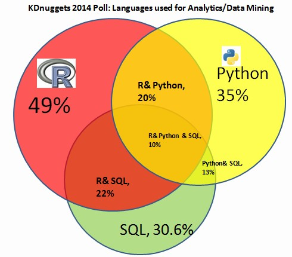
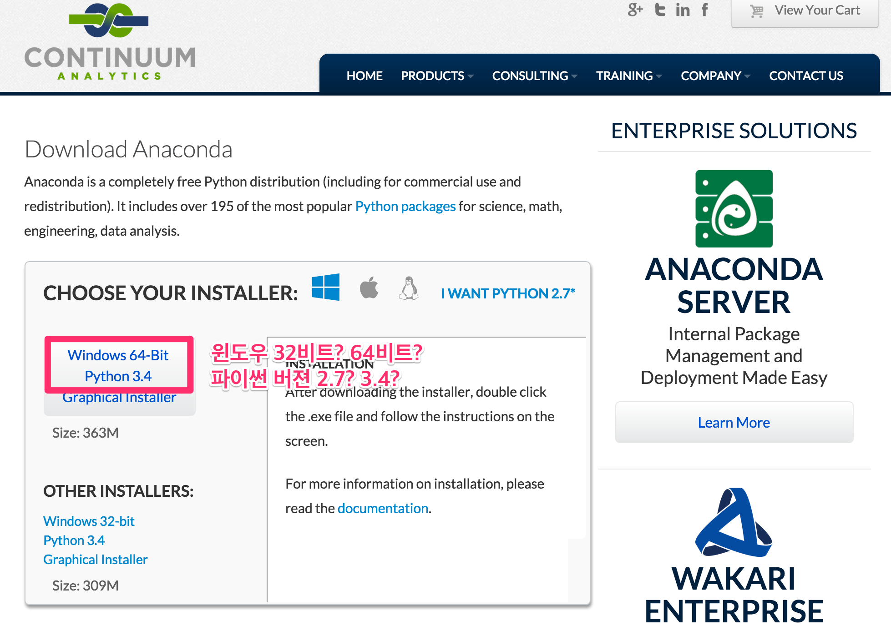
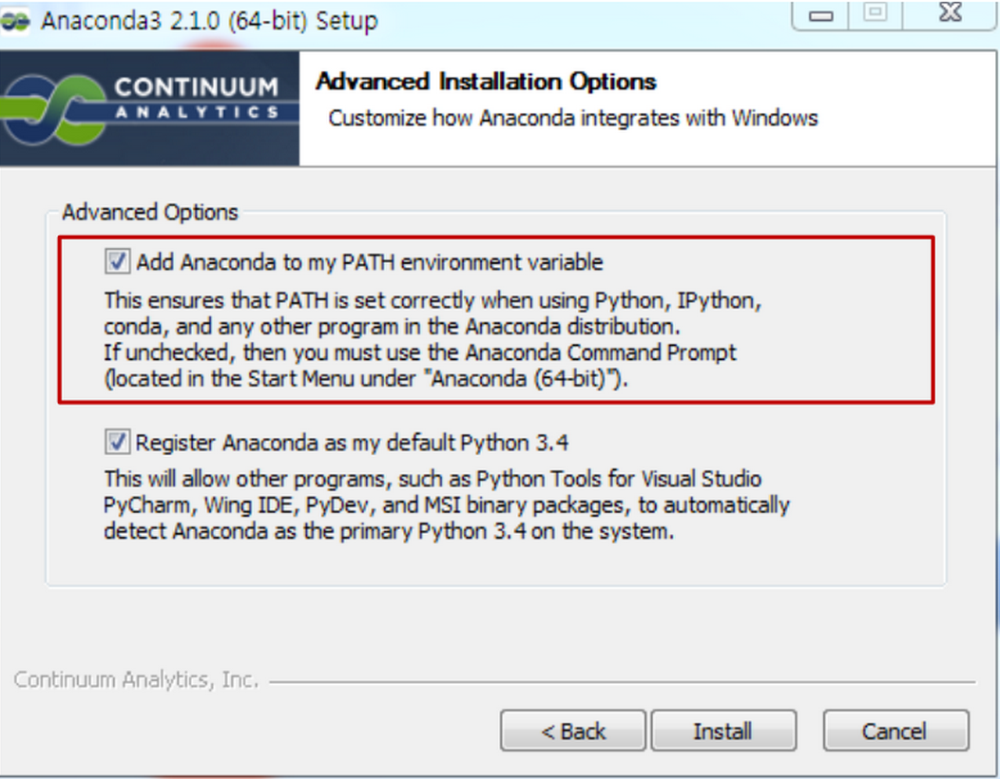
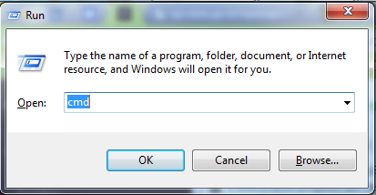
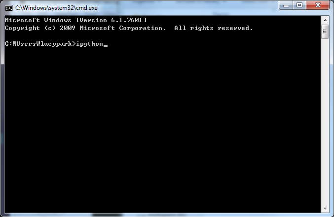
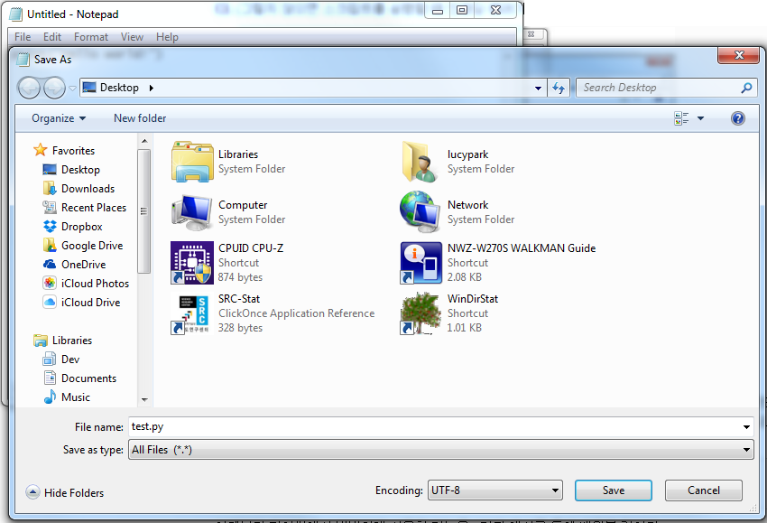
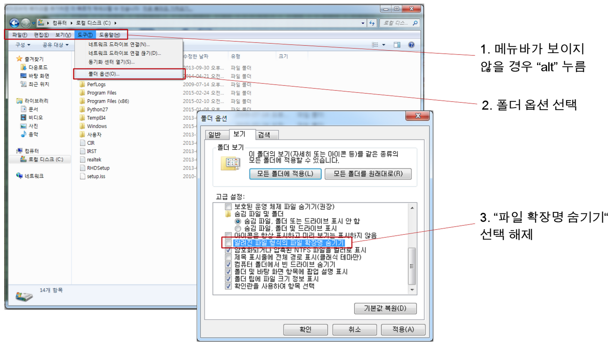
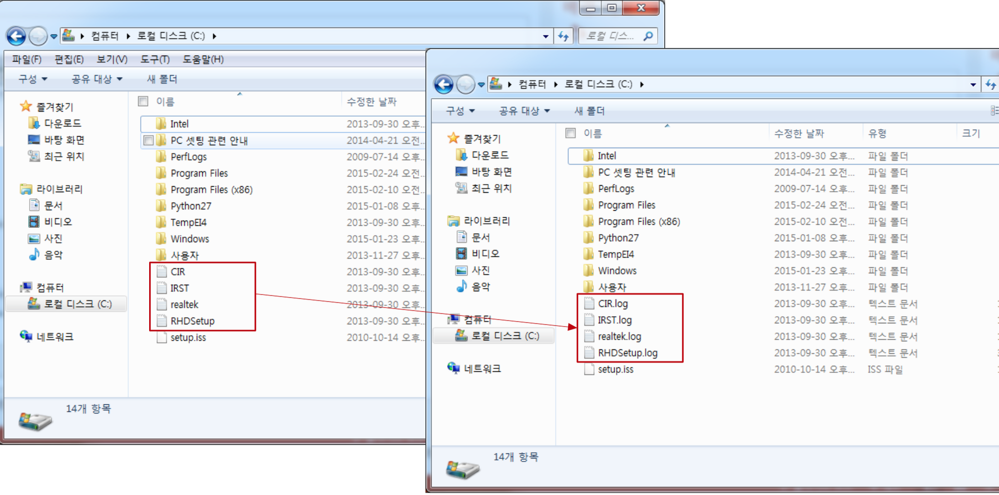

Title: Introduction to Python
Date: 2015-03-08 18:00
Toc: True

## 오늘의 목표

- 나도 할 수 있다, 프로그래밍!
    - 왜?
    - 뭐든지 잘할 수 있어야 재밌고 재밌어야 잘할 수 있고 잘 해야 재밌음.
    - 일단 나도 할 수 있다는 자신감을 느껴보고 더불어 신기함과 재미도 느껴보자!
    - <s>간지도 좀 남</s>

## 들어가기 전에

1. 운영체제(OS)란?
    - ["시스템 하드웨어와 소프트웨어를 실행하기 위한 시스템 소프트웨어"](http://ko.wikipedia.org/wiki/%EC%9A%B4%EC%98%81_%EC%B2%B4%EC%A0%9C)
        - ex: 윈도우 7, Mac OS 10.10, Ubuntu 14.04, iOS 6, Android 5.0, ...
    - 프로그래밍을 하기 전에는 내가 어떤 OS의 어떤 버젼을 사용하고 있는지 꼭 알아두자!
    - **여기서는 윈도우 7을 사용하고 있다는 가정 하에 튜토리얼을 진행합니다.** 
    
1. 쉘(shell)이란?
    - ["운영체제 상에서 다양한 운영체제 기능과 서비스를 구현하는 인터페이스를 제공하는 프로그램"](http://ko.wikipedia.org/wiki/%EC%85%B8)
    - 운영체제의 핵심 부분을 구성하는 "커널(kernel)"을 감싸고 있다는 뜻에서 "쉘"이라는 이름이 붙었죠 
    
1. GUI? CLI?
    - GUI는 graphic user interface의 약자로, 그래픽으로 컴퓨터를 조작할 수 있게 해준다. [윈도우 쉘](http://en.wikipedia.org/wiki/Windows_shell)이 대표적인 graphic shell이다. 
    
    - CLI는 command line interface의 약자로, 텍스트로 컴퓨터를 조작할 수 있게 해준다. 윈도우에서는 [명령 프롬프트](http://en.wikipedia.org/wiki/Cmd.exe)가 대표적인 text shell이다. 
    

## 왜 파이썬인가?

- [파이썬은, 처음 배우는 프로그래밍 언어로써 좋다](http://blog.trinket.io/why-python/)
    - Python is now the most popular introductory language at Top US Universities (July, 2014) 
    
- [파이썬은, 연구용 언어로써 좋다](http://www.stat.washington.edu/~hoytak/blog/whypython.html)
    - Python is a major programming language for data mining (Aug, 2014) 
    

### What's so great about Python?

이번 시간에 계속 살펴보겠지만, 파이썬의 문법은 아주 간결하고 읽기 편합니다.
게다가 [문서화](https://docs.python.org/)가 아주 상세하게 잘 되어 있어서 배우기도 쉽고요.

하지만 파이썬이 모든 경우에 가장 좋은 언어라고 할 수는 없습니다.
특히, 파이썬이 현존하는 모든 태스크를 위해 가장 적합하게 설계된 언어는 아닙니다.
<!-- 프로그래밍 언어는 그 자체로 기술(technology, 技術)이라기보다는 아이디어를 표현하는 기술법(description, 記述)이며 각 태스크에 적합한 언어는 따로 있습니다.  (적어도 2015년 현재에는 그런듯합니다) -->

비유를 한 번 들어볼까요?
나무를 베고, 못을 박고, 나사를 돌릴 때 여러분은 아래에 있는 도구 중 어떤 것을 선택하겠습니까?

보통은 나무를 벨 때 톱을, 못을 박을 때는 망치를, 나사를 돌릴 때는 드라이버를 사용하겠죠.
프로그래밍 언어도 도구여서, 목적에 따라 다른 도구를 사용하는 것이 좋을 때가 있습니다.
가령, 웹에 시각화를 올리기 위해서는 자바스크립트가, 구조적 데이터를 다룰 때는 R이 더 편할 수도 있는거죠.

한편 파이썬은 특정 목적에 적합한 언어라기보다는 범용으로 사용할 수 있는 언어(general purpose language)입니다. 
일종의 Swiss army knife와 같은거죠.

실제로 파이썬의 다양한 3rd-party 패키지들을 사용하면 웹에 시각화를 올린다든지 구조적인 데이터를 다루는 일 등을 할 수 있습니다.

- 시각화: matplotlib, mpld3
- 웹프로그래밍: requests, django, flask
- 구조적 데이터 분석: numpy, scipy, scikit-learn
- 비구조적 데이터 분석 (또는 자연어 처리): nltk, konlpy

하지만 Swiss army knife가 때로는 망치만큼의 강건함이나 만족스러움을 주지 못하듯, 파이썬도 마찬가지 일 수 있습니다. 
그럴 때는 망치를 구하시면 됩니다! (i.e., JavaScript, R 등 새로운 스킬/도구/언어를 또 습득하시면 됩니다! 하지만 그건 이 수업 말고 다른 기회에...)

게다가 파이썬에는 활발한 개발 커뮤니티가 있습니다.
[PEP](https://www.python.org/dev/peps/pep-0001/), 즉 Python enhancement proposal이라고 누구나 파이썬 언어 자체에 대한 제안을 할 수도 있고
아래와 같이 유저(user) 커뮤니티들도 활발하게 돌아가고 있습니다.
개발을 하다가 질문이 있을 때는 아래 커뮤니티들을 적극 활용해보세요!

1. [파이썬 코리아 페이스북 그룹](https://www.facebook.com/groups/pythonkorea/)
2. [생활코딩 페이스북 그룹](https://www.facebook.com/groups/codingeverybody/)
3. [파이조그(PyJog)](https://www.facebook.com/pyjog): 이 커뮤니티는 오프라인 커뮤니티입니다. 고수님들을 직접 만날 기회이니 프로그래밍을 더 잘해보고 싶은 분은 한 번쯤 참석해보시기 바랍니다.

요약하자면, 파이썬은 아래와 같은 장점들이 있습니다:

1. 쉽다
1. 간결하고 읽기 쉽다 (readability)
1. 문서화가 잘 되어 있다 (documentation)
1. 라이브러리/패키지가 풍부하다
1. [개발 커뮤니티](https://www.python.org/community/)가 활발하다

### Then is Python the best programming language for data mining?

<!-- No, and [there probably will never be such a thing](http://paulgraham.com/hundred.html) -->
데이터마이너는 가장 핵심이 되는 데이터 분석 뿐 아니라, 앞 단의 데이터 수집이나 데이터 정제부터, 데이터 시각화까지
넓은 영역의 태스크들을 수행하게 됩니다.

데이터마이닝을 배우는 이 강좌에서 파이썬을 주 언어로 택한 이유는
파이썬이 데이터마이닝을 위해 가장 좋은 언어이거나, 데이터마이닝의 특정 태스크를 수행하는데 가장 좋기 때문은 아닙니다.
다만, 좋은 Swiss army knife를 마련해서 도구는 빨리 습득하고,
여러분이 데이터마이닝 알고리즘들 자체에 조금 더 focus할 수 있게 하기 위함입니다.

게다가 덤으로, 좋은 프로그래밍 언어를 습득함으로써 프로그래밍 자체에 대한 이해를 높이고 흥미를 느낄 수 있으면 좋겠죠!

자, 그럼 시작해볼까요 :)

## Installing Python

- 윈도우에서 자바 프로그래밍 환경을 마련하는 일반적인 절차는?
    - 1단계: [자바 개발 키트 (JDK)](http://www.oracle.com/technetwork/java/javase/downloads/index.html) 설치 (2015년 3월 현재, JDK 8u40 배포중)
    - 2단계: 환경변수 설정 (ex: `JAVA_HOME`)
    - 3단계: 자바 IDE 설치 (ex: [이클립스](https://eclipse.org/), [IntelliJ IDEA](https://www.jetbrains.com/idea/))
- 윈도우에서 R 프로그래밍 환경을 마련하는 일반적인 절차는?
    - 1단계: [R 배포판](http://cran.r-project.org/) 설치 (2015년 3월 현재, R 3.1.2 배포중)
    - 2단계: R IDE 설치 (ex: [RStudio](http://rstudio.com))
- 윈도우에서 파이썬 프로그래밍 환경을 마련하는 일반적인 절차는?
    - 1단계: [파이썬 배포판](http://python.org/download) 설치
    - 2단계: 파이썬 IDE 설치

자, 그럼 시작해봅시다!

### 1단계: 파이썬 배포판 설치

1. Download [Continuum's Anaconda](http://continuum.io/downloads#34)
    - 잠깐, [python.com](http://python.org/download)이 아니라 딴데서 설치파일을 다운받으라고?
        - python.com/download: 파이썬 정식 배포판
        - continuum.io/downloads#34: 파이썬 사제 배포판 
    - 파이썬 정식 배포판이 아니라 일반 회사의 사제 배포판을 사용하는 이유는?
        - Windows에서는 파이썬의 몇몇 패키지 설치가 어렵다는 풍문이 있다
        - 이를 극복하기 위해 [윈도우만을 위해 사전에 컴파일 된 패키지를 따로 제공하는 사람도 있다](http://www.lfd.uci.edu/~gohlke/pythonlibs/)
        - 우리는 패키지 설치의 번거로움에서 벗어나기 위해 사전에 [195개의 패키지](http://docs.continuum.io/anaconda/pkg-docs.html)가 한꺼번에 깔리는 배포판을 선택
    
    - 윈도우 32비트? 64비트?
        - 아나콘다가 알아서 인식해서 잡아주겠지만, 궁금한 사람은 [내 컴퓨터의 속성 메뉴에서 나의 시스템 종류를 확인하자](images/bit.png).
    - [Python 2.x? 3.x?](https://wiki.python.org/moin/Python2orPython3)
        - 아직까지 학계에서는 Python 2도 많이 사용
        - 하지만 우리는 더 최신 버젼인 Python 3 선택
            1. 파이썬 3가 유니코드 서포트를 해서 한국어를 사용하는 사람들에게 편리
            1. [이제 많은 패키지들이 파이썬 3도 지원](http://python3wos.appspot.com/)
            1. 파이썬 3 is [the way to go](http://pythonkr.github.io/pyconkr-2014/pdf/pyconkr-2014-25_geofront.pdf)
    <!-- - 그리고 자꾸 패키지, 패키지하는데 패키지가 뭔가요? -->
2. Install Anaconda
    - 고맙게도 파이썬 환경변수 설정은 따로 할 필요없이 아나콘다가 알아서 해줌 
    
3. Run Python!
    - 다음과 같이 터미널을 열자:
        1. `window` + `r` 단축키를 이용해 실행창(Run)을 열고
        2. `cmd`라고 입력한다. 
        
    - 터미널에 `ipython`을 입력해서 "파이썬 쉘"을 열어보자. 
        터미널로 작업할 때는 열심히 "독서"하는 습관을 들이는 것이 좋다.
        우리가 `ipython`을 입력하니 무엇이 출력되었는가?
        파이썬 버젼 3.4.1, 64비트 아나콘다 2.1.0이 구동되었다는 것을 알 수 있고, 그 밖의 소소한 명령어에 대한 소개도 있다. 
        
    - 파이썬 쉘이 열리면:

            :::python
            In [1]: print("Hello world!")
            Hello world!

            In [2]: 1+3
            Out[2]: 4

            In [3]: 1/3
            Out[3]: 0.3333333333333333

            In [4]: 2**10
            Out[4]: 1024

            In [5]: exit    # exit을 입력하는 대신 단축키 ctrl+d를 사용할 수도 있다

    - Now you're a Python programmer! (적어도 계산기로는 쓸 수 있다)

### 1.5단계: 파이썬 스크립트 실행
위와 같이 파이썬을 쉘(shell)에서 실행하는 것은 순간적인 실행을 위해서는 아주 편리하지만,
긴 프로그램을 짜고자 할 때, 또는 프로그램을 저장하고자 할 때는 적합하지 않다.
이럴 때는 스크립트(script) 파일을 이용해서 파이썬을 실행할 수도 있다.

스크립트 파일 실행을 위해 PyCharm, Eclipse 등의 IDE를 활용할 수도 있지만,
일단은 IDE없이 한 번 가보자.

먼저 프로그래밍의 기본! 파이썬 스크립트를 만들어 Hello world를 출력해볼까?
이미 우리는 ipython을 통해 파이썬 쉘에서 Hello world를 출력해봤지만 
다음의 몇 가지 절차를 거치면 파일을 이용해 파이썬 스크립트를 실행할 수 있다.

1. 아래와 같이 윈도우에서 메모장을 열자.
    1. `window` + `r` 단축키를 이용해 실행창(Run)을 열고
    2. `notepad`라고 입력한다.
2. 다음의 헬로월드 출력문을 파일에 입력한 후

        :::python
        print("Hello world!")

3. 파일을 바탕화면에 `test.py`라는 이름으로 저장하자. 다만 한 가지 유의할 점은, **다음 그림과 같이 Encoding을 UTF-8로 변경해서 저장해줘야 한다.** (그렇지 않으면 스크립트를 실행할 때 인코딩 에러가 발생할 것이다.) 

4. 그 다음에, 다시 터미널을 띄워서 (앞에서 어떻게 했는지 기억하는가?)
5. 아래와 같이 입력하면 파이썬 파일이 실행된다. 
첫번째 줄은 윈도우 탐색기에서 "바탕화면"으로 이동하라는 버튼을 누른 것과 같고, 두번째 줄은 윈도우 탐색기에서 `test.py` 파일을 클릭하여 실행한 것과 같다. 멋지지 않은가? 이제 우리도 마우스를 클릭하는 GUI(graphic user interface)가 아니라 키보드로 명령어를 입력하는 CLI(command line interface)에서 프로그래밍을 할 수 있게 된 것이다!

        :::bash
        > cd Desktop        # Desktop이라는 디렉토리로 변경하라(change directory)
        > python test.py    # python이라는 프로그램으로 test.py라는 파일을 실행하라

    이제부터 파이썬에서 빈번하게 사용할 기능을 7가지 예시를 통해 배워볼 것이다. 
    방금 생성한 `test.py`에서 Hello world! 출력문 대신 아래의 다양한 예시를 입력해보자.
    이미 Desktop 폴더로 이동한 상태이니 **앞으로는 터미널에 `python test.py`만 입력해서 코드를 실행하면 된다.**
    각 예시는 이해를 돕기 위해 자바 1.7의 코드와 병렬적으로 배치해두었다.

#### 예시 1: "Hello world"

앞에서 우리는 파이썬 쉘과 스크립트로 Hello world!를 출력하는데 성공했다.
우리의 파이썬 코드와 자바 코드에는 어떤 차이점이 있을까?
다음은 자바와 파이썬으로 각각 Hello world!를 출력하는 코드이다.

- Java 1.7

        :::java
        public class MyClass {
            public static void main (String[] args) {
                System.out.println("Hello world!");
            }
        }

- Python 3

        :::python
        print("Hello world!")

자바와 파이썬 코드에 어떤 차이점이 있는가? 자바 코드와는 달리 파이썬 코드에서는:

1. `public class MyClass { ... }` 등과 같이 클래스를 선언하지 않아도 된다.
1. `public static void main (String[] args) { ... }` 등과 같이 메인함수를 선언하지 않아도 된다.
1. 라인 끝에 세미콜론(`;`)을 붙이지 않아도 된다.

그리하여 파이썬으로는 무려 한 줄 만으로 Hello world!를 출력할 수 있다!
아주 간결하지 않은가?

#### 예시 2: 변수 선언

다음으로 변수를 선언해보자.
`print`문을 이용해 출력하는 것이 없다면 변수를 선언하는 것만으로는 터미널 창에 아무 것도 뜨지 않겠지만,
변수 선언만으로도 중요한 차이점을 많이 발견할 수 있으니 코드는 한 번 자세히 들여다보자.
다음은 자바와 파이썬으로 각각 변수를 선언하는 코드이다.

- Java 1.7 (static typed)

        :::java
        String myString = "this is a string";
        myString = "3"; //  ok
        myString = '3'; //  Type mismatch: cannot convert from char to String
        myString = 3;   //  Type mismatch: cannot convert from int to String

- Python 3 (dynamic typed)

        :::python
        my_string = "this is a string"
        my_string = "3" # ok
        my_string = '3' # ok
        my_string = 3   # ok

이미 위에서 언급된 차이점들 외에도 크게 네 가지 차이점을 발견할 수 있다.

1. 자바는 [정적 타이핑(static typing)](http://en.wikipedia.org/wiki/Type_system#Static_type-checking)언어라 변수의 데이터 타입(type), 즉 String인지 int인지 등을 미리 지정해줘야하고, 한 번 지정하고 나면 변수의 타입은 바뀔 수 없다. 반면 파이썬은 [동적 타이핑(dynamic typing)](http://en.wikipedia.org/wiki/Type_system#DYNAMIC) 언어라 변수의 데이터 타입(type) 선언할 필요도 없을 뿐더러 처음 선언이 된 이후에도 다른 타입으로 바뀔 수 있다.
1. 자바에서는 작은 따옴표(`char`)와 큰 따옴표(`String`)의 사용이 구분되지만 파이썬에서는 작은 따옴표나 큰 따옴표로 묶인 문자열은 전부 `str` 타입으로 간주된다.
1. 자바 코드에서는 변수를 선언할 때 `myString`과 같이 [camelCase](http://en.wikipedia.org/wiki/CamelCase)를 사용하는데 반해 파이썬 코드에서는 `my_string`과 같이 [under_score](http://en.wikipedia.org/wiki/Naming_convention_(programming)#Python_and_Ruby)를 사용한다. 파이썬의 스타일링에 관해서는 [PEP-8](https://www.python.org/dev/peps/pep-0008/)에 잘 나와 있다. 만일 파이썬 프로그래밍을 꾸준히 할 마음이 있다면 한 번쯤 훑어보자. 이 문서를 지금 당장 다 읽지 않더라도, 중요한 지침을 담고 있으니 반드시 이름은 기억해두는 것이 좋다.
1. 주석을 다는 방법이 다르다. 자바에서는 `//` 썼다면, 파이썬에서는 `#`를 쓴다. 긴 주석의 경우에도 자바는 `/* some very long comment */`라면, 파이썬은 `""" some very long comment """`와 같다. (긴 주석 내에서는 줄바꿈을 할 수 있다.)

#### 예시 3: 파일 쓰기 (writing)

아래는 `some_file.txt`에 "Hello world full of data!"라는 문자열을 입력하는 코드이다.
자바에서 파일 입출력(I/O)은 생각만큼 간단하지 않지만, 파이썬에서는 무척 간단하다.
코드를 이렇게 읽어보자: `"some_file.txt"`를 `"w"`(write) 모드로 `open`하고 그것을 `f`라고 부르자.
그리고 `f`에는 `"Hello world full of data!"`라는 문자열을 `write`하자!

- Java 1.7

        :::java
        import java.io.*;

        public class WriteFile {
            public static void main(String[] args) throws IOException {
                Writer writer = null;
                try {
                    writer = new BufferedWriter(new OutputStreamWriter(
                          new FileOutputStream("some_file.txt"), "utf-8"));
                    writer.write("Hello world full of data!");
                } catch (IOException ex) {
                    System.out.println("An exception occurred during writing file.");
                } finally {
                    try {writer.close();} catch (Exception ex) {}
                }
            }
        }

- Python 3

        :::python
        with open("some_file.txt", "w") as f:
            f.write("Hello world full of data!")

#### 예시 4: 파일 읽기 (reading)

이미 바탕화면에는 `some_file.txt`라는 파일이 생겼을 것이다. 한 번 확인해보자.
만일 `test.py` 파일을 바탕화면이 아니라 다른 폴더 안에 저장했다면, `some_file.txt`는 그 폴더 안에 있을 것이다.

이번에는 그 파일의 내용을 읽어보자.
아마도 "Hello world full of data!"가 출력되겠지?

- Java 1.7

        :::java
        import java.io.BufferedReader;
        import java.io.FileReader;
        import java.io.IOException;

        public class ReadFile {
            public static void main(String[] args) throws IOException {
                BufferedReader br = new BufferedReader(new FileReader("some_file.txt"));
                try {
                    StringBuilder sb = new StringBuilder();
                    String line = br.readLine();

                    while (line != null) {
                        sb.append(line);
                        sb.append(System.lineSeparator());
                        line = br.readLine();
                    }
                    String everything = sb.toString();
                    System.out.println(everything);
                } finally {
                    br.close();
                }
            }
        }

- Python 3

        :::python
        with open("some_file.txt", "r") as f:
            d = f.read()
        print(d)

#### 예시 5: HashMap 또는 Dictionary

**Key**와 **value**로 이루어진 데이터 타입을 자바에서는 HashMap, 파이썬에서는 [dictionary](https://docs.python.org/3/tutorial/datastructures.html#dictionaries)라고 부른다.
Dictionary는 1) key가 unique하다는 점과 2) item에 순서가 없다는 점이 독특하다. Dict에 대한 상급 활용법이 궁금한 사람은 [이 곳](https://speakerdeck.com/jongman/2014-pycon-kr-widaehan-dict-ihaehago-sayonghagi)을 살펴보자.

- Java 1.7

        :::java
        import java.util.*;

        public class HashTest {
            public static void main(String[] args) {
                // create hashmap
                HashMap<String, String> studentIds = new HashMap<String, String>();
                studentIds.put("홍길동", "13083301");
                studentIds.put("김미자", "11030104");
                studentIds.put("박은정", "11121994");

                // iterate over hashmap
                for (Map.Entry<String, String> entry : studentIds.entrySet()) {
                    System.out.println("Key: " + entry.getKey() + ", Value: " + entry.getValue());
                }

                // get keys
                System.out.println(studentIds.keySet());

                // get value for key
                System.out.println(studentIds.get("박은정"));
            }
        }

- Python 3

        :::python
        # -*- coding: utf-8 -*-

        # create dictionary
        student_ids = { "홍길동": "13083301",
                       "김미자": "11030104",
                       "박은정": "11121994" }

        # iterate over hashmap
        for k, v in student_ids.items():
            print("Key: " + k + ", Value: " + v)

        # get keys
        print(student_ids.keys())

        # get value for key
        print(student_ids["박은정"])

앞서 살펴본 예시와는 달리 아래 파이썬 코드의 상단에 `# -*- coding: utf-8 -*-`이라는 특이한 줄이 생긴 것을 볼 수 있다.
이 줄은 [PEP 263](https://www.python.org/dev/peps/pep-0263/)에 의해 제안된 것으로,
프로그램 상으로는 역할을 하지 않지만 코드에 영문 알파벳 등 기본적인 ASCII 문자 외에 다른 문자(ex: 한글)가 코드에 있는 경우 반드시 필요한 줄이다.
우리는 앞서 파일을 OS간 호환성을 위해 UTF-8으로 인코딩하여 저장했으므로, 파일이 UTF-8로 되어 있다고 선언한다.
만일 앞에서 파일을 UTF-8으로 저장하지 않았다면, 윈도우의 시스템 인코딩인 cp949로 선언해야 인코딩 에러를 피할 수 있을 것이다.
(만일 cp949로 선언해도 인코딩 에러가 발생한다면, 터미널에서 `chcp`를 입력하여 내가 어떤 코드 페이지를 사용하고 있는지 확인하자.)
앞으로 고생을 덜기 위해 (그리고 다양한 프로그래밍 환경에서 작업하는 사람들과 원활하게 협업하기 위해) 다음의 두 가지는 습관화하는 것이 좋다:

1. 파이썬 스크립트를 저장할 때 UTF-8 인코딩을 지정하고
2. 파이썬 스크립트 최상단에 `# -*- coding: utf-8 -*-`과 같은 방식으로 인코딩을 명시하자.

#### 예시 6: Array 또는 List
순서가 존재하는 데이터 타입인 배열(array)은 어떻게 선언할까?

- Java 1.7

        :::java
        import java.util.ArrayList;

        public class ArrayTest {
            public static void main(String[] args) {
                // create arraylist
                ArrayList<String> myList = new ArrayList<String>();
                myList.add("a");
                myList.add("b");
                myList.add("c");
                myList.add("d");
                myList.add("e");
                System.out.println(myList);

                // get item in arraylist
                System.out.println(myList.get(3));

                // split arraylist
                System.out.println(myList.subList(1, 4));
            }
        }

- Python 3

        :::python
        # create list
        my_list = ['a', 'b', 'c', 'd', 'e']
        print(my_list)

        # get item in list
        print(my_list[3])   # returns 'd'

        # split list
        print(my_list[1:4]) # returns ['b', 'c', 'd']

많은 프로그래밍 언어는 배열에 속하는 item의 번호, 즉 [index를 매길 때 1이 아니라 0부터 시작한다](https://plus.google.com/115212051037621986145/posts/YTUxbXYZyfi).
그러니까 위의 `my_list`에서 item 'a'의 index는 0, item 'b'의 index는 1, item 'e'의 index는 4이다.
이 때 `my_list[3]`이라고 입력하면 index 값이 3인 item을 가져오라는 뜻이며, 따라서 'd'를 출력한다.
한편 list를 분할할 때는 `my_list[1:4]`라고 입력하는데, 이는 index가 1인 item부터 index가 4인 item _직전_까지 가져오라는 의미이다.
list 분할은 데이터 분석에서 데이터를 두 개 이상의 set으로 partitioning할 때 활용할 수 있다.
가령 위의 `my_list`를 ['a', 'b', 'c']와 ['d', 'e']로 나누는 것은 아래와 같이 다양한 방식으로 할 수 있다. (세 경우 모두 같은 결과를 낳는다)

- `p1, p2 = my_list[0:3], my_list[3:5]`
- `p1, p2 = my_list[:3], my_list[3:]`
- `p1, p2 = my_list[:-2], my_list[-2:]`

위에서 볼 수 있듯 `my_list[:4]`라고 입력하면 처음부터 index가 4인 item _직전_까지 반환하고
`my_list[1:]`을 입력하면 index가 1인 item부터 마지막 item까지 반환한다.
음수 index를 명시하면 마지막에서부터 index를 세게 되는데,
(위 예시의 경우 배열의 길이인 `len(my_list)`에서 2를 뺀 값)
이것도 아주 편리하게 이용되는 기능이다.

#### 예시 7: 클래스(class)와 상속(inheritance)

예시 1에서도 설명했지만, 파이썬에서는 클래스를 반드시 선언해주지는 않아도 된다.
하지만, 클래스가 유용한 경우는 종종 있고, 파이썬에서도 클래스를 만들 수 있다.
아래 코드를 참고하자.

- Java 1.7

        :::java
        class Animal {
            protected String name;
            public Animal(String name) {
                this.name = name;
            }
            public void saySomething() {
                System.out.println("I am a " + name + ".");
            }
        }

        class Dog extends Animal {
            public Dog(String name) {
                super(name);
            }
            public void saySomething() {
                System.out.println("I am a " + name + ". Bark, bark!");
            }
        }

        public class ClassTest {
            public static void main(String[] args) {
                Dog dog = new Dog("Chiwawa");
                dog.saySomething();
            }
        }

- Python 3

        :::python
        class Animal():

            def say_something(self):
                print("I am a " + self.name + ".")

            def __init__(self, name):
                self.name = name

        class Dog(Animal):
            def say_something(self):
                print("I am a " + self.name + ". Bark, bark!")

        dog = Dog("Chiwawa")
        dog.say_something()

### 2단계: 파이썬 IDE 설치
지금까지 IDE 없이 파이썬 스크립트를 작성하고 실행해보았다.
어떤가? 나쁘지 않은가?
사실 별도의 IDE 없이 좀 더 괜찮은 에디터를 사용해서 파이썬 프로그래밍을 하는 프로그래머도 많이 있다. 가령:

1. [Sublime Text](sublime-text.html)
1. Vim
1. [...and more](http://tutorialzine.com/2012/07/battle-of-the-tools-which-is-the-best-code-editor/)

등만 잘 활용해도 충분하다.
하지만 IDE의 풍부한 기능을 사용하고 싶다면 다음의 몇 가지 대안을 검토해볼 수도 있다.

1. PyCharm
1. Eclipse
1. Visual Studio 
1. [...and more](http://pedrokroger.net/choosing-best-python-ide/)

또는,
터미널로 돌아가서, `ipython`을 입력하는 대신 `ipython notebook`이라고 입력해보자.
신세계가 열릴 것이다!

- [IPython notebook official docs](http://ipython.org/notebook.html)
- [IPython notebook을 사용한 예시들](http://nbviewer.ipython.org/)

<!--
## 좀 더 실질적인걸 해볼까요?

- 문법은 대강 알겠는데, 어디다가 쓸 수 있을까요?
- 앞에서 사용한 문법을 응용해서 내 컴퓨터에 파일 생성하고 이름 바꾸고 지우기!

        :::python
        # Create ten files
        for i in range(10):
            with open("some file %s.txt" % i, "w") as f:
                f.write("Hello world full of data!\nThis is the %sth file." % i)
-->

## What's next?

- 이제 설치도 끝났고 파이썬이 대강 어떻게 돌아갔는지 살펴보았다
- 그렇다면 다음 단계는 뭘까?
- 앞으로 우리는 몇 시간에 걸쳐 각종 데이터마이닝 알고리즘에 대해 공부하고, 각각을 파이썬 코드를 이용해 직접 돌려볼 것이다
- 하지만 파이썬을 책으로 좀 더 깊게 들여다보고 싶다면? 아래 링크들을 참고해보자
    - 초급: [Learn Python the hard way](http://learnpythonthehardway.org/book/) ([번역본](http://www.yes24.com/24/goods/15240210))
    - 중/고급: [The hacker's guide to Python](https://julien.danjou.info/books/the-hacker-guide-to-python) ([번역본](http://www.yes24.com/24/goods/15418826))
    - 데이터 분석 (적어도 초급은 떼고 시작하면 좋음): [Python for data analysis](http://www.amazon.com/Python-Data-Analysis-Wrangling-IPython/dp/1449319793) ([번역본](http://www.hanbit.co.kr/book/look.html?isbn=978-89-6848-047-8))
- 난 책 같은거 필요없다! 온라인으로 배울 방법이 궁금하다면?
    - [Code Academy](http://www.codecademy.com/tracks/python)
    - [Getting started with Python for data science](https://www.kaggle.com/wiki/GettingStartedWithPythonForDataScience)
- 난 바로 실전으로 들어간다. 파이썬을 활용한 연습문제를 풀어보고 싶다면?
    - [Python Challenge](http://www.pythonchallenge.com): 파이썬보다는 퀴즈
    - [Project Euler](https://projecteuler.net/): 파이썬보다는 알고리즘
- 가장 중요한 것: 여러분이 이 과정을 **즐기는** 것이 가장 중요합니다.
    - 프로젝트도, 여러분이 스스로 흥미와 재미를 느낄 법한 주제를 골라보는 것이 중요해요.
    - 과연 그게 뭘까요? 내가 가진, 혹은 앞으로 이 수업을 통해 가질 기술로, 나는 나의 삶을, 우리 학교를, 서울시를, 대한민국을, 세계에 어떤 영향을 줄 수 있을까요?
- 제안: 프로젝트 팀을 짜고나면 프로젝트 뿐 아니라 파이썬 스터디도 같이 진행해보면 어때요?

## Appendix

### 초짜 프로그래머가 프로그래밍 잘하는 법
1. 에러 메세지를 잘 *읽자* (read, not see). 흔히들 시험 볼 때 문제 속에 답이 있다고 하는데, 프로그래밍할 때는 에러 메세지 속에 이유가 있다. 진짜다.
1. [구글링!](http://lmgtfy.com/?q=python3 docs)
    - 주의: 구글링을 한다고 무조건 좋은 레퍼런스가 찾아지는 것은 아니다
    - 보통은 공식 문서 (official documents) / API가 가장 좋은 레퍼런스 (ex: [docs.python.org](http://docs.python.org) <- 웹문서의 도메인을 잘 보라.)
1. Learn how to program, rather than just accomplishing the task
    - 프로그래밍을 배우는 것과 복/붙하는 것은 다르다 (참고: [Teach yourself programming in ten years](http://norvig.com/21-days.html))
    - 일단 프로그램이 작동하게 하는데 성공했다면, 왜 작동했는지를 이해하자.
1. Follow coding conventions. 많은 똑똑한 사람들이 선택한 방법에는 이유가 있다.
    - [PEP-8](https://www.python.org/dev/peps/pep-0008)
1. 변수/파일에는 직관적인 이름을 붙여주자.

<blockquote class="twitter-tweet" lang="en">
There are two hard things in computer science: cache invalidation, naming things, and off-by-one errors.
&mdash; Jeff Atwood (@codinghorror) <a href="https://twitter.com/codinghorror/status/506010907021828096">August 31, 2014</a></blockquote>

### 윈도우 프로그래머를 위한 팁

1. 윈도우에서 자주 속썩이는 것들
    1. 인코딩이 골치. UTF8 쓰는게 OS간 호환성에 가장 좋지만, 윈도우는 EUC-KR이 기본. 한글 사용자라면 [유니코드가 뭔지 알아보자](http://www.joelonsoftware.com/articles/Unicode.html).
    1. [Newlines가 골치](http://blog.codinghorror.com/the-great-newline-schism/).
    1. 역슬래시가 골치
        - 왜 내 키보드에는 역슬래시가 없을까? (폰트 문제)
        - 폴더 구분자를 쓸 때 왜 역슬래시를 두 번 표기해야할까?
        - 폴더 구분자를 쓸 때 왜 역슬래시 대신 슬래시를 쓸까?
    1. 사용자(user)의 홈디렉토리(home directory)에 대한 개념을 익히자
        - 보통 사용자가 "lucypark"라면 윈도우에서 홈디렉토리는 `C:\Users\lucypark`. 맥이나 리눅스에서는 `~/`
        - 다른 OS를 한번쯤 써보면 금세 익힐 수 있게 된다!
    1. 탐색기(Explorer) 설정 변경 
    

    "파일 확장명 숨기기" 선택 해제를 하고 나면 다음과 같이 된다.
    파일이 확장자(extension)가 있는지, 없는지, 있다면 어떤 확장자인지 아는 것은 중요하다.
    확장자는 우리가, 그리고 컴퓨터가, 파일이 어떤 프로그램으로 실행할 수 있는지 알 수 있는 힌트이기 때문이다.

    

### 그 밖의 유용한 참고자료

- [Java vs Python](http://blogs.perceptionsystem.com/images/JavaVsPython.png)
- 최성철, [산업공학과를 위한 프로그래밍 입문 (w/파이썬) Part 1: 파이썬 기초](http://www.slideshare.net/blissray/w-37771905), 2014.
- 최성철, [산업공학과를 위한 프로그래밍 입문 (w/파이썬) Part 2: 파이썬 활용](http://www.slideshare.net/blissray/w-part-2), 2014.
- 김태훈, [140분의 Python: 소개부터 문법 실습까지](http://carpedm20.github.io/140min-python), 2015.
