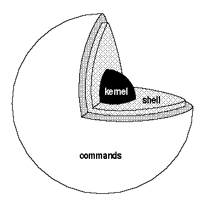

Title: Introduction to Python
Date: 2015-03-08 18:00
Toc: True

## 들어가기 전에

1. 운영체제(OS)란?
    - ["시스템 하드웨어와 소프트웨어를 실행하기 위한 시스템 소프트웨어"](http://ko.wikipedia.org/wiki/%EC%9A%B4%EC%98%81_%EC%B2%B4%EC%A0%9C)
        - ex: 윈도우 7, Mac OS 10.10, Ubuntu 14.04, iOS 6, Android 5.0, ...
    - 프로그래밍을 하기 전에는 내가 어떤 OS의 어떤 버젼을 사용하고 있는지 꼭 알아두자!
    - **여기서는 윈도우 7을 사용하고 있다는 가정 하에 튜토리얼을 진행합니다.**
1. 쉘(shell)이란?
    - ["운영체제 상에서 다양한 운영체제 기능과 서비스를 구현하는 인터페이스를 제공하는 프로그램"](http://ko.wikipedia.org/wiki/%EC%85%B8)
    - 운영체제의 핵심 부분을 구성하는 "커널(kernel)"을 감싸고 있다는 뜻에서 "쉘"이라는 이름이 붙었죠 
    

## 왜 파이썬인가?

1. Python is now the most popular introductory language at Top US Universities (July, 2014) 

1. Python is a major programming language for data mining (Aug, 2014) 

So is Python the best programming language ever?

- No, and [there probably will never be such a thing](http://paulgraham.com/hundred.html)
- But, definitely worth the effort for now

그렇다면 진짜로 왜?

1. 쉽다
1. 간편하다

...외에도 가독성(readability)이 좋다는 점, 문서화(documentation)가 잘 되어있다는 점, 라이브러리/패키지가 풍부해서 데이터 분석부터 시각화, 웹프로그래밍 등 다양한 영역에 사용할 수 있다는 점, 개발 커뮤니티가 활발하다는 점 등 때문에 [처음 배우는 프로그래밍 언어로써](http://blog.trinket.io/why-python/), 그리고 [연구용 언어로써](http://www.stat.washington.edu/~hoytak/blog/whypython.html) 좋다는 평가가 있습니다.

> 파이썬 프로그래밍을 하다가 궁금한 점이 있을 때는 아래 커뮤니티들에 질문을 던져보세요: 
> 1. [파이썬 코리아 페이스북 그룹](https://www.facebook.com/groups/pythonkorea/) 
> 2. [생활코딩 페이스북 그룹](https://www.facebook.com/groups/codingeverybody/) 
> 그 외에도 [파이조그(PyJog)](https://www.facebook.com/pyjog)와 같이 주말에 오프라인으로 모여서 각자 코딩하는 모임도 있습니다. 고수님들을 만날 기회이니 프로그래밍을 더 잘해보고 싶은 분은 한 번쯤 참석해보시기 바랍니다.

## Installing Python

- 윈도우에서 자바 프로그래밍 환경을 마련하는 일반적인 절차는?
    - 1단계: [자바 개발 키트 (JDK)](http://www.oracle.com/technetwork/java/javase/downloads/index.html) 설치 (2015년 3월 현재, JDK 8u40 배포중)
    - 2단계: 환경변수 설정 (ex: `JAVA_HOME`)
    - 3단계: 자바 IDE 설치 (ex: [이클립스](https://eclipse.org/), [IntelliJ IDEA](https://www.jetbrains.com/idea/))
- 윈도우에서 R 프로그래밍 환경을 마련하는 일반적인 절차는?
    - 1단계: [R 배포판](http://cran.r-project.org/) 설치 (2015년 3월 현재, R 3.1.2 배포중)
    - 2단계: R IDE 설치 (ex: [RStudio](http://rstudio.com))
- 윈도우에서 파이썬 프로그래밍 환경을 마련하는 일반적인 절차는?
    - 1단계: [파이썬 배포판](http://python.org/download) 설치
    - 2단계: 파이썬 IDE 설치

자, 그럼 시작해봅시다!

### 1단계: 파이썬 배포판 설치

1. Download [Continuum's Anaconda](http://continuum.io/downloads#34)
    - 잠깐, [python.com](http://python.org/download)이 아니라 딴데서 설치파일을 다운받으라고?
        - python.com/download: 파이썬 정식 배포판
        - continuum.io/downloads#34: 파이썬 사제 배포판 
    - 파이썬 정식 배포판이 아니라 일반 회사의 사제 배포판을 사용하는 이유는?
        - Windows에서는 파이썬의 몇몇 패키지 설치가 어렵다는 풍문이 있다
        - 이를 극복하기 위해 [윈도우만을 위해 사전에 컴파일 된 패키지를 따로 제공하는 사람도 있다](http://www.lfd.uci.edu/~gohlke/pythonlibs/)
        - 우리는 패키지 설치의 번거로움에서 벗어나기 위해 사전에 [195개의 패키지](http://docs.continuum.io/anaconda/pkg-docs.html)가 한꺼번에 깔리는 배포판을 선택
    
    - 윈도우 32비트? 64비트?
        - 아나콘다가 알아서 인식해서 잡아주겠지만, 궁금한 사람은 [내 컴퓨터의 속성 메뉴에서 나의 시스템 종류를 확인하자](images/bit.png).
    - [Python 2.x? 3.x?](https://wiki.python.org/moin/Python2orPython3)
        - 아직까지 학계에서는 Python 2도 많이 사용
        - 하지만 우리는 더 최신 버젼인 Python 3 선택
            1. 파이썬 3가 유니코드 서포트를 해서 한국어를 사용하는 사람들에게 편리
            1. [이제 많은 라이브러리들이 파이썬 3도 지원](http://python3wos.appspot.com/)
            1. 파이썬 3 is [the way to go](http://pythonkr.github.io/pyconkr-2014/pdf/pyconkr-2014-25_geofront.pdf)
2. Install Anaconda
    - 고맙게도 파이썬 환경변수 설정은 따로 할 필요없이 아나콘다가 알아서 해줌 
    
3. Run Python!
    - 다음과 같이 터미널을 열자:
        1. `window` + `r` 단축키를 이용해 실행창(Run)을 열고
        2. `cmd`라고 입력한다. 
        
    - `ipython`을 입력해서 "파이썬 쉘"을 열어보자. 
        터미널로 작업할 때는 열심히 "독서"하는 습관을 들이는 것이 좋다.
        우리가 `ipython`을 입력하니 무엇이 출력되었는가?
        파이썬 버젼 3.4.1, 64비트 아나콘다 2.1.0이 구동되었다는 것을 알 수 있고, 그 밖의 소소한 명령어에 대한 소개도 있다. 
        
    - 파이썬 쉘이 열리면:

            :::python
            In [1]: print("Hello world!")
            Hello world!

            In [2]: 1+3
            Out[2]: 4

            In [3]: 1/3
            Out[3]: 0.3333333333333333

            In [4]: 2**10
            Out[4]: 1024

            In [5]: exit    # exit을 입력하는 대신 단축키 ctrl+d를 사용할 수도 있다

    - Now you're a Python programmer! (적어도 계산기로는 쓸 수 있다)

### 1.5단계: 파이썬 스크립트 실행
위와 같이 파이썬을 쉘(shell)에서 실행하는 것은 순간적인 실행을 위해서는 아주 편리하지만,
긴 프로그램을 짜고자 할 때, 또는 프로그램을 저장하고자 할 때는 적합하지 않다.
이럴 때는 스크립트(script) 파일을 이용해서 파이썬을 실행할 수도 있다.

스크립트 파일 실행을 위해 PyCharm, Eclipse 등의 IDE를 활용할 수도 있지만,
일단은 IDE없이 한 번 가보자.

먼저 프로그래밍의 기본! 파이썬 스크립트를 만들어 Hello world를 출력해볼까?
이미 우리는 ipython을 통해 파이썬 쉘에서 Hello world를 출력해봤지만 
다음의 몇 가지 절차를 거치면 파일을 이용해 파이썬 스크립트를 실행할 수 있다.

1. 아래와 같이 윈도우에서 메모장을 열자.
    1. `window` + `r` 단축키를 이용해 실행창(Run)을 열고
    2. `notepad`라고 입력한다.
2. 다음의 헬로월드 출력문을 파일에 입력한 후

        :::python
        print("Hello world!")

3. 파일을 바탕화면에 `test.py`라는 이름으로 저장하자. 다만 한 가지 유의할 점은, **다음 그림과 같이 Encoding을 UTF-8로 변경해서 저장해줘야 한다.** (그렇지 않으면 스크립트를 실행할 때 인코딩 에러가 발생할 것이다.) 

4. 그 다음에, 다시 터미널을 띄워서 (어떻게 했는지 기억하는가?)
5. 아래와 같이 입력하면 파이썬 파일이 실행된다. 
첫번째 줄은 윈도우 탐색기에서 "바탕화면"으로 이동하라는 버튼을 누른 것과 같고, 두번째 줄은 윈도우 탐색기에서 `test.py` 파일을 클릭하여 실행한 것과 같다. 멋지지 않은가? 이제 우리도 마우스를 클릭하는 GUI(graphic user interface)가 아니라 키보드로 명령어를 입력하는 CLI(command line interface)에서 프로그래밍을 할 수 있게 된 것이다!

        :::bash
        > cd Desktop        # Desktop이라는 디렉토리로 변경하라(**c**hange **d**irectory)
        > python test.py    # python이라는 프로그램으로 test.py라는 파일을 실행하라

    이제부터 파이썬에서 빈번하게 사용할 기능을 7가지 예시를 통해 배워볼 것이다. 
    방금 생성한 `test.py`에서 Hello world! 출력문 대신 아래의 다양한 예시를 입력해보자.
    이미 Desktop 폴더로 이동한 상태이니 **앞으로는 터미널에 `python test.py`만 입력해서 코드를 실행하면 된다.**
    각 예시는 이해를 돕기 위해 자바 1.7의 코드와 병렬적으로 배치해두었다.

#### 예시 1: "Hello world"

앞에서 우리는 파이썬 쉘과 스크립트로 Hello world!를 출력하는데 성공했다.
우리의 파이썬 코드와 자바 코드에는 어떤 차이점이 있을까?
다음은 자바와 파이썬으로 각각 Hello world!를 출력하는 코드이다.

- Java 1.7

        :::java
        public class MyClass {
            public static void main (String[] args) {
                System.out.println("Hello world!");
            }
        }

- Python 3

        :::python
        print("Hello world!")

자바와 파이썬 코드에 어떤 차이점이 있는가? 자바 코드와는 달리 파이썬 코드에서는:

1. `public class MyClass { ... }` 등과 같이 클래스를 선언하지 않아도 된다.
1. `public static void main (String[] args) { ... }` 등과 같이 메인함수를 선언하지 않아도 된다.
1. 라인 끝에 세미콜론(`;`)을 붙이지 않아도 된다.

그리하여 파이썬으로는 무려 한 줄 만으로 Hello world!를 출력할 수 있다!
아주 간결하지 않은가?

#### 예시 2: 변수 선언

다음으로 변수를 선언해보자.
`print`문을 이용해 출력하는 것이 없다면 변수를 선언하는 것만으로는 터미널 창에 아무 것도 뜨지 않겠지만,
변수 선언만으로도 중요한 차이점을 많이 발견할 수 있으니 코드는 한 번 자세히 들여다보자.
다음은 자바와 파이썬으로 각각 변수를 선언하는 코드이다.

- Java 1.7 (static typed)

        :::java
        String myString = "this is a string";
        myString = "3"; //  ok
        myString = '3'; //  Type mismatch: cannot convert from char to String
        myString = 3;   //  Type mismatch: cannot convert from int to String

- Python 3 (dynamic typed)

        :::python
        my_string = "this is a string"
        my_string = "3" # ok
        my_string = '3' # ok
        my_string = 3   # ok

이미 위에서 언급된 차이점들 외에도 크게 네 가지 차이점을 발견할 수 있다.

1. 자바는 [정적 타이핑(static typing)](http://en.wikipedia.org/wiki/Type_system#Static_type-checking)언어라 변수의 데이터 타입(type), 즉 String인지 int인지 등을 미리 지정해줘야하고, 한 번 지정하고 나면 변수의 타입은 바뀔 수 없다. 반면 파이썬은 [동적 타이핑(dynamic typing)](http://en.wikipedia.org/wiki/Type_system#DYNAMIC) 언어라 변수의 데이터 타입(type) 선언할 필요도 없을 뿐더러 처음 선언이 된 이후에도 다른 타입으로 바뀔 수 있다.
1. 자바에서는 작은 따옴표(`char`)와 큰 따옴표(`String`)의 사용이 구분되지만 파이썬에서는 작은 따옴표나 큰 따옴표로 묶인 문자열은 전부 `str` 타입으로 간주된다.
1. 자바 코드에서는 변수를 선언할 때 `myString`과 같이 [camelCase](http://en.wikipedia.org/wiki/CamelCase)를 사용하는데 반해 파이썬 코드에서는 `my_string`과 같이 [under_score](http://en.wikipedia.org/wiki/Naming_convention_(programming)#Python_and_Ruby)를 사용한다. 파이썬의 스타일링에 관해서는 [PEP-8](https://www.python.org/dev/peps/pep-0008/)에 잘 나와 있다. 만일 파이썬 프로그래밍을 꾸준히 할 마음이 있다면 한 번쯤 훑어보자. 이 문서를 지금 당장 다 읽지 않더라도, 중요한 지침을 담고 있으니 반드시 이름은 기억해두는 것이 좋다.
1. 주석을 다는 방법이 다르다. 자바에서는 `//` 썼다면, 파이썬에서는 `#`를 쓴다. 긴 주석의 경우에도 자바는 `/* some very long comment */`라면, 파이썬은 `""" some very long comment """`와 같다. (긴 주석 내에서는 줄바꿈을 할 수 있다.)

#### 예시 3: 파일 쓰기 (writing)

아래는 `some_file.txt`에 "Hello world full of data!"라는 문자열을 입력하는 코드이다.
자바에서 파일 입출력(I/O)은 생각만큼 간단하지 않지만, 파이썬에서는 무척 간단하다.
코드를 이렇게 읽어보자: `"some_file.txt"`를 `"w"`(write) 모드로 `open`하고 그것을 `f`라고 부르자.
그리고 `f`에는 `"Hello world full of data!"`라는 문자열을 `write`하자!

- Java 1.7

        :::java
        import java.io.*;

        public class WriteFile {
            public static void main(String[] args) throws IOException {
                Writer writer = null;
                try {
                    writer = new BufferedWriter(new OutputStreamWriter(
                          new FileOutputStream("some_file.txt"), "utf-8"));
                    writer.write("Hello world full of data!");
                } catch (IOException ex) {
                    System.out.println("An exception occurred during writing file.");
                } finally {
                    try {writer.close();} catch (Exception ex) {}
                }
            }
        }

- Python 3

        :::python
        with open("some_file.txt", "w") as f:
            f.write("Hello world full of data!")

#### 예시 4: 파일 읽기 (reading)

이미 바탕화면에는 `some_file.txt`라는 파일이 생겼을 것이다. 한 번 확인해보자.
만일 `test.py` 파일을 바탕화면이 아니라 다른 폴더 안에 저장했다면, `some_file.txt`는 그 폴더 안에 있을 것이다.

이번에는 그 파일의 내용을 읽어보자.
아마도 "Hello world full of data!"가 출력되겠지?

- Java 1.7

        :::java
        import java.io.BufferedReader;
        import java.io.FileReader;
        import java.io.IOException;

        public class ReadFile {
            public static void main(String[] args) throws IOException {
                BufferedReader br = new BufferedReader(new FileReader("some_file.txt"));
                try {
                    StringBuilder sb = new StringBuilder();
                    String line = br.readLine();

                    while (line != null) {
                        sb.append(line);
                        sb.append(System.lineSeparator());
                        line = br.readLine();
                    }
                    String everything = sb.toString();
                    System.out.println(everything);
                } finally {
                    br.close();
                }
            }
        }

- Python 3

        :::python
        with open("some_file.txt", "r") as f:
            d = f.read()
        print(d)

#### 예시 5: HashMap 또는 Dictionary

Key와 value로 이루어진 데이터 타입을 자바에서는 HashMap, 파이썬에서는 [dictionary](https://docs.python.org/3/tutorial/datastructures.html#dictionaries)라고 부른다.
Dictionary는 1) key가 unique하다는 점과 2) item에 순서가 없다는 점이 독특하다. Dict에 대한 상급 활용법이 궁금한 사람은 [이 곳](https://speakerdeck.com/jongman/2014-pycon-kr-widaehan-dict-ihaehago-sayonghagi)을 살펴보자.

- Java 1.7

        :::java
        import java.util.*;

        public class HashTest {
            public static void main(String[] args) {
                // create hashmap
                HashMap<String, String> studentIds = new HashMap<String, String>();
                studentIds.put("홍길동", "13083301");
                studentIds.put("김미자", "11030104");
                studentIds.put("박은정", "11121994");

                // iterate over hashmap
                for (Map.Entry<String, String> entry : studentIds.entrySet()) {
                    System.out.println("Key: " + entry.getKey() + ", Value: " + entry.getValue());
                }

                // get keys
                System.out.println(studentIds.keySet());

                // get value for key
                System.out.println(studentIds.get("박은정"));
            }
        }

- Python 3

        :::python
        # -*- coding: utf-8 -*-

        # create dictionary
        student_ids = { "홍길동": "13083301",
                       "김미자": "11030104",
                       "박은정": "11121994" }

        # iterate over hashmap
        for k, v in student_ids.items():
            print("Key: %s, Value: %s" % (k, v))

        # get keys
        print(student_ids.keys())

        # get value for key
        print(student_ids["박은정"])

앞서 살펴본 예시와는 달리 아래 파이썬 코드의 상단에 `# -*- coding: utf-8 -*-`이라는 특이한 줄이 생긴 것을 볼 수 있다.
이 줄은 [PEP 263](https://www.python.org/dev/peps/pep-0263/)에 의해 제안된 것으로,
프로그램 상으로는 역할을 하지 않지만 코드에 영문 알파벳 등 기본적인 ASCII 문자 외에 다른 문자(ex: 한글)가 코드에 있는 경우 반드시 필요한 줄이다.
우리는 앞서 파일을 OS간 호환성을 위해 UTF-8으로 인코딩하여 저장했으므로, 파일이 UTF-8로 되어 있다고 선언한다.
만일 앞에서 파일을 UTF-8으로 저장하지 않았다면, 윈도우의 시스템 인코딩인 cp949로 선언해야 인코딩 에러를 피할 수 있을 것이다.
(만일 cp949로 선언해도 인코딩 에러가 발생한다면, 터미널에서 `chcp`를 입력하여 내가 어떤 코드 페이지를 사용하고 있는지 확인하자.)
앞으로 고생을 덜기 위해 (그리고 다양한 프로그래밍 환경에서 작업하는 사람들과 원활하게 협업하기 위해) 다음의 두 가지는 습관화하는 것이 좋다:

1. 파이썬 스크립트를 저장할 때 UTF-8 인코딩을 지정하고
2. 파이썬 스크립트 최상단에 `# -*- coding: utf-8 -*-`과 같은 방식으로 인코딩을 명시하자.

#### 예시 6: Array 또는 List
순서가 존재하는 데이터 타입인 배열은 어떻게 선언할까?

- Java 1.7

        :::java
        import java.util.ArrayList;

        public class ArrayTest {
            public static void main(String[] args) {
                // create arraylist
                ArrayList<String> myList = new ArrayList<String>();
                myList.add("a");
                myList.add("b");
                myList.add("c");
                myList.add("d");
                myList.add("e");
                System.out.println(myList);

                // split arraylist
                System.out.println(myList.subList(1, 4));

                // get item in arraylist
                System.out.println(myList.get(3));
            }
        }

- Python 3

        :::python
        # create list
        my_list = ['a', 'b', 'c', 'd', 'e']
        print(my_list)

        # split list
        print(my_list[1:4])

        # get item in list
        print(my_list[3])

#### 예시 7: 클래스(class)와 상속(inheritance)

예시 1에서도 설명했지만, 파이썬에서는 클래스를 반드시 선언해주지는 않아도 된다.
하지만, 클래스가 유용한 경우는 종종 있고, 파이썬에서도 클래스를 만들 수 있다.
아래 코드를 참고하자.

- Java 1.7

        :::java
        class Animal {
            protected String name;
            public Animal(String name) {
                this.name = name;
            }
            public void saySomething() {
                System.out.println("I am a " + name + ".");
            }
        }

        class Dog extends Animal {
            public Dog(String name) {
                super(name);
            }
            public void saySomething() {
                System.out.println("I am a " + name + ". Bark, bark!");
            }
        }

        public class ClassTest {
            public static void main(String[] args) {
                Dog dog = new Dog("Chiwawa");
                dog.saySomething();
            }
        }

- Python 3

        :::python
        class Animal():

            def say_something(self):
                print("I am a " + self.name + ".")

            def __init__(self, name):
                self.name = name

        class Dog(Animal):
            def say_something(self):
                print("I am a " + self.name + ". Bark, bark!")

        dog = Dog("Chiwawa")
        dog.say_something()

### 2단계: 파이썬 IDE 설치
지금까지 IDE 없이 파이썬 스크립트를 작성하고 실행해보았다.
어떤가? 나쁘지 않은가?
사실 별도의 IDE 없이 좀 더 괜찮은 에디터를 사용해서 파이썬 프로그래밍을 하는 프로그래머도 많이 있다. 가령:

1. [Sublime Text](sublime-text.html)
1. Vim
1. [...and more](http://tutorialzine.com/2012/07/battle-of-the-tools-which-is-the-best-code-editor/)

등만 잘 활용해도 충분하다.
하지만 IDE의 풍부한 기능을 사용하고 싶다면 다음의 몇 가지 대안을 검토해볼 수도 있다.

1. PyCharm
1. Eclipse
1. Visual Studio 
1. [...and more](http://pedrokroger.net/choosing-best-python-ide/)

## Appendix

### 초짜 프로그래머가 프로그래밍 잘하는 법
1. 에러 메세지를 잘 *읽자* (read, not see). 흔히들 시험 볼 때 문제 속에 답이 있다고 하는데, 프로그래밍할 때는 에러 메세지 속에 이유가 있다. 진짜다.
1. [구글링!](http://lmgtfy.com/?q=python3 docs)
    - 주의: 구글링을 한다고 무조건 좋은 레퍼런스가 찾아지는 것은 아니다
    - 보통은 공식 문서 (official documents) / API가 가장 좋은 레퍼런스 (ex: [docs.python.org](http://docs.python.org) <- 웹문서의 도메인을 잘 보라.)
1. Learn how to program, rather than just accomplishing the task
    - 프로그래밍을 배우는 것과 복/붙하는 것은 다르다 (참고: [Teach yourself programming in ten years](http://norvig.com/21-days.html))
    - 일단 프로그램이 작동하게 하는데 성공했다면, 왜 작동했는지를 이해하자.
1. Follow coding conventions. 많은 똑똑한 사람들이 선택한 방법에는 이유가 있다.
    - [PEP-8](https://www.python.org/dev/peps/pep-0008)
1. 변수/파일에는 직관적인 이름을 붙여주자.

<blockquote class="twitter-tweet" lang="en">
There are two hard things in computer science: cache invalidation, naming things, and off-by-one errors.
&mdash; Jeff Atwood (@codinghorror) <a href="https://twitter.com/codinghorror/status/506010907021828096">August 31, 2014</a></blockquote>

### 윈도우 프로그래머를 위한 팁

1. 윈도우에서 자주 속썩이는 것들
    1. 인코딩이 골치. UTF8 쓰는게 OS간 호환성에 가장 좋지만, 윈도우는 EUC-KR이 기본. 한글 사용자라면 [유니코드가 뭔지 알아보자](http://www.joelonsoftware.com/articles/Unicode.html).
    1. [Newlines가 골치](http://blog.codinghorror.com/the-great-newline-schism/).
    1. 역슬래시가 골치
        - 왜 내 키보드에는 역슬래시가 없을까? (폰트 문제)
        - 폴더 구분자를 쓸 때 왜 역슬래시를 두 번 표기해야할까?
        - 폴더 구분자를 쓸 때 왜 역슬래시 대신 슬래시를 쓸까?
    1. 사용자(user)의 홈디렉토리(home directory)에 대한 개념을 익히자
        - 보통 사용자가 "lucypark"라면 윈도우에서 홈디렉토리는 `C:\Users\lucypark`. 맥이나 리눅스에서는 `~/`
        - 다른 OS를 한번쯤 써보면 금세 익힐 수 있게 된다!
    1. 탐색기(Explorer) 설정 변경 
    

    "파일 확장명 숨기기" 선택 해제를 하고 나면 다음과 같이 된다.
    파일이 확장자(extension)가 있는지, 없는지, 있다면 어떤 확장자인지 아는 것은 중요하다.
    확장자는 우리가, 그리고 컴퓨터가, 파일이 어떤 프로그램으로 실행할 수 있는지 알 수 있는 힌트이기 때문이다.

    

### 그 밖의 유용한 참고자료

- [Java vs Python](http://blogs.perceptionsystem.com/images/JavaVsPython.png)
- 최성철, [산업공학과를 위한 프로그래밍 입문 (w/파이썬) Part 1: 파이썬 기초](http://www.slideshare.net/blissray/w-37771905), 2014.
- 최성철, [산업공학과를 위한 프로그래밍 입문 (w/파이썬) Part 2: 파이썬 활용](http://www.slideshare.net/blissray/w-part-2), 2014.
- 김태훈, [140분의 Python: 소개부터 문법 실습까지](http://carpedm20.github.io/140min-python/#/82), 2015.
