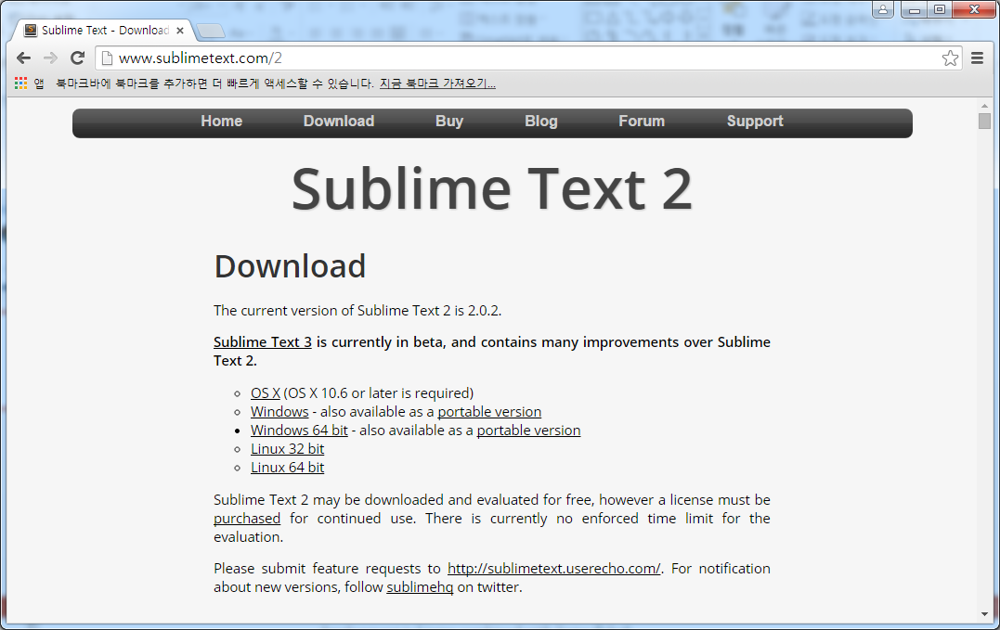
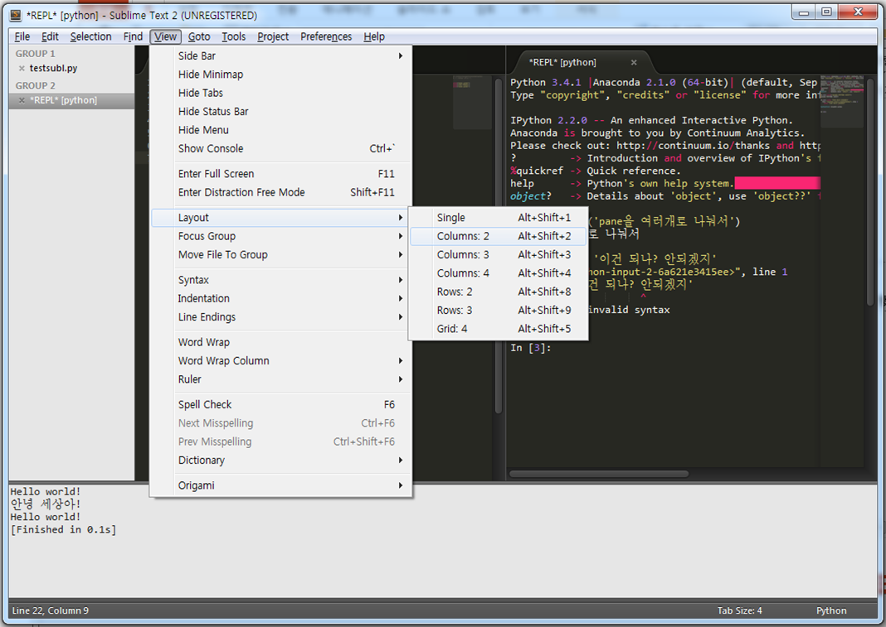
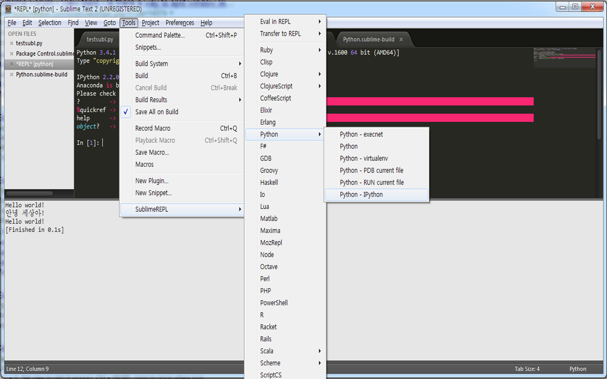

Title: 파이썬 프로그래밍을 위한 Sublime Text
Date: 2015-03-09 13:26
Toc: True

## Installation

1. Sublime Text 설치 

2. [Sublime Text 패키지 매니저](https://packagecontrol.io/installation#st2) 설치

> 내가 설치한 Sublime Text의 버젼을 잘 확인하자! 2인가 3인가?

## Suggested packages

### IMESupport: 한글 입력이 한 박자 늦게 되는 문제 해결

- [**IMESupport** 패키지 설치](http://meaningone.tistory.com/116)

### Origami: Divide window to several panes

- 방법 1. 

- 방법 2. Install the **Origami** package (훨씬 다양하게 pane을 나눠 쓸 수 있음)

### SublimeREPL: Python REPL in Sublime

