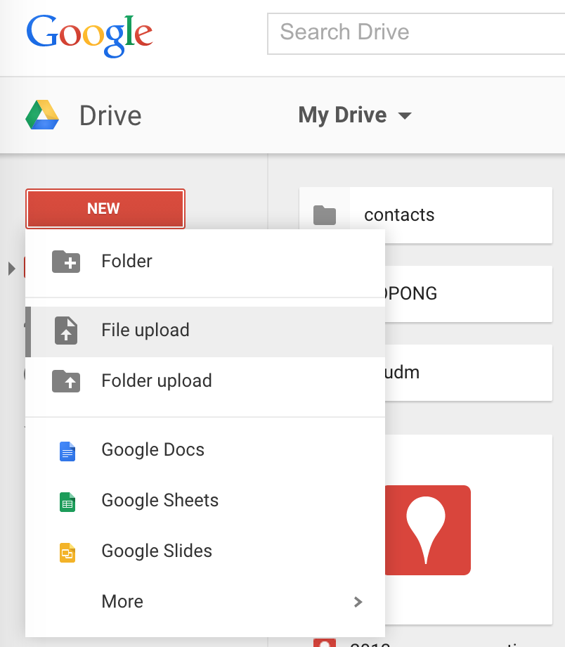
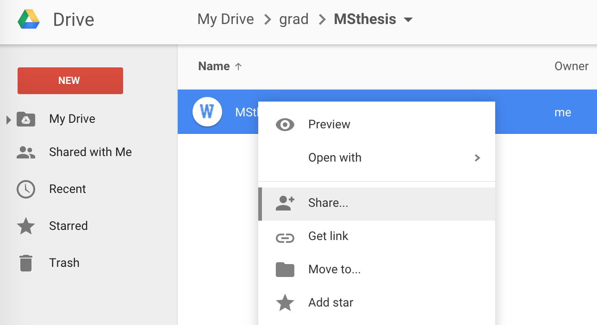
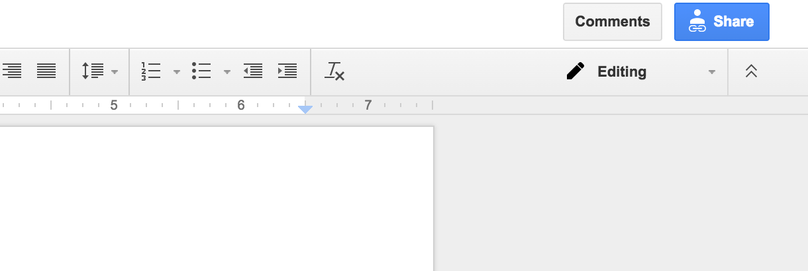
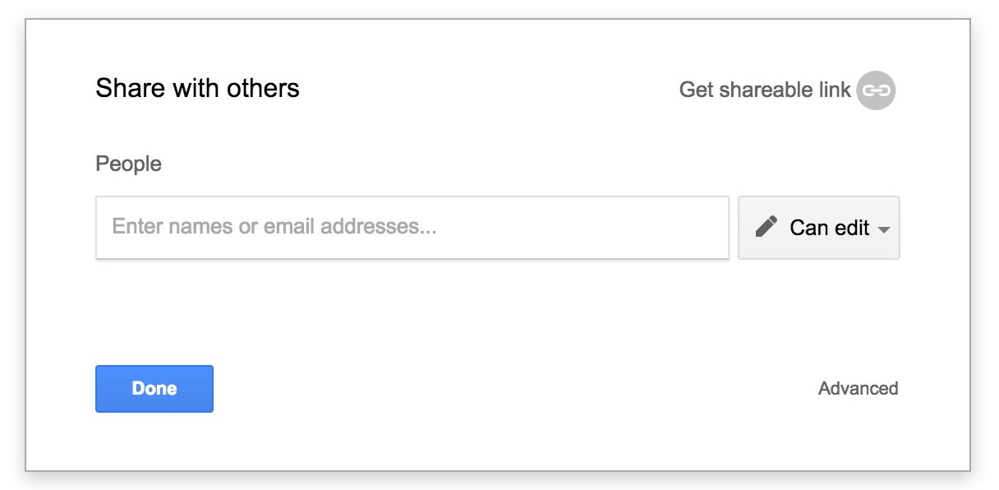
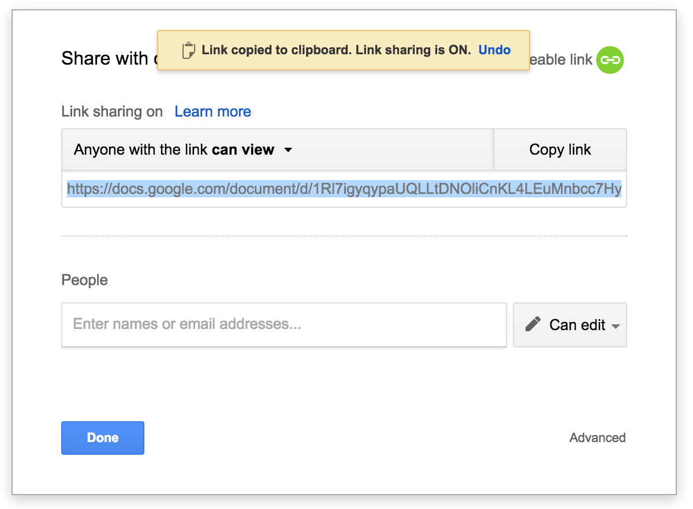
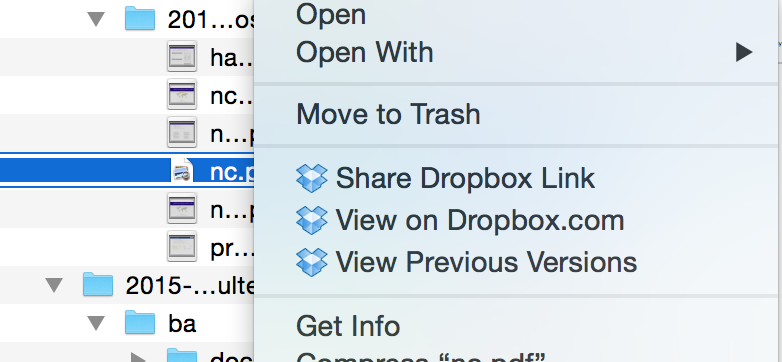

Title: How to upload files and get a URL
Date: 2015-03-05 21:51
Toc: True

### Using Google Drive

1. Go to [Google Drive](http://drive.google.com) and log in.
2. Upload your file.
    - If you have created your assignment in something other than Google Drive: Upload your assignment to Google Drive by clicking the "New" button and "File upload". 
    
    - If you have created your assignment in Google Drive: Go to the next step.
3. Change the sharing settings for your file. You can do this by following the steps below.
    1. Right-click on the file name and clicking "Share...", or open the file and click the "Share" button on the upper right side of the page. 
    
    
    2. Click "Get sharable link" on the upper-right side of the popup menu. 
    
    3. Copy the link for the document. 
    
4. Congratulations! Now you can share your file with whomever you want by pasting that URL anywhere.

### Using Dropbox

1. Go to your Dropbox folder.
2. Right-click on a file and click "Share Dropbox Link". 

3. You're done already! Go share the URL somewhere.
